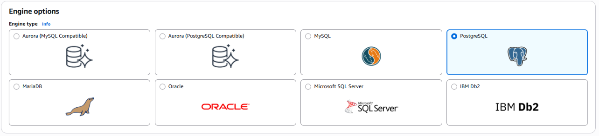
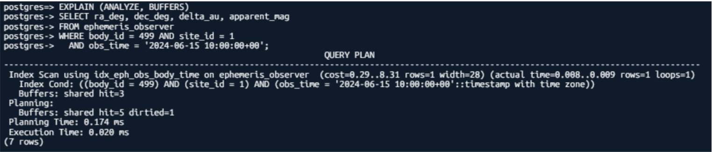
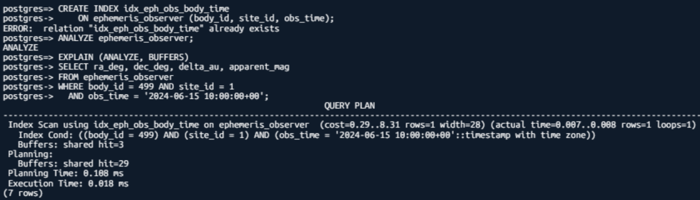
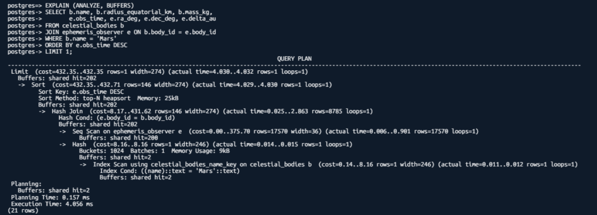
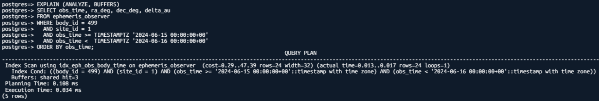
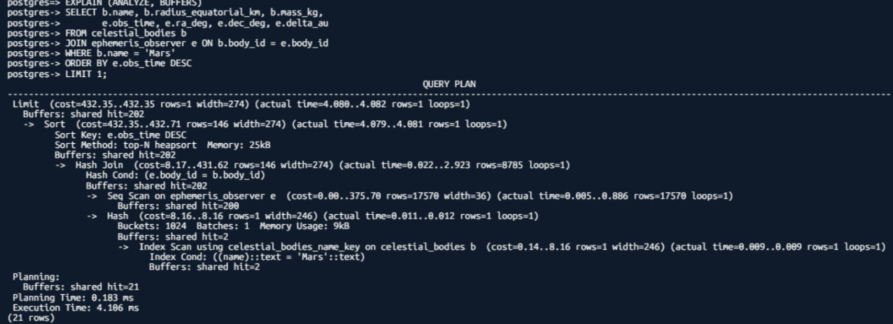
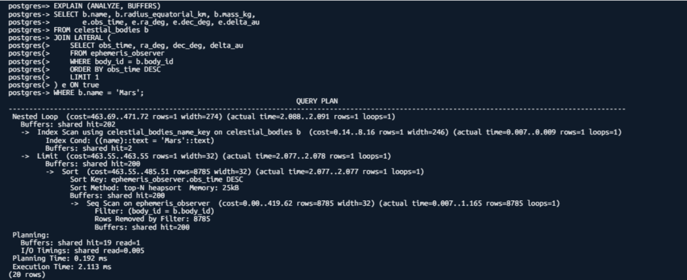

# 01 RDS Evidence

## 1. Why Choose the Relational Paradigm?

The data follows a strict temporal structure and maintains logical relationships between celestial bodies.

**Key benefits:**

- **Data Integrity (ACID):** Ensures that coordinates and distance data remain consistent and accurate during bulk updates via API.
- **Range Queries:** Efficient filtering within specific timeframes (for example, 10:00 to 22:00 on January 1, 1998).
- **Table Schema:** Clean separation between `Planets` (static data such as radius and mass) and `Ephemeris_Data` (time-series coordinates) using foreign keys.

## 2. Why the PostgreSQL Engine?

We selected PostgreSQL for the following technical reasons:

- **Numerical Precision:** PostgreSQL handles floating-point numeric types exceptionally well, which is critical for high-precision orbital calculations.
- **PostGIS extension:** Provides a roadmap for future scalability if the concept expands to Mars surface mapping.
- **PostgreSQL vs. MySQL/Aurora:** PostgreSQL offers more advanced indexing management for temporal data, making it more efficient for scientific workloads.

## 3. Encryption & Backup

- **Encryption:** Enabled encryption at rest using the `aws/rds` KMS key. Credentials and sensitive connection strings are secured via AWS Secrets Manager.
- **Backup:** Configured a 7-day automated backup policy and enabled Multi-AZ deployment to ensure high availability in the event of a regional or data center failure.

## 4. Data Access Pattern Log

### Part A: Common Access Patterns

- **Instant Coordinate Retrieval:** Querying the position of Mars at a precise timestamp.
  - Frequency: High (triggered every time a user opens the dashboard).
    
    
- **Daily Movement Schedule:** Fetching 24 hours of ephemeris data to plot trajectory charts.
  - Frequency: Medium.
    
    
- **Physical Parameters Lookup:** Combining radius and mass data with current positioning.
  - Frequency: Low.
    
    

### Part B: Query Serving Mechanism

- **Engine:** RDS PostgreSQL (relational).
- **Optimization strategies:**
  - **Composite indexes:** Enables near-instant lookups for positions at specific times without full table scans.
  - **B-tree indexing:** Applied to the timestamp column to efficiently support range queries.

### Part C: Wrong-Paradigm Test

If we were to use a key-value paradigm such as DynamoDB for this concept:

- **The issue:** DynamoDB is excellent for single-key lookups, but range queries for specific timeframes or calculating distance changes require expensive scans or an overly complex sort key design.
- **The consequence:** Costs would increase and performance would degrade as years of Mars historical data accumulate, while PostgreSQL handles this with efficient indexing and lower overhead.
