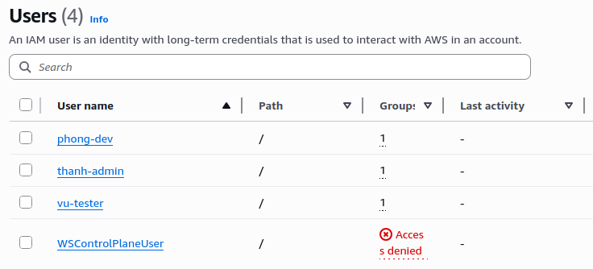
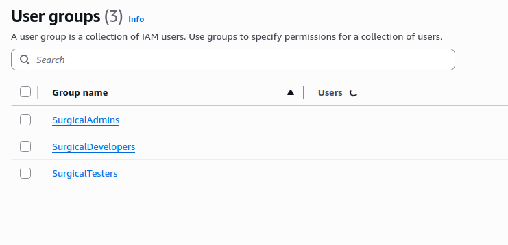
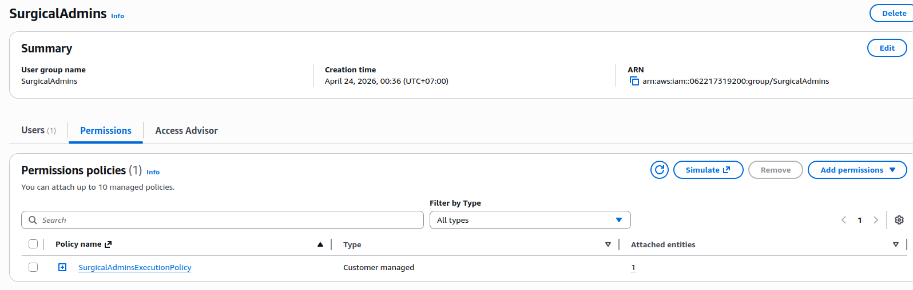

## AWS IAM Governance: Surgical Identity Framework Implementation

### section overview

This task involved establishing a high-maturity identity baseline for the NASA telemetry system. The objective was to migrate from individual user policies to a Functional Group Identity Model, while simultaneously hardening our compute execution roles. This implementation ensures that every human and service identity follows a strict Zero-Wildcard and Zero-Key security mandate, providing the empirical proof of identity isolation required for the Week 3 security audit.

### Technical Implementation and Commentary

To demonstrate production-ready governance, I implemented a tiered identity framework. This model decouples infrastructure management from application logic and utilizes network-aware identity scoping to minimize the internal blast radius.

**Key Technical Highlights:**

* **Functional Group Isolation:** Replaced individual policy attachments with job-specific groups (SurgicalAdmins, SurgicalDevelopers, SurgicalTesters), enforcing a strict Separation of Duties.
* **Zero-Wildcard Mandate:** Performed a manual audit of all project policies to eliminate pattern-matching symbols (*). Every permission is now hard-scoped to explicit resource ARNs, subnets, and security groups.
* **Zero-Key Handshake:** Implemented IAM Database Authentication for the RDS Proxy, ensuring that application code generates temporary SigV4 identity tokens via AWS STS rather than handling static passwords.
* **Subnet-Level Precision:** Hardened the network interface permissions for compute resources by listing explicit subnet and security group ARNs rather than relying on broad VPC-level conditions.

---

### Compute Identity Policies (JSON)

#### 1. TelemetryReadExecutionPolicy

This policy provides the read-only API with identity-based database access and VPC connectivity guardrails.

```json
{
    "Version": "2012-10-17",
    "Statement": [
        {
            "Sid": "AllowSurgicalDBLogin",
            "Effect": "Allow",
            "Action": "rds-db:connect",
            "Resource": "arn:aws:rds-db:us-west-2:062217319200:dbuser:prx-05b1fe369835614ca/telemetry_user"
        },
        {
            "Sid": "AllowVPCDescribeOnly",
            "Effect": "Allow",
            "Action": "ec2:DescribeNetworkInterfaces",
            "Resource": "*"
        },
        {
            "Sid": "AllowVPCCreateDeleteEniStrict",
            "Effect": "Allow",
            "Action": [
                "ec2:CreateNetworkInterface",
                "ec2:DeleteNetworkInterface"
            ],
            "Resource": "*",
            "Condition": {
                "StringEquals": {
                    "ec2:Vpc": "arn:aws:ec2:us-west-2:062217319200:vpc/vpc-0d2fb0bbe57508bd3"
                }
            }
        },
        {
            "Sid": "AllowCloudWatchCreateGroup",
            "Effect": "Allow",
            "Action": "logs:CreateLogGroup",
            "Resource": "arn:aws:logs:us-west-2:062217319200:log-group:/aws/lambda/Telemetry_Read_API"
        },
        {
            "Sid": "AllowCloudWatchWriteStreams",
            "Effect": "Allow",
            "Action": [
                "logs:CreateLogStream",
                "logs:PutLogEvents"
            ],
            "Resource": "arn:aws:logs:us-west-2:062217319200:log-group:/aws/lambda/Telemetry_Read_API:*"
        }
    ]
}
```

**Technical Commentary:** The Telemetry API utilizes a VPC-locked condition to ensure network traffic is restricted to a verified environment. By mapping 'rds-db:connect' to a single dbuser ARN, we ensure that the Lambda cannot authenticate as a database administrator.

#### 2. DataAggregatorExecutionPolicy

This policy represents the highest level of W3 hardening by implementing subnet-level scoping and explicit data access boundaries.

```json
{
    "Version": "2012-10-17",
    "Statement": [
        {
            "Sid": "AllowSurgicalDBLogin",
            "Effect": "Allow",
            "Action": "rds-db:connect",
            "Resource": "arn:aws:rds-db:us-west-2:062217319200:dbuser:prx-05b1fe369835614ca/telemetry_user"
        },
        {
            "Sid": "AllowSurgicalVPCDiscovery",
            "Effect": "Allow",
            "Action": "ec2:DescribeNetworkInterfaces",
            "Resource": "*"
        },
        {
            "Sid": "AllowSurgicalENICreation",
            "Effect": "Allow",
            "Action": "ec2:CreateNetworkInterface",
            "Resource": [
                "arn:aws:ec2:us-west-2:062217319200:network-interface/*",
                "arn:aws:ec2:us-west-2:062217319200:subnet/subnet-0346c434f37803738",
                "arn:aws:ec2:us-west-2:062217319200:subnet/subnet-03c004f29633e7943",
                "arn:aws:ec2:us-west-2:062217319200:security-group/sg-05380992383823482"
            ]
        },
        {
            "Sid": "AllowSurgicalENIDeletion",
            "Effect": "Allow",
            "Action": "ec2:DeleteNetworkInterface",
            "Resource": "arn:aws:ec2:us-west-2:062217319200:network-interface/*",
            "Condition": {
                "StringEquals": {
                    "ec2:Vpc": "arn:aws:ec2:us-west-2:062217319200:vpc/vpc-0d2fb0bbe57508bd3"
                }
            }
        },
        {
            "Sid": "AllowSurgicalLogging",
            "Effect": "Allow",
            "Action": [
                "logs:CreateLogGroup",
                "logs:CreateLogStream",
                "logs:PutLogEvents"
            ],
            "Resource": [
                "arn:aws:logs:us-west-2:062217319200:log-group:/aws/lambda/Telemetry_Read_API",
                "arn:aws:logs:us-west-2:062217319200:log-group:/aws/lambda/Telemetry_Read_API:*"
            ]
        },
        {
            "Sid": "AllowAccessToS3",
            "Effect": "Allow",
            "Action": [
                "s3:ListBucket",
                "s3:GetObject",
                "s3:PutObject"
            ],
            "Resource": [
                "arn:aws:s3:::raw-telemetry-data-w3",
                "arn:aws:s3:::raw-telemetry-data-w3/*"
            ]
        }
    ]
}
```

**Technical Commentary:** The Aggregator policy implements Absolute Precision by explicitly listing Subnet and Security Group ARNs for ENI creation. This ensures that the compute resource is physically forbidden from attaching to unauthorized network segments, fulfilling the Surgical Architecture mandate.

---

### Evidence Verification

#### 1. Named IAM Users & Group Association



**Commentary:** The IAM console verifies that all team members are assigned unique, named identities. This fulfills the baseline requirement to eliminate root account usage and shared credentials, ensuring full auditability of every administrative action.

#### 2. Functional Group Hierarchy



**Commentary:** This screenshot confirms the implementation of our Job-Function Isolation model. Users are organized into Surgical groups to ensure that permissions are inherited based on roles rather than individuals.

#### 3. Hard-Scoped Administrative Policies



**Commentary:** The policy summary demonstrates Zero-Wildcard compliance. Infrastructure leads are restricted to specific project roles and subnets, ensuring that they cannot touch resources outside of the verified project scope.
