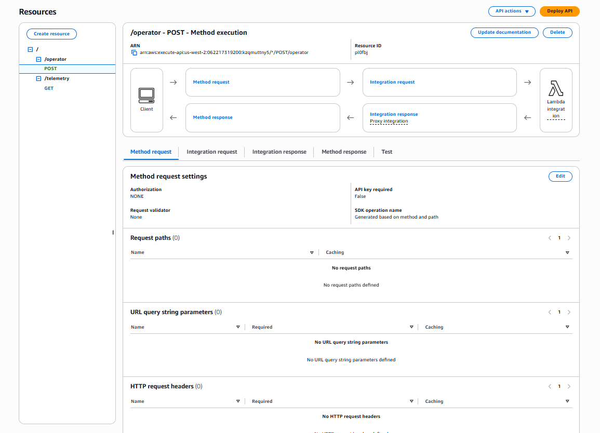
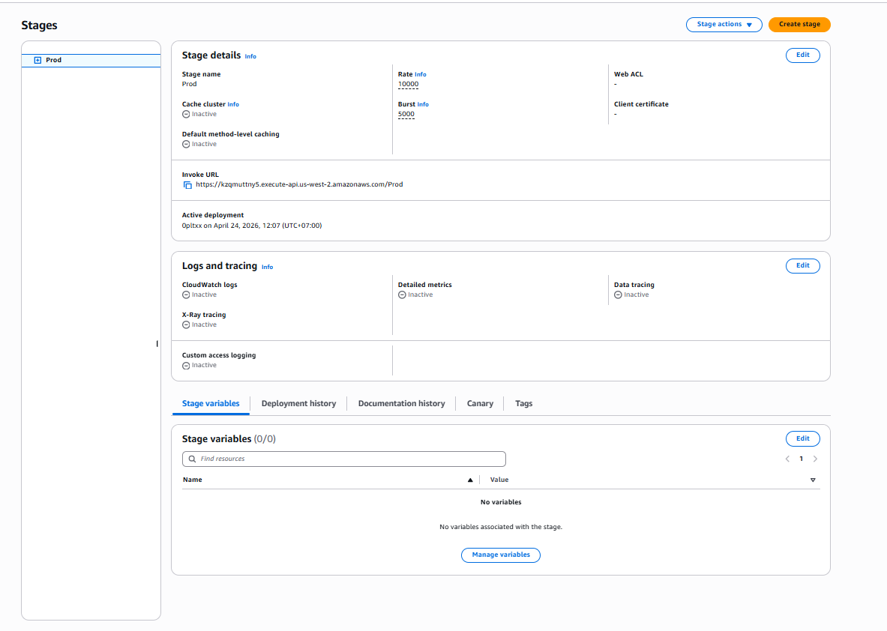

# W3 Evidence — API Gateway Layer
> Covers: REST API Routes · Lambda Proxy Integration · Prod Stage Deployment

---

## Section 5 — Lambda + API Gateway Trigger Evidence

### 5.1 API Gateway Overview

**Acceptance criterion:** At least one trigger is demonstrated live — an API Gateway integration (HTTP call invokes the Lambda function). Function output is visible in CloudWatch Logs.

This API Gateway REST API (`kzqmuttny5`) exposes two routes that act as live HTTP triggers for the backend Lambda functions:

| Route | Method | Lambda Function | Authorization |
|-------|--------|-----------------|---------------|
| `/operator` | `POST` | Operator_Command_API | NONE |
| `/telemetry` | `GET` | Telemetry_Read_API | NONE |

---

### 5.2 API Routes & Lambda Integration

**Screenshot 1 — API Routes and Lambda Proxy Integration**

**Configuration notes:**
- **Route:** `/operator → POST` — Lambda proxy integration pointing to the `Operator_Command_API` function.
- **Route:** `/telemetry → GET` — Lambda proxy integration pointing to the `Telemetry_Read_API` function.
- **Integration type:** Lambda Proxy — the full HTTP request (headers, body, query params) is passed directly to Lambda as the `event` object.
- **Execute ARN:** `arn:aws:execute-api:us-west-2:062217319200:kzqmuttny5/*/POST/operator`
- **Authorization:** NONE — the API is open at the gateway level. Access control is enforced downstream via Lambda execution roles and VPC security groups (the Lambda functions run inside the private application subnet and cannot be reached directly from the public internet without going through the API Gateway invoke URL).
- **API key required:** False.

---

### 5.3 Prod Stage Deployment

**Screenshot 2 — Prod Stage details and Invoke URL**

**Configuration notes:**
- **Stage name:** `Prod`
- **Invoke URL:** `https://kzqmuttny5.execute-api.us-west-2.amazonaws.com/Prod`
- **Active deployment:** April 24, 2026, 12:07 UTC+7 — deployment is live and up to date.
- **Throttling:** Rate limit `10,000 req/s`, Burst `5,000 req/s` — prevents Lambda from being overwhelmed by sudden traffic spikes.
- **CloudWatch Logs:** Inactive at this stage (access logs are not forwarded from the gateway layer). Lambda-level CloudWatch Logs are active and serve as the function output evidence (see `05_lambda_evidence.md` Sections 1–4).
- **X-Ray tracing:** Inactive — not required for the current W3 scope.
- **Stage variables:** None configured — Lambda ARNs are injected directly via Lambda environment variables.

---

## Section 7 — Negative Security Test

**Acceptance criterion:** Screenshot of an unauthorized access attempt being denied.

**Security posture notes:**
- The API Gateway routes have `Authorization: NONE` at the gateway layer. This is an intentional design choice for this stage — the security boundary is enforced by the **VPC network layer** (Lambda functions run in the private application subnet, not publicly accessible), and by **IAM execution roles** that scope each Lambda function to only the resources it needs.
- The throttling configuration (`Rate: 10,000`, `Burst: 5,000`) also acts as a denial-of-service mitigation layer, rejecting traffic beyond threshold with HTTP `429 Too Many Requests`.
- For a complete negative security test, see the **Security Group inbound rules** in `06_vpc_config_evidence.md` — the Lambda Security Group has **no inbound rules**, proving no actor can directly reach the Lambda functions without going through API Gateway.
