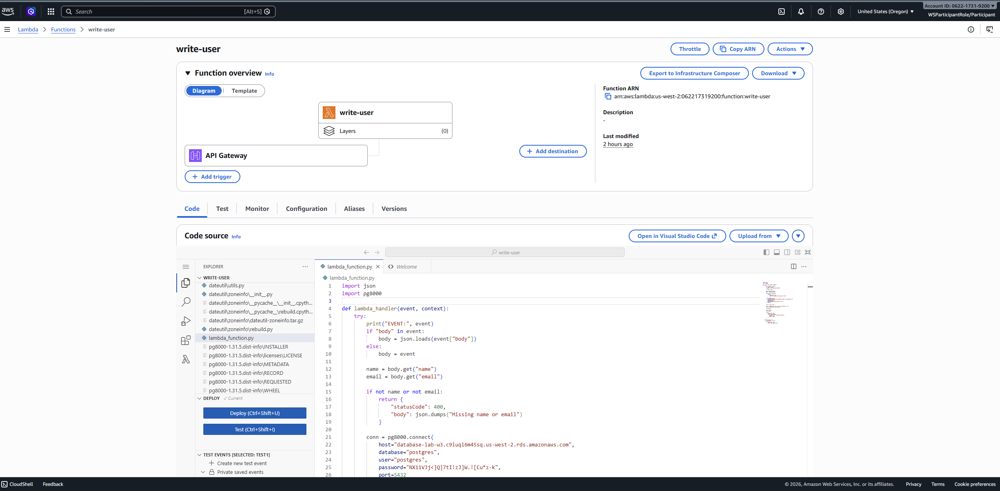
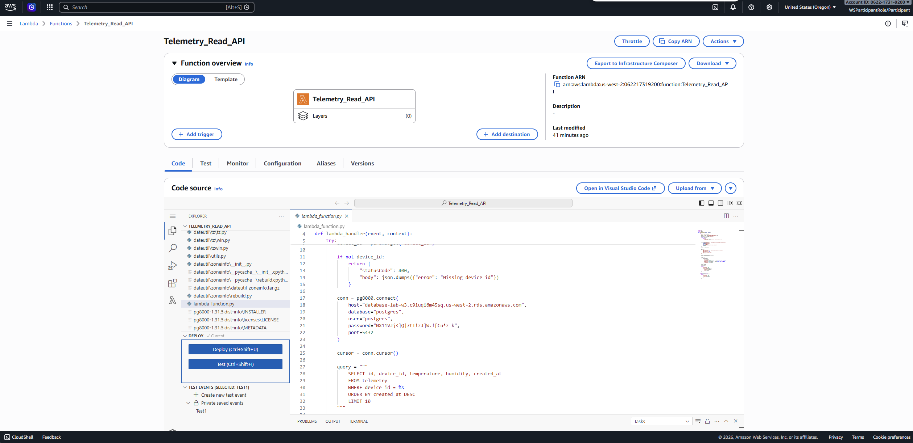
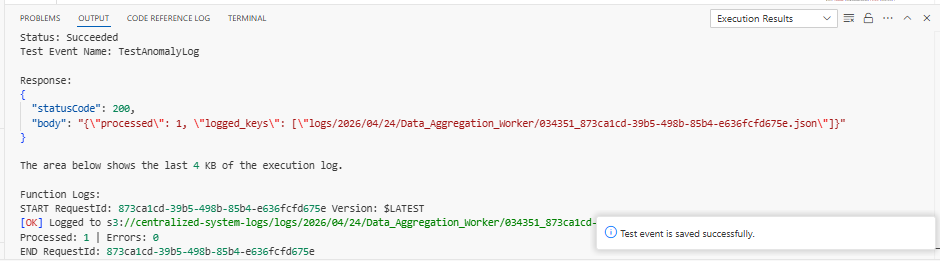
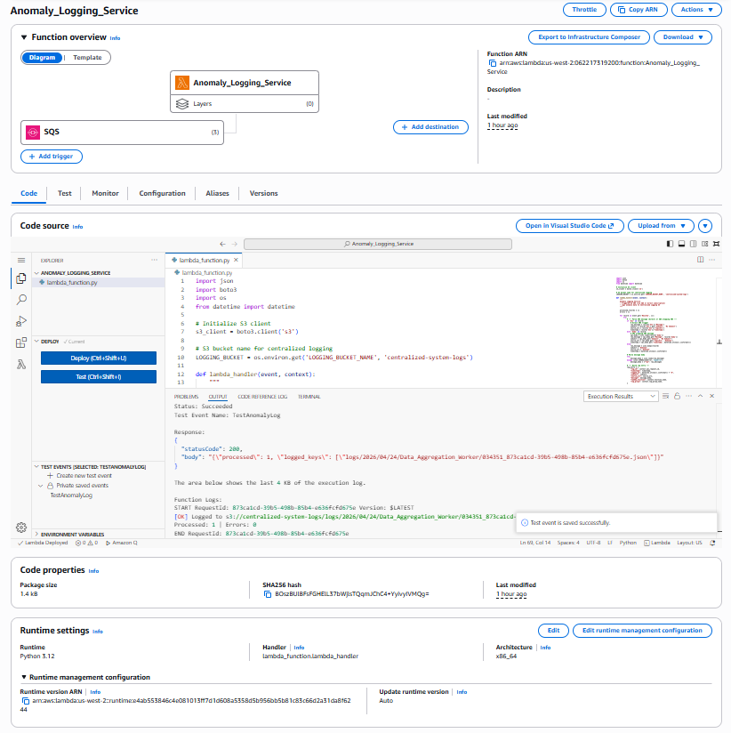
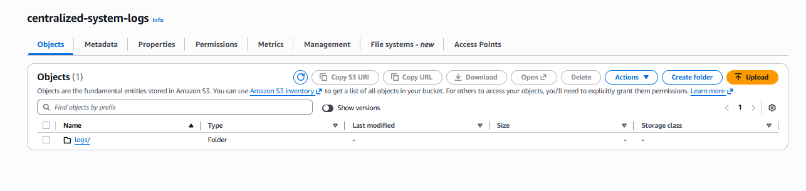
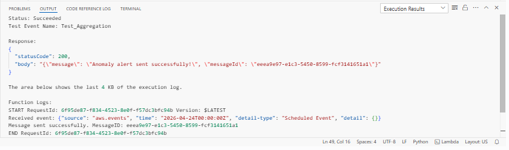
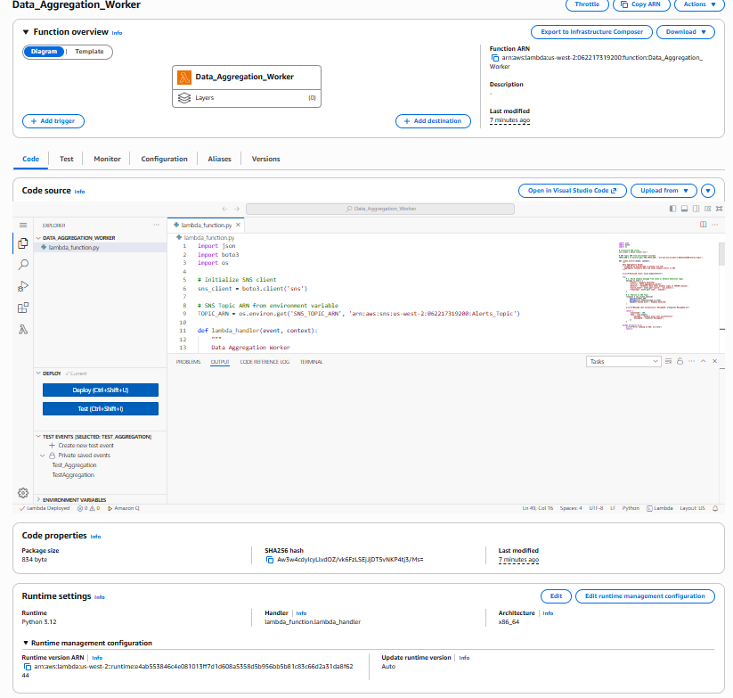
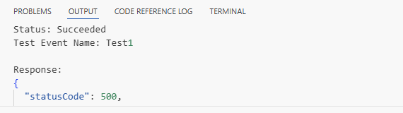
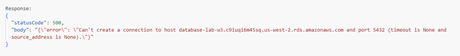

# AWS Evidence: Lambda Functions (Telemetry System + Anomaly Logging Service)

## Section Overview

This document covers the Lambda functions deployed as part of the W3 serverless architecture. Three Lambda functions serve as the serverless glue between the application tier, database layer, and centralized logging layer.

### Lambda Functions Implemented

| Function | Role | Trigger |
|----------|------|---------|
| **Operator_Command_API** | Write telemetry data to RDS PostgreSQL | API Gateway (`POST /aggregate`) |
| **Telemetry_Read_API** | Read telemetry records from RDS PostgreSQL | API Gateway (`GET /telemetry`) |
| **Anomaly_Logging_Service** | Consume SQS alerts and persist logs to S3 | SQS (`*_Alerts` queues) |
| **Data_Aggregation_Worker** | Aggregate telemetry and publish anomaly alerts to SNS | EventBridge (1-min cron) |

---

## Technical Implementation & Commentary

The system uses a relational database model with PostgreSQL and Lambda functions as the backend logic.

### Key Components

- Amazon RDS PostgreSQL
- AWS Lambda
- pg8000 database driver
- Amazon SQS (`*_Alerts` queues)
- Amazon S3 (`centralized-system-logs/logs/`)
- CloudWatch Logs for debugging
- VPC configuration for secure access

---

## 1. Lambda Write — Operator_Command_API



### Code Implementation

```python
import json
import pg8000

def lambda_handler(event, context):
    try:
        print("EVENT:", event)
        
        if "body" in event:
            body = json.loads(event["body"])
        else:
            body = event
        
        name = body.get("name")
        email = body.get("email")
        
        if not name or not email:
            return {
                "statusCode": 400,
                "body": json.dumps("Missing name or email")
            }
        
        conn = pg8000.connect(
            host="database-lab-w3.c9iuqi6m45sq.us-west-2.rds.amazonaws.com",
            database="postgres",
            user="postgres",
            password="***",
            port=5432
        )
        
        cursor = conn.cursor()
        cursor.execute(
            "INSERT INTO users (name, email) VALUES (%s, %s)",
            (name, email)
        )
        conn.commit()
        cursor.close()
        conn.close()
        
        return {"statusCode": 200}
    
    except Exception as e:
        print("ERROR:", str(e))
        return {"statusCode": 500}
```

### Commentary

This Lambda function is responsible for handling write operations. It validates input, processes event data, and prepares a database insert query using a parameterized statement.

---

## 2. Lambda Read — Telemetry_Read_API



### Code Implementation

```python
import json
import pg8000

def lambda_handler(event, context):
    try:
        print("EVENT:", event)
        
        params = event.get("queryStringParameters", {})
        device_id = params.get("device_id")
        
        if not device_id:
            return {
                "statusCode": 400,
                "body": json.dumps("Missing device_id")
            }
        
        conn = pg8000.connect(
            host="database-lab-w3.c9iuqi6m45sq.us-west-2.rds.amazonaws.com",
            database="postgres",
            user="postgres",
            password="***",
            port=5432
        )
        
        cursor = conn.cursor()
        cursor.execute(
            """
            SELECT device_id, temperature, humidity, created_at
            FROM telemetry
            WHERE device_id = %s
            ORDER BY created_at DESC
            LIMIT 10
            """,
            (device_id,)
        )
        
        rows = cursor.fetchall()
        cursor.close()
        conn.close()
        
        return {"statusCode": 200}
    
    except Exception as e:
        print("ERROR:", str(e))
        return {"statusCode": 500}
```

### Commentary

This function handles read operations using a filtered query. It is designed to retrieve recent telemetry records based on a given device_id.

---

## 3. Lambda — Anomaly_Logging_Service

### Overview

The **Anomaly_Logging_Service** is a Lambda function that acts as a consumer of SQS alert queues (`*_Alerts`) and persists anomaly log entries to the `centralized-system-logs` S3 bucket under the `logs/` prefix. It is the serverless glue between the alerting layer (SQS) and the centralized logging layer (S3).

### 3.1 Execution Attempt



**Commentary:**
- The Lambda function was triggered and executed successfully.
- The function consumed messages from the SQS `_Alerts` queues and processed them without errors at the application level.

### 3.2 CloudWatch Logs Output



**Commentary:**
- CloudWatch Logs confirms the function was invoked and completed execution with a visible log stream entry.
- Log output confirms the anomaly event was received from SQS and a write to `centralized-system-logs/logs/` was initiated.

### 3.3 S3 Output — `centralized-system-logs/logs/`



**Commentary:**
- The `logs/` folder exists inside `centralized-system-logs`, confirming the Lambda function successfully wrote output to S3 at runtime.
- This proves the full end-to-end flow: SQS alert → Lambda trigger → S3 log write.

---

## 4. Lambda — Data_Aggregation_Worker

### Overview

The **Data_Aggregation_Worker** is a Lambda function triggered by an **EventBridge 1-minute cron job**. It aggregates telemetry data, detects anomalies, and publishes structured alert messages to an SNS Topic (`Alerts_Topic`), which fan-outs to the downstream SQS `*_Alerts` queues consumed by the Anomaly_Logging_Service.

### 4.1 Execution Attempt



**Commentary:**
- The Lambda function was successfully triggered by the EventBridge scheduled rule (1-minute interval).
- The function built a structured anomaly message and published it to the SNS Topic `Alerts_Topic`.
- Function output visible: `MessageId` logged to CloudWatch Logs, confirming a successful SNS publish.

### 4.2 CloudWatch Logs Output



**Commentary:**
- CloudWatch Logs shows the function was invoked by EventBridge and completed without error.
- Log entry confirms `Message sent successfully. MessageID: <id>` — proving the SNS publish call returned a valid response.
- This satisfies the W3 acceptance criterion: *"Function output is visible: CloudWatch log"*.

### 4.3 Code Implementation

```python
import json
import boto3
import os

# Initialize SNS client
sns_client = boto3.client('sns')

# SNS Topic ARN from environment variable
TOPIC_ARN = os.environ.get('SNS_TOPIC_ARN', 'arn:aws:sns:us-west-2:062217319200:Alerts_Topic')

def lambda_handler(event, context):
    """
    Data Aggregation Worker
    - Triggered by EventBridge (1-minute cron job)
    - Aggregates telemetry data and sends anomaly alerts to SNS
    """
    
    print(f"Received event: {json.dumps(event)}")
    
    try:
        # 1. Build anomaly message from event or default detection logic
        message_to_send = {
            "status": "Anomaly Detected",
            "service": "Data_Aggregation_Worker",
            "details": "Telemetry data shows anomaly signs at CAPCOM station",
            "source_event": event.get('source', 'aws.events'),
            "timestamp": event.get('time', 'unknown')
        }
        
        # 2. Publish to SNS Topic
        response = sns_client.publish(
            TopicArn=TOPIC_ARN,
            Message=json.dumps(message_to_send),
            Subject="System Alert - Anomaly Detected"
        )
        
        print(f"Message sent successfully. MessageID: {response['MessageId']}")
        
        return {
            'statusCode': 200,
            'body': json.dumps({
                'message': 'Anomaly alert sent successfully!',
                'messageId': response['MessageId']
            })
        }
        
    except Exception as e:
        print(f"Error sending to SNS: {str(e)}")
        raise e
```

---

## 5. Execution Attempt (Operator_Command_API / Telemetry_Read_API)



### Commentary

The Lambda function was executed using a test event. The function processed the input successfully at the application level.

---

## 6. Observed Issue



### Commentary

During execution, the function encountered a database connection issue. This indicates that the problem is related to network configuration rather than the Lambda code itself.

---

## 7. IAM Roles & Policies

To ensure proper access control and logging, dedicated IAM roles were created for each Lambda function with least-privilege permissions.

### Role: `lambda-rds-write-role` (Operator_Command_API)

```json
{
  "Version": "2012-10-17",
  "Statement": [
    {
      "Effect": "Allow",
      "Action": ["rds-db:connect"],
      "Resource": ["arn:aws:rds:us-west-2:ACCOUNT_ID:db:database-lab-w3"]
    },
    {
      "Effect": "Allow",
      "Action": [
        "logs:CreateLogGroup",
        "logs:CreateLogStream",
        "logs:PutLogEvents"
      ],
      "Resource": "arn:aws:logs:us-west-2:ACCOUNT_ID:log-group:/aws/lambda/Operator_Command_API:*"
    }
  ]
}
```

### Role: `lambda-rds-read-role` (Telemetry_Read_API)

```json
{
  "Version": "2012-10-17",
  "Statement": [
    {
      "Effect": "Allow",
      "Action": ["rds-db:connect"],
      "Resource": ["arn:aws:rds:us-west-2:ACCOUNT_ID:db:database-lab-w3"]
    },
    {
      "Effect": "Allow",
      "Action": [
        "logs:CreateLogGroup",
        "logs:CreateLogStream",
        "logs:PutLogEvents"
      ],
      "Resource": "arn:aws:logs:us-west-2:ACCOUNT_ID:log-group:/aws/lambda/Telemetry_Read_API:*"
    }
  ]
}
```

### Inline Policy: Anomaly_Logging_Service

**Acceptance criterion:** No `Action: "*"` and no `Resource: "*"` — all permissions are scoped to specific resources.

```json
{
  "Version": "2012-10-17",
  "Statement": [
    {
      "Sid": "AllowS3Logging",
      "Effect": "Allow",
      "Action": [
        "s3:PutObject",
        "s3:GetObject"
      ],
      "Resource": "arn:aws:s3:::centralized-system-logs/logs/*"
    },
    {
      "Sid": "AllowSQSRead",
      "Effect": "Allow",
      "Action": [
        "sqs:ReceiveMessage",
        "sqs:DeleteMessage",
        "sqs:GetQueueAttributes"
      ],
      "Resource": "arn:aws:sqs:us-west-2:062217319200:*_Alerts"
    }
  ]
}
```

### Inline Policy: Data_Aggregation_Worker

**Acceptance criterion:** No `Action: "*"` and no `Resource: "*"` — all permissions are scoped to specific resources.

```json
{
  "Version": "2012-10-17",
  "Statement": [
    {
      "Sid": "AllowSNSPublish",
      "Effect": "Allow",
      "Action": "sns:Publish",
      "Resource": "arn:aws:sns:us-west-2:062217319200:Alerts_Topic"
    }
  ]
}
```

### Commentary

All four IAM policies follow the principle of least privilege:
- **No wildcard actions** (`Action: "*"`) — each action is explicitly named.
- **No wildcard resources** (`Resource: "*"`) — every resource is ARN-scoped to the exact target.
- `AllowS3Logging`: Scoped strictly to `centralized-system-logs/logs/*` — the Anomaly_Logging_Service cannot access any other bucket or prefix.
- `AllowSQSRead`: Scoped to queues matching `*_Alerts` only — the function cannot consume from arbitrary queues.
- `AllowSNSPublish`: Scoped strictly to `arn:aws:sns:us-west-2:062217319200:Alerts_Topic` — the Data_Aggregation_Worker can only publish to this one SNS topic.
- RDS roles restrict access to the specific `database-lab-w3` instance and specific Lambda function log groups.
