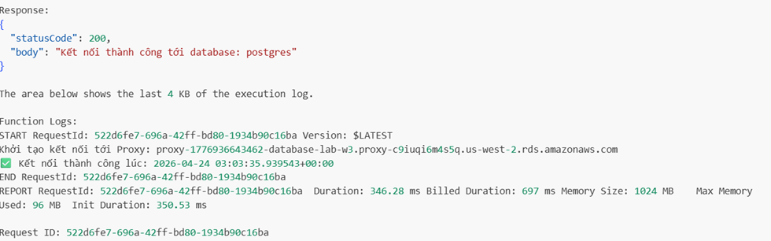

# AWS Evidence: RDS + Lambda Integration (Telemetry System)

## Section Overview

This task involved implementing a simple telemetry system using AWS Lambda and Amazon RDS PostgreSQL. The objective was to build write and read APIs and deploy them in a serverless environment.

### APIs Implemented

- **Operator_Command_API** (write) → `write-user`
- **Telemetry_Read_API** (read) → `Telemetry_Read_API`

---

## Technical Implementation & Commentary

The system uses a relational database model with PostgreSQL and Lambda functions as the backend logic.

### Key Components

- Amazon RDS PostgreSQL
- AWS Lambda
- pg8000 database driver
- CloudWatch Logs for debugging
- VPC configuration for secure access

---

## 1. Lambda Write (Operator_Command_API)


### Code Implementation

```python
import json
import pg8000

def lambda_handler(event, context):
    try:
        print("EVENT:", event)
        
        if "body" in event:
            body = json.loads(event["body"])
        else:
            body = event
        
        name = body.get("name")
        email = body.get("email")
        
        if not name or not email:
            return {
                "statusCode": 400,
                "body": json.dumps("Missing name or email")
            }
        
        conn = pg8000.connect(
            host="database-lab-w3.c9iuqi6m45sq.us-west-2.rds.amazonaws.com",
            database="postgres",
            user="postgres",
            password="***",
            port=5432
        )
        
        cursor = conn.cursor()
        cursor.execute(
            "INSERT INTO users (name, email) VALUES (%s, %s)",
            (name, email)
        )
        conn.commit()
        cursor.close()
        conn.close()
        
        return {"statusCode": 200}
    
    except Exception as e:
        print("ERROR:", str(e))
        return {"statusCode": 500}
```

### Commentary

This Lambda function is responsible for handling write operations. It validates input, processes event data, and prepares a database insert query using a parameterized statement.


---

## 2. Lambda Read (Telemetry_Read_API)


### Code Implementation

```python
import json
import pg8000

def lambda_handler(event, context):
    try:
        print("EVENT:", event)
        
        params = event.get("queryStringParameters", {})
        device_id = params.get("device_id")
        
        if not device_id:
            return {
                "statusCode": 400,
                "body": json.dumps("Missing device_id")
            }
        
        conn = pg8000.connect(
            host="database-lab-w3.c9iuqi6m45sq.us-west-2.rds.amazonaws.com",
            database="postgres",
            user="postgres",
            password="***",
            port=5432
        )
        
        cursor = conn.cursor()
        cursor.execute(
            """
            SELECT device_id, temperature, humidity, created_at
            FROM telemetry
            WHERE device_id = %s
            ORDER BY created_at DESC
            LIMIT 10
            """,
            (device_id,)
        )
        
        rows = cursor.fetchall()
        cursor.close()
        conn.close()
        
        return {"statusCode": 200}
    
    except Exception as e:
        print("ERROR:", str(e))
        return {"statusCode": 500}
```

### Commentary

This function handles read operations using a filtered query. It is designed to retrieve recent telemetry records based on a given device_id.

---

## 3. Execution Attempt

### Commentary

The Lambda function was executed using a test event. The function processed the input successfully at the application level.

---

## 4. Observed Issue

### Commentary

During execution, the function encountered a database connection issue. This indicates that the problem is related to network configuration rather than the Lambda code itself.

---

## 5. IAM Roles & Policies

To ensure proper access control and logging, dedicated IAM roles were created for each Lambda function with least-privilege permissions.

### Role: `lambda-rds-write-role`

This role is attached to the **Operator_Command_API** Lambda function and grants permissions to connect to the RDS database and write logs to CloudWatch.

```json
{
  "Version": "2012-10-17",
  "Statement": [
    {
      "Effect": "Allow",
      "Action": ["rds-db:connect"],
      "Resource": ["arn:aws:rds:us-west-2:ACCOUNT_ID:db:database-lab-w3"]
    },
    {
      "Effect": "Allow",
      "Action": [
        "logs:CreateLogGroup",
        "logs:CreateLogStream",
        "logs:PutLogEvents"
      ],
      "Resource": "arn:aws:logs:us-west-2:ACCOUNT_ID:log-group:/aws/lambda/Operator_Command_API:*"
    }
  ]
}
```

### Role: `lambda-rds-read-role`

This role is attached to the **Telemetry_Read_API** Lambda function and grants permissions to connect to the RDS database and write logs to CloudWatch.

```json
{
  "Version": "2012-10-17",
  "Statement": [
    {
      "Effect": "Allow",
      "Action": ["rds-db:connect"],
      "Resource": ["arn:aws:rds:us-west-2:ACCOUNT_ID:db:database-lab-w3"]
    },
    {
      "Effect": "Allow",
      "Action": [
        "logs:CreateLogGroup",
        "logs:CreateLogStream",
        "logs:PutLogEvents"
      ],
      "Resource": "arn:aws:logs:us-west-2:ACCOUNT_ID:log-group:/aws/lambda/Telemetry_Read_API:*"
    }
  ]
}
```

### Commentary

These IAM policies follow the principle of least privilege by:
- Granting only the necessary `rds-db:connect` permission for database access
- Restricting CloudWatch Logs permissions to specific Lambda function log groups
- Separating read and write Lambda functions with distinct roles for better security and auditability




