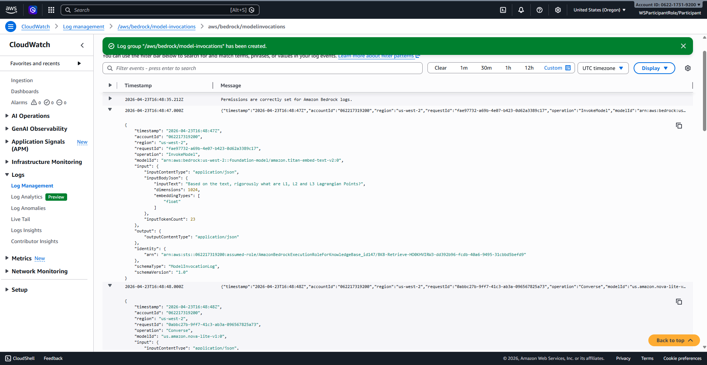
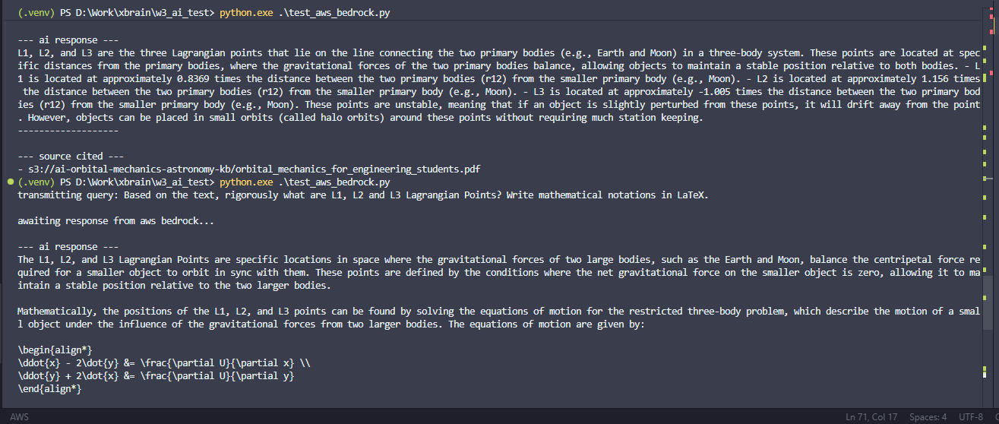

## AWS Bedrock Evidence: Knowledge Base RAG Implementation

### section overview
This task involved performing a stress-test query against orbital mechanics textbooks stored in an Amazon Bedrock Knowledge Base. The objective was to retrieve a specific mathematical definition (Matrix K) and verify that the system could correctly cite its sources from S3 using a Retrieval-Augmented Generation (RAG) workflow.

### Technical Implementation & Commentary
To demonstrate production-ready integration, I implemented this solution using the **AWS SDK for Python (Boto3)** rather than the Bedrock Playground. 

**Key Technical Highlights:**
*   **Programmatic Invocation:** Used the `bedrock-agent-runtime` client to trigger the `retrieve_and_generate` operation.
*   **Model Selection:** Leveraged the **Amazon Nova 2 Lite v1** model via a cross-region inference profile (`us.amazon.nova-lite-v1:0`) for efficient, low-latency processing in `us-west-2`.
*   **Factual Integrity:** Set a low `temperature` of **0.1** to ensure the model stayed strictly focused on the retrieved textbook data, minimizing hallucinations in the LaTeX output.
*   **Observability:** Successfully configured **Model Invocation Logging** to capture the full request/response lifecycle in CloudWatch, providing an audit trail for the inference.

---

### Invocation Code (Python/Boto3)
The following script was used to execute the query. It handles the retrieval of relevant chunks from the Knowledge Base and the subsequent generation of the response by the LLM.

```python
import boto3

# Initialize the Bedrock Agent Runtime client for us-west-2
client = boto3.client('bedrock-agent-runtime', region_name='us-west-2')

# Configuration
KNOWLEDGE_BASE_ID = 'HO0KHVIRW3' 
MODEL_ARN = 'us.amazon.nova-lite-v1:0' 

query = "Based on the text, what is the mathematical definition of the matrix K? Please output the equation in LaTeX format."

try:
    # Execute the retrieve and generate call
    response = client.retrieve_and_generate(
        input={'text': query},
        retrieveAndGenerateConfiguration={
            'type': 'KNOWLEDGE_BASE',
            'knowledgeBaseConfiguration': {
                'knowledgeBaseId': KNOWLEDGE_BASE_ID,
                'modelArn': MODEL_ARN,
                'retrievalConfiguration': {
                    'vectorSearchConfiguration': {'numberOfResults': 10}
                },
                'generationConfiguration': {
                    'inferenceConfig': {
                        'textInferenceConfig': {
                            'maxTokens': 1024,
                            'temperature': 0.1,
                            'topP': 0.9
                        }
                    }
                }
            }
        }
    )

    # Print the final AI response
    print(f"AI Response:\n{response['output']['text']}")

except Exception as e:
    print(f"Error during execution: {e}")
```

---

### Evidence Verification

#### 1. CloudWatch Log Entry


**Commentary:** 
The CloudWatch logs show successful `InvokeModel` and `Converse` operations. The logs confirm that the Bedrock service assumed the correct IAM execution role to retrieve data from the Knowledge Base and generate a response using the Nova Lite model.

#### 2. Model Output & Citations


**Commentary:** 
The terminal output confirms the model successfully formatted the mathematical definition of Matrix K in LaTeX. Furthermore, the `retrievedReferences` metadata provides the specific S3 URIs of the orbital mechanics textbooks used to ground the answer, completing the RAG requirements.