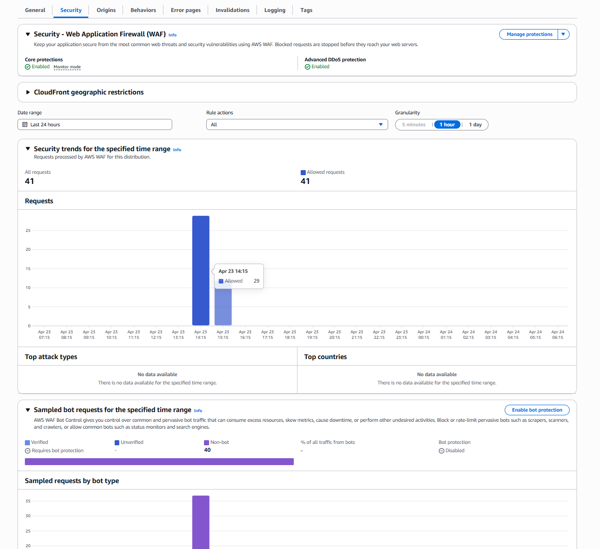
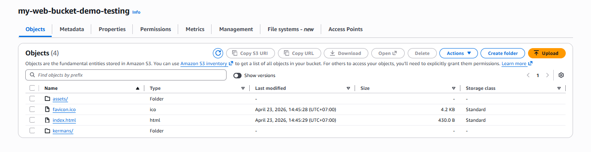
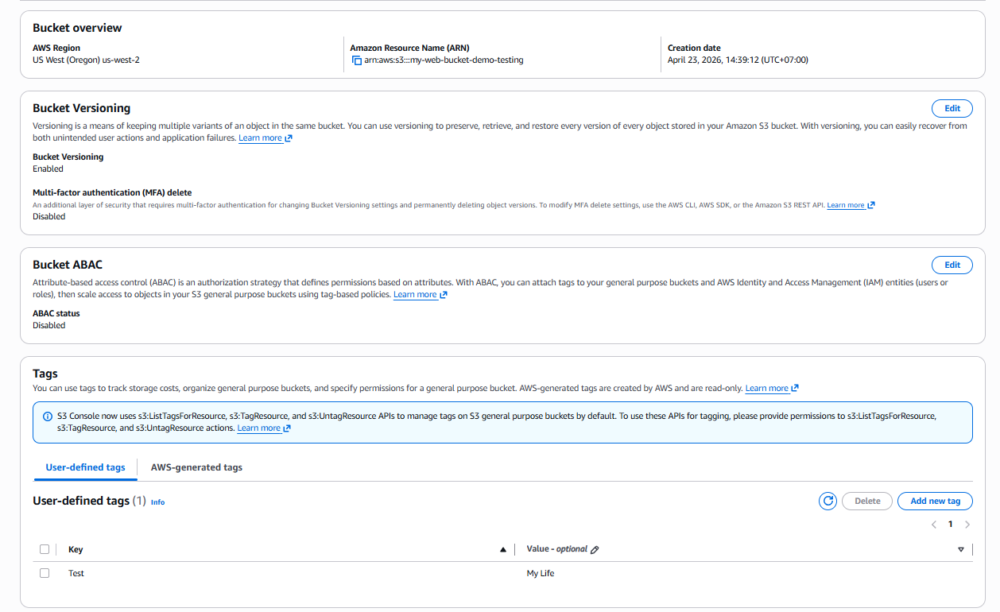
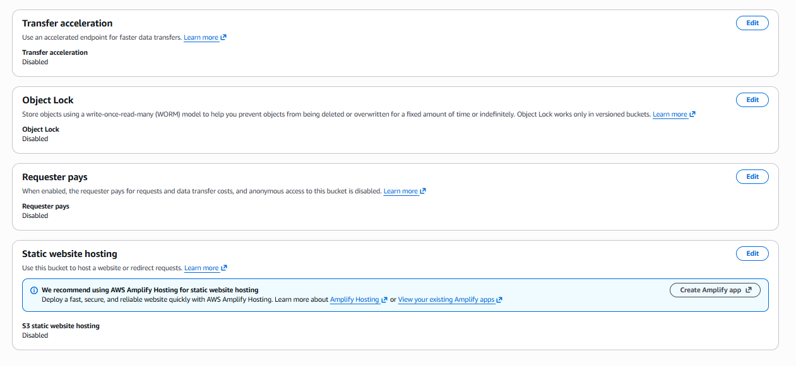
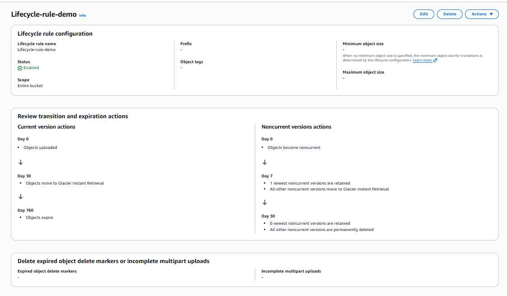

# W3 Evidence — S3 & Networking Layer
> Covers: CloudFront Distribution · WebStatic Bucket · Centralized Logging Bucket · Bedrock Knowledge Base S3 Integration · S3 Gateway VPC Endpoint

---

## Section 3 — Deployment Evidence

### 3.1 CloudFront Distribution

**Acceptance criterion:** Distribution deployed, WAF / Advanced DDoS protection enabled, default root object set, S3 origin locked down via OAC bucket policy.

**Screenshot 1 — Distribution overview + WAF Security tab**

**Screenshot 2 — CloudFront Logging tab (real-time log config attached)**

**Configuration notes:**
- Default root object set to `index.html` — requests to `/` resolve to the static entry point without exposing the bucket path.
- **WAF enabled (Core protections — Monitor mode).** Advanced DDoS protection is shown as *Enabled* in the Security tab. WAF is in Monitor mode initially to baseline real traffic patterns before switching to Block mode.
- Standard logging and Cookie logging are both Off. We forward access logs to the Centralized Logging S3 bucket via the CloudWatch real-time log config, giving lower-latency visibility than S3 batch delivery.

---

### 3.2 S3 — WebStatic Bucket (Origin for CloudFront)

**Acceptance criterion:** Bucket holds static frontend files, Block Public Access ON, OAC bucket policy restricts GetObject to the CloudFront distribution ARN only.

**Screenshot 3 — WebStatic bucket objects list**

**Screenshot 4 — Bucket policy and Block Public Access detail**

**Screenshot 5 — Properties tab: Default encryption, Object Lock, Lifecycle**

**Configuration notes:**
- **Block Public Access is ON** (all public access blocked).
- Bucket policy enforces `PolicyForCloudFrontPrivateContent`: `Effect: Allow`, `Principal: cloudfront.amazonaws.com`, `Action: s3:GetObject`. This is OAC (Origin Access Control) — CloudFront is the only authorized reader. 
- Object Ownership: **Bucket owner enforced** — access is entirely policy-driven.
- **Default encryption:** SSE-S3 (AWS-managed keys). Bucket Key is Enabled to reduce KMS API call costs.
- **Bucket Versioning:** Enabled. Object Lock is Enabled.

---

### 3.3 S3 — Centralized Logging Bucket

**Acceptance criterion:** Separate bucket for CloudFront / application logs, Block Public Access ON, Versioning enabled, encryption enabled.

**Screenshot 6 — Centralized Logging S3 Bucket Overview & Structure**

**Screenshot 7 — Logging Bucket Properties & Policy**

**Configuration notes:**
- Similar security baseline as the WebStatic bucket: **Block Public Access ON**, **Versioning Enabled**, SSE-S3 encryption, Bucket Key enabled.
- The bucket policy receives log delivery writes from the S3 Log Delivery group rather than CloudFront reads.
- **Lifecycle rule configured:** Transitions logs to Glacier Instant Retrieval at Day 30 and expires them at Day 760, keeping long-term log storage costs predictable.

---

### 3.4 S3 — Bedrock Knowledge Base Bucket

**Acceptance criterion:** S3 buckets from W2 remain with Block Public Access ON, default encryption enabled, and versioning turned on. The Bedrock Knowledge Base must connect to one of these existing buckets.

**Screenshot 8 — Bedrock S3 Data Source details**

**Configuration notes:**
- Reused a W2 S3 bucket without creating a new one, as mandated by the requirements.
- Maintained the strict security posture: **Block Public Access ON**, default encryption enabled, versioning on.
- Documents are successfully ingested for the Knowledge Base vector store synchronization.

---

## Section 6 — VPC + Networking Evidence

### 6.1 S3 Gateway VPC Endpoint

**Acceptance criterion:** S3 Gateway Endpoint provisioned, labeled on diagram with route table entry, associated with application and isolated route tables.

**Screenshot 9 — S3 Gateway VPC Endpoint detail + Status**

**Screenshot 10 — VPC Endpoint Route Tables Association**

**Configuration notes:**
- Service name: `com.amazonaws.[region].s3`. Endpoint type: **Gateway**. Status: **Available**.
- Associated with both the application tier route table and the isolated/database tier route table.
- Traffic from EC2 instances and Lambda in the application tier to S3 (WebStatic, Logging, and Bedrock buckets) travels **entirely within the AWS network** via this endpoint. No NAT Gateway charge is accumulated, and the data remains private.
