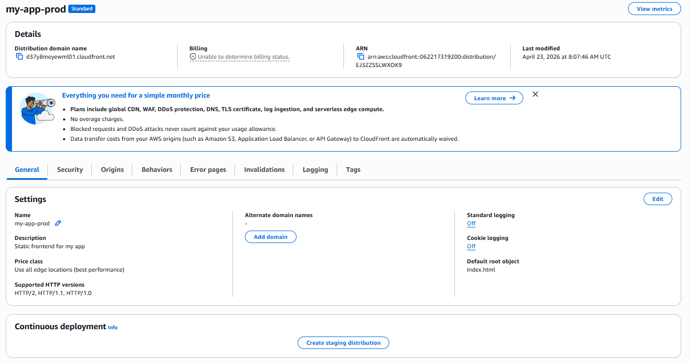
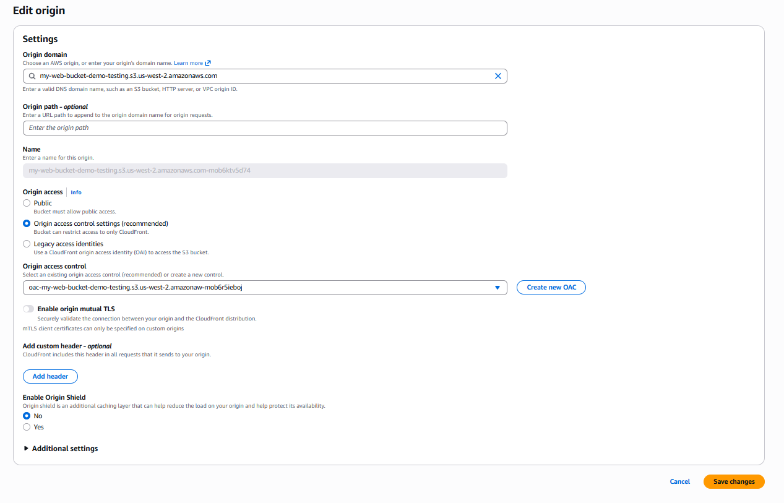
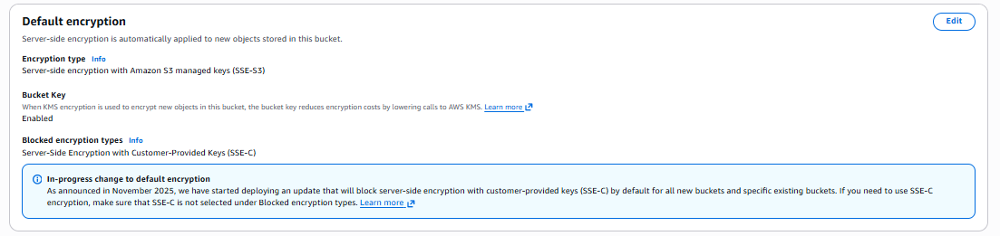
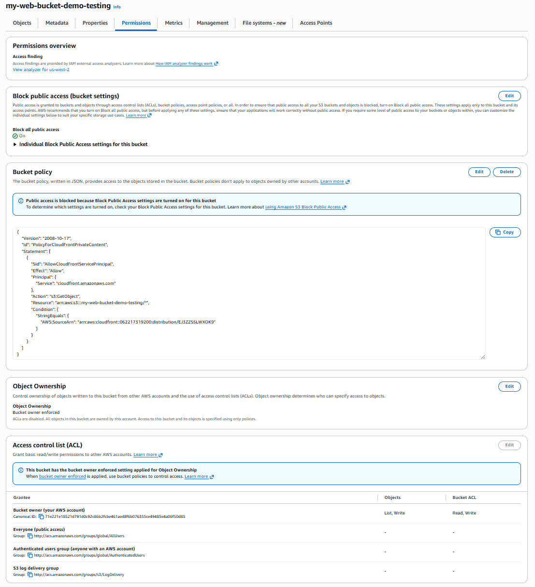
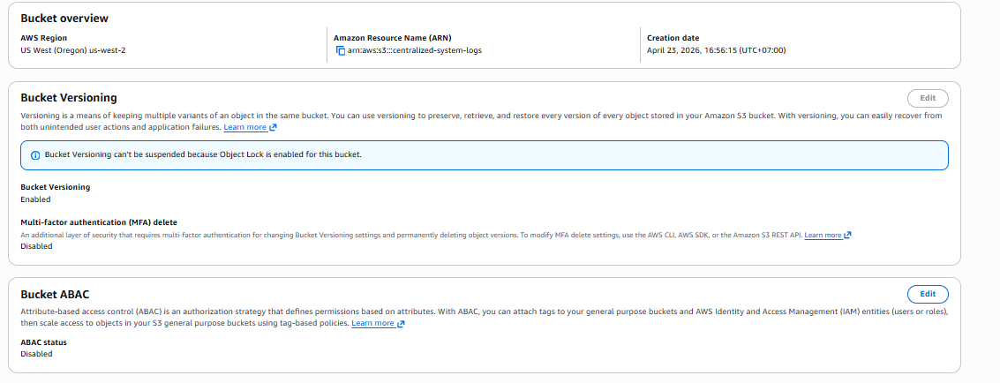
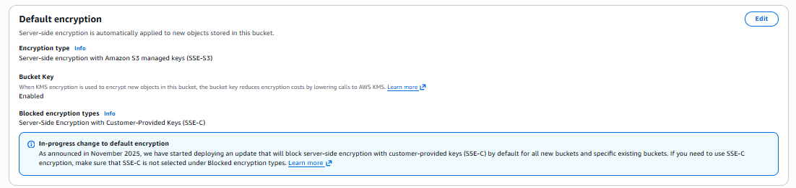
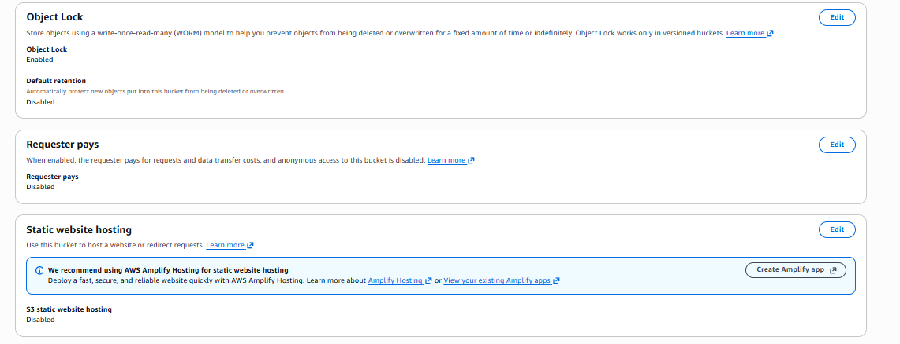
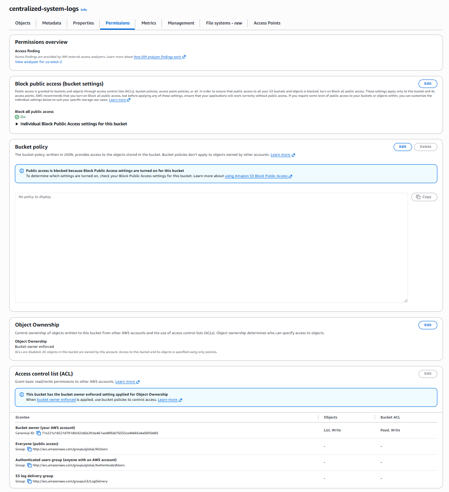
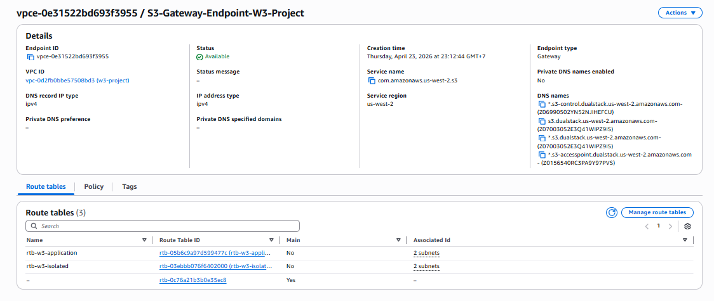

# W3 Evidence — S3 & Networking Layer
> Covers: CloudFront Distribution · WebStatic Bucket · Centralized Logging Bucket · S3 Gateway VPC Endpoint

---

## Section 3 — Deployment Evidence

### 3.1 CloudFront Distribution

**Acceptance criterion:** Distribution deployed, WAF / Advanced DDoS protection enabled, default root object set, S3 origin locked down via OAC bucket policy.

**Screenshot 1 — CloudFront Distribution (General Settings)**

**Screenshot 2 — CloudFront Security / WAF tab**

**Screenshot 3 — CloudFront Edit Origin (S3 origin)**

**Configuration notes:**
- Default root object set to `index.html` — requests to `/` resolve to the static entry point without exposing the bucket path.
- **WAF enabled (Core protections — Monitor mode).** Advanced DDoS protection shown as *Enabled* in the Security tab. We kept WAF in Monitor mode initially to baseline real traffic patterns before switching to Block mode.
- Origin strictly locked to `my-web-bucket-demo-testing` via OAC — no public bucket URL works.

---

### 3.2 S3 — WebStatic Bucket (`my-web-bucket-demo-testing`)

**Acceptance criterion:** Bucket holds static frontend files, Block Public Access ON, OAC bucket policy restricts GetObject to the CloudFront distribution ARN only.

**Screenshot 4 — Objects tab**

**Screenshot 5 — Properties tab**

**Screenshot 6 — Default Encryption (SSE-S3)**

**Screenshot 7 — Properties continued**

**Screenshot 8 — Permissions tab (Block Public Access, Bucket Policy, ACL)**

**Configuration notes:**
- **Block Public Access is ON** (all public access blocked at the bucket level).
- Bucket policy enforces `PolicyForCloudFrontPrivateContent`: `Effect: Allow`, `Principal: cloudfront.amazonaws.com`, `Action: s3:GetObject`. This is OAC — CloudFront is the only authorized reader.
- Object Ownership: **Bucket owner enforced** — access is entirely policy-driven.
- **Default encryption:** SSE-S3 (AWS-managed keys). Bucket Key is Enabled to reduce KMS API call costs.
- **Bucket Versioning:** Enabled. Object Lock is Enabled.

---

### 3.3 S3 — Centralized Logging Bucket (`centralized-system-logs`)

**Acceptance criterion:** Separate bucket for CloudFront / application logs, Block Public Access ON, Versioning enabled, encryption enabled.

**Screenshot 9 — Properties tab**

**Screenshot 10 — Default Encryption**

**Screenshot 11 — Properties continued**

**Screenshot 12 — Permissions tab (Block Public Access, Bucket Policy, ACL)**

**Screenshot 13 — Lifecycle Rule (`lifecycle-rule-demo`)**

**Configuration notes:**
- Same security baseline as the WebStatic bucket: **Block Public Access ON**, SSE-S3 encryption, Versioning Enabled.
- The bucket policy receives log delivery writes from the S3 Log Delivery group rather than CloudFront reads.
- **Lifecycle rule `lifecycle-rule-demo`:** Transitions logs to Glacier Instant Retrieval at Day 30, expires at Day 760 — keeping long-term log storage costs predictable.

---

## Section 6 — VPC + Networking Evidence

### 6.1 S3 Gateway VPC Endpoint

**Acceptance criterion:** S3 Gateway Endpoint provisioned, labeled on diagram with route table entry, associated with application and isolated route tables.

**Screenshot 14 — VPC Endpoint `vpce-0e31522bd693f3955` / S3-Gateway-Endpoint-W3-Project**

**Configuration notes:**
- Endpoint ID: `vpce-0e31522bd693f3955`. Service: `com.amazonaws.us-west-2.s3`. Type: **Gateway**. Status: **Available**.
- Associated with both the application tier route table (`rtb-w5-appl…`) and the isolated/database tier route table (`rtb-w5-isolat…`).
- Traffic from Lambda and EC2 in the application tier to S3 travels **entirely within the AWS network** — no NAT Gateway charge, no public internet path.
- We configured this because routing S3 traffic through a NAT Gateway costs ~$0.045/GB egress plus NAT hourly; a Gateway endpoint is free and keeps the data path private.
