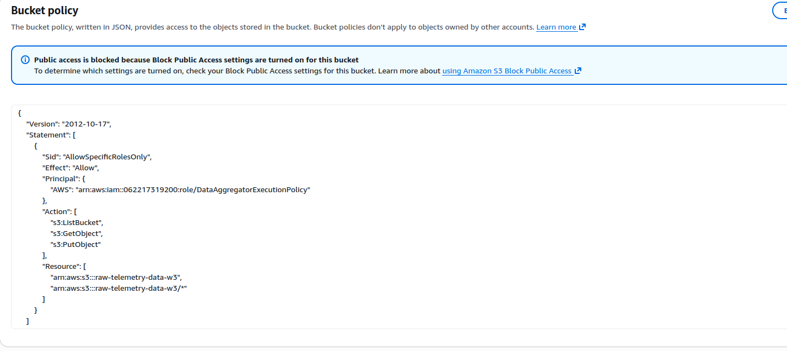
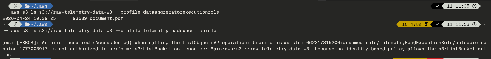

## AWS Security Validation: Least Privilege and Negative Testing

### section overview
This task involved performing empirical validation of our Surgical Architecture guardrails by comparing the access levels of two distinct project identities. The objective was to demonstrate the Principle of Least Privilege (PoLP) by contrasting authorized data retrieval with an unauthorized access attempt. This process provides the mandatory Negative Security Testing evidence required for the Week 3 audit, proving that our S3 bucket policies physically block cross-service data leakage.

### Technical Implementation and Commentary
To demonstrate production-ready security, I utilized the AWS CLI to impersonate different project identities. By leveraging named profiles, we simulated the exact execution environment of our compute resources (Step 6 and Step 7 in our architecture) to verify that identity-based boundaries and network-level hardening are correctly enforced.

**Key Technical Highlights:**
*   **Tiered Hardening Comparison:** Contrasted a VPC-level locked policy (Telemetry Reader) with a Subnet-level hardened policy (Data Aggregator) to demonstrate the evolution of our security model.
*   **Identity Isolation:** Verified that the Telemetry Read-API is restricted to its own data domain and is physically unable to access the raw telemetry storage tier.
*   **Resource-Based Enforcement:** The validation confirms that access is denied at the S3 bucket level unless the requesting identity is explicitly whitelisted, regardless of their project-level permissions.

---

### Lambda Execution Policies (JSON)

Below are the configurations for the two identities used in this validation. These policies demonstrate the difference between standard VPC isolation and the Week 3 Surgical Standard.

#### 1. TelemetryReadExecutionPolicy (Unauthorized Identity)
This policy uses a VPC-locked condition for network connectivity but lacks the subnet-level precision of the aggregator.

```json
{
    "Version": "2012-10-17",
    "Statement": [
        {
            "Sid": "AllowSurgicalDBLogin",
            "Effect": "Allow",
            "Action": "rds-db:connect",
            "Resource": "arn:aws:rds-db:us-west-2:062217319200:dbuser:prx-05b1fe369835614ca/telemetry_user"
        },
        {
            "Sid": "AllowVPCDescribeOnly",
            "Effect": "Allow",
            "Action": "ec2:DescribeNetworkInterfaces",
            "Resource": "*"
        },
        {
            "Sid": "AllowVPCCreateDeleteEniStrict",
            "Effect": "Allow",
            "Action": [
                "ec2:CreateNetworkInterface",
                "ec2:DeleteNetworkInterface"
            ],
            "Resource": "*",
            "Condition": {
                "StringEquals": {
                    "ec2:Vpc": "arn:aws:ec2:us-west-2:062217319200:vpc/vpc-0d2fb0bbe57508bd3"
                }
            }
        },
        {
            "Sid": "AllowCloudWatchLogging",
            "Effect": "Allow",
            "Action": [
                "logs:CreateLogGroup",
                "logs:CreateLogStream",
                "logs:PutLogEvents"
            ],
            "Resource": [
                "arn:aws:logs:us-west-2:062217319200:log-group:/aws/lambda/Telemetry_Read_API",
                "arn:aws:logs:us-west-2:062217319200:log-group:/aws/lambda/Telemetry_Read_API:*"
            ]
        }
    ]
}
```

#### 2. DataAggregatorExecutionPolicy (Authorized Identity)
This policy implements the "Gold Standard" by listing explicit Subnet and Security Group ARNs, eliminating network wildcards entirely.

```json
{
    "Version": "2012-10-17",
    "Statement": [
        {
            "Sid": "AllowSurgicalDBLogin",
            "Effect": "Allow",
            "Action": "rds-db:connect",
            "Resource": "arn:aws:rds-db:us-west-2:062217319200:dbuser:prx-05b1fe369835614ca/telemetry_user"
        },
        {
            "Sid": "AllowSurgicalVPCDiscovery",
            "Effect": "Allow",
            "Action": "ec2:DescribeNetworkInterfaces",
            "Resource": "*"
        },
        {
            "Sid": "AllowSurgicalENICreation",
            "Effect": "Allow",
            "Action": "ec2:CreateNetworkInterface",
            "Resource": [
                "arn:aws:ec2:us-west-2:062217319200:network-interface/*",
                "arn:aws:ec2:us-west-2:062217319200:subnet/subnet-0346c434f37803738",
                "arn:aws:ec2:us-west-2:062217319200:subnet/subnet-03c004f29633e7943",
                "arn:aws:ec2:us-west-2:062217319200:security-group/sg-05380992383823482"
            ]
        },
        {
            "Sid": "AllowAccessToS3",
            "Effect": "Allow",
            "Action": [
                "s3:ListBucket",
                "s3:GetObject",
                "s3:PutObject"
            ],
            "Resource": [
                "arn:aws:s3:::raw-telemetry-data-w3",
                "arn:aws:s3:::raw-telemetry-data-w3/*"
            ]
        }
    ]
}
```

---

### Security Validation Workflow

#### 1. S3 Bucket Policy Configuration
The following policy ensures that access is restricted to the specific authorized identity.



#### 2. Comparative Access Validation (CLI)
The results below confirm that our surgical boundaries successfully differentiate between project identities.



**Technical Commentary:**
*   **Success Path:** The `dataaggreratorexecutionrole` successfully performs the list operation. This validates that the combination of its identity-based S3 permissions and the bucket-level resource policy allows authorized traffic to flow perfectly.
*   **Failure Path:** The `telemetryreadexecutionrole` attempt is met with an `AccessDenied` error. This demonstrate that even a project-internal identity is blocked from data tiers it does not surgically need.
