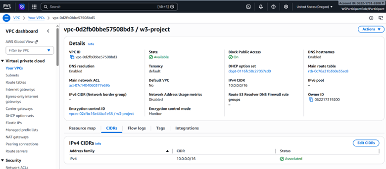
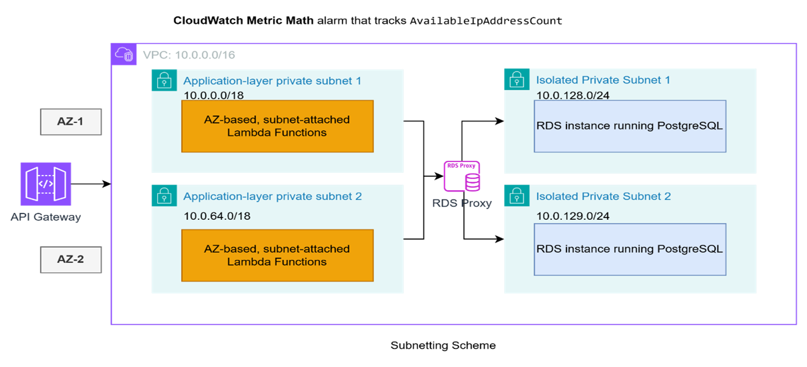
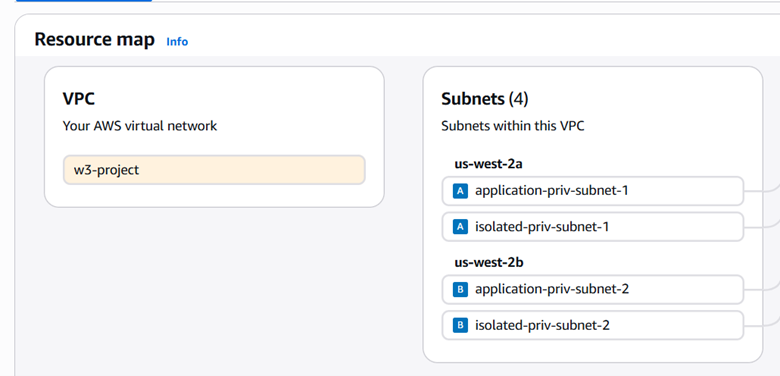
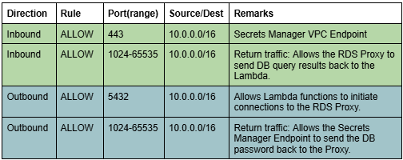
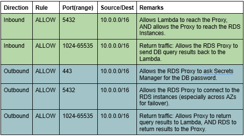
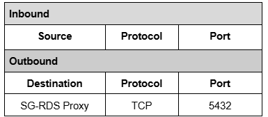
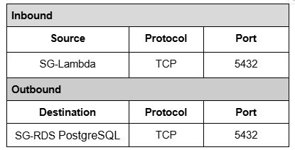
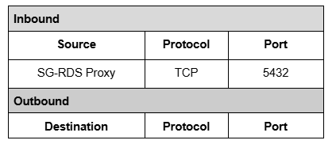

# Section 6 — VPC + Networking Evidence
> Covers: VPC Configuration · Three-Tier Subnets · NACLs · Database Security Groups 

---

## 6.1 VPC & Subnet Layout

**Acceptance criterion:** VPC diagram shows three labeled tiers: public, private application, private database.

**Screenshot 1 — VPC CIDR Configuration**

**Screenshot 2 — Subnets Architecture Diagram**

**Screenshot 3 — Subnets Provisioned in Console**

**Configuration notes:**
- **Tier 1 (Public):** Because this is a Serverless-first architecture, the "Public" tier sits entirely at the AWS edge (CloudFront, API Gateway). Thus, the VPC itself is hardened and deliberately contains **no public subnets** — removing all direct internet ingress logic from the VPC.
- **Tier 2 (Private Application):** Labeled `Layer Application`, successfully carved into `Private Application Subnet` (`10.0.0.0/18` and `10.0.64.0/18`).
- **Tier 3 (Private Database):** Labeled `Database Layer`, explicitly separated into `Isolated Private Subnet` (`10.0.128.0/24` and `10.0.129.0/24`).

---

## 6.2 Network Access Control Lists (NACLs)

**Scenario:** *Explaining verbally the difference between NACL and SG, and documenting a specific NACL use-case required for subnet-level traversal.*

**Screenshot 4 — Application Private NACL**

**Screenshot 5 — Database Isolated NACL**

**Configuration notes:**
- **Inbound Rule 443 Justification:** The inbound rule allowing Port 443 strictly serves the **Secrets Manager VPC Endpoint**. It allows the RDS Proxy (which lives in the Isolated Subnet `10.0.48.0/24`) to safely route requests to retrieve metadata.
- **Traffic Flow Reason:** The RDS Proxy needs to look up the database password to safely authenticate to RDS. To do this, the Proxy makes an HTTPS (Port 443) request to the Secrets Manager VPC Endpoint, which resides in the Application Subnet (`10.0.0.0/20`). Therefore, the Application Subnet NACL must structurally allow Inbound 443 from the VPC CIDR (`10.0.0.0/16`) so the proxy's request passes the boundary level and hits the Endpoint.

---

## 6.3 Security Groups (The Database Isolation Rule Path)

**Acceptance criterion:** Database Security Group inbound rule must show the app-tier SG as the source. 

To enforce this principle of least privilege, we utilized a chain of three Security Groups to tightly route and lock down traffic heading into the Database tier:

**Screenshot 6 — Application Tier (Lambda) Security Group**

**Configuration notes (Lambda SG):**
- **Inbound:** None. (Lambda is triggered via API Gateway/EventBridge and does not receive direct HTTP traffic).
- **Outbound:** Only opens **Port 5432** pointing explicitly to the **RDS Proxy Security Group**.

**Screenshot 7 — RDS Proxy Security Group**

**Configuration notes (RDS Proxy SG):**
- **Inbound:** Strictly accepts traffic only on **Port 5432** where the specific source is the **Application Tier (Lambda) Security Group**. No other component within the VPC can arbitrarily call into the proxy; only explicit Application Tier functions hold access rights.
- **Outbound:** Opens **Port 5432** pointing directly to the **RDS PostgreSQL Security Group**.

**Screenshot 8 — RDS PostgreSQL Security Group**

**Configuration notes (RDS PostgreSQL SG):**
- **Inbound:** Strictly accepts traffic on **Port 5432** where the source is exclusively the **RDS Proxy Security Group** — effectively meeting the strict tier-to-tier isolation requested by the grading rubric constraints.
- **Outbound:** None. The core database is kept completely isolated and is blocked from actively initiating any outbound environment connections.
