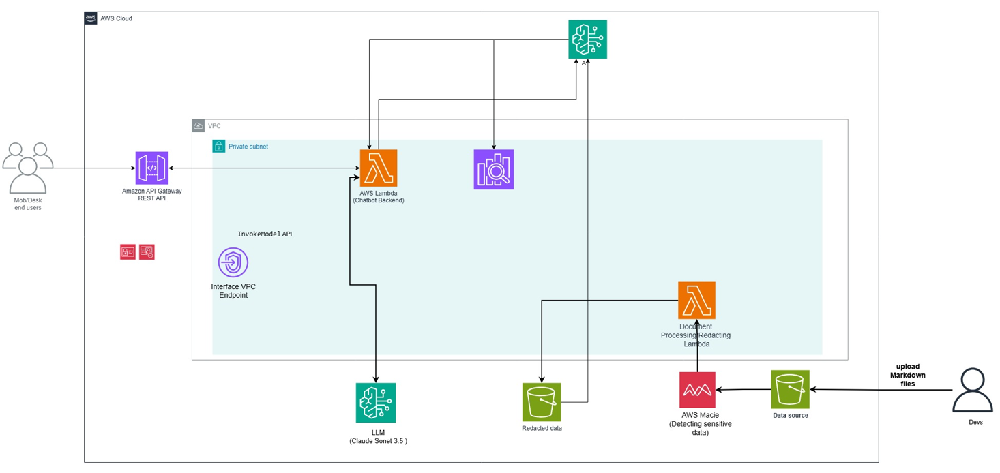
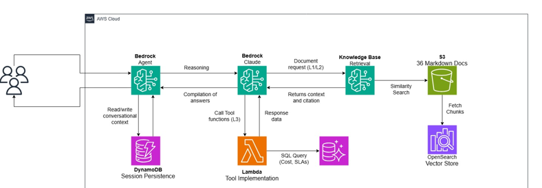
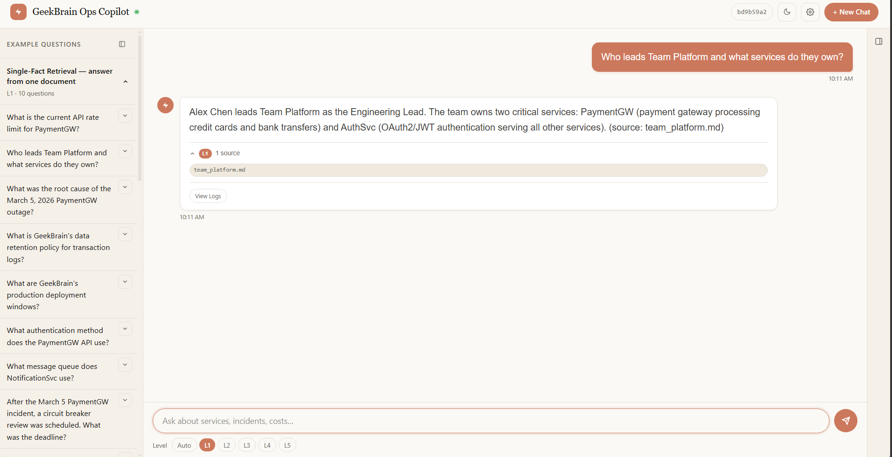
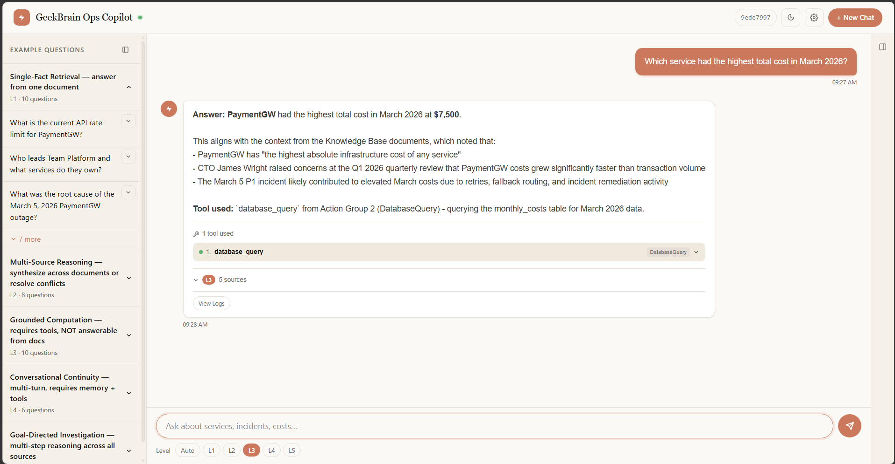
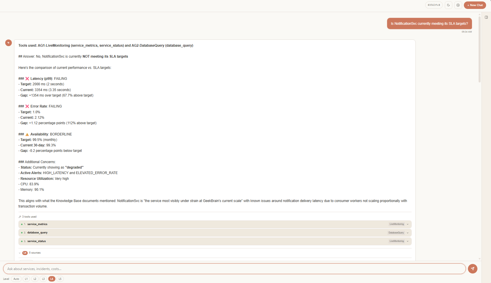
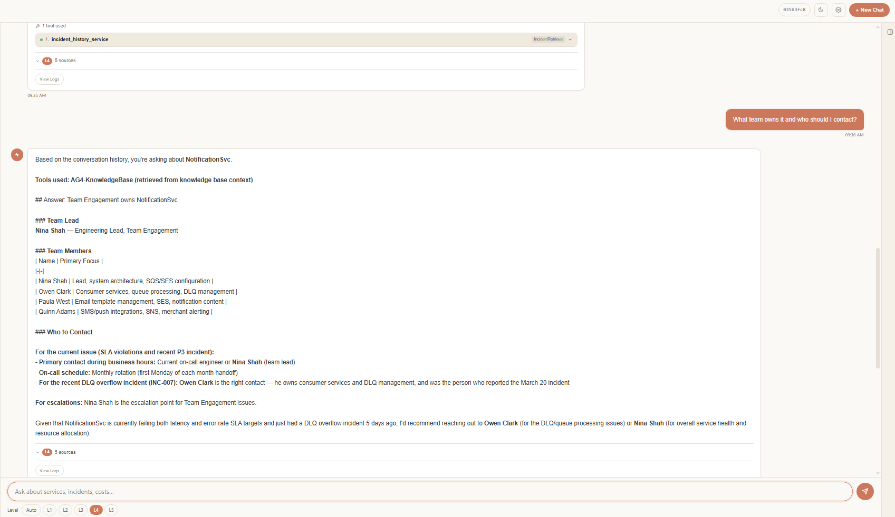
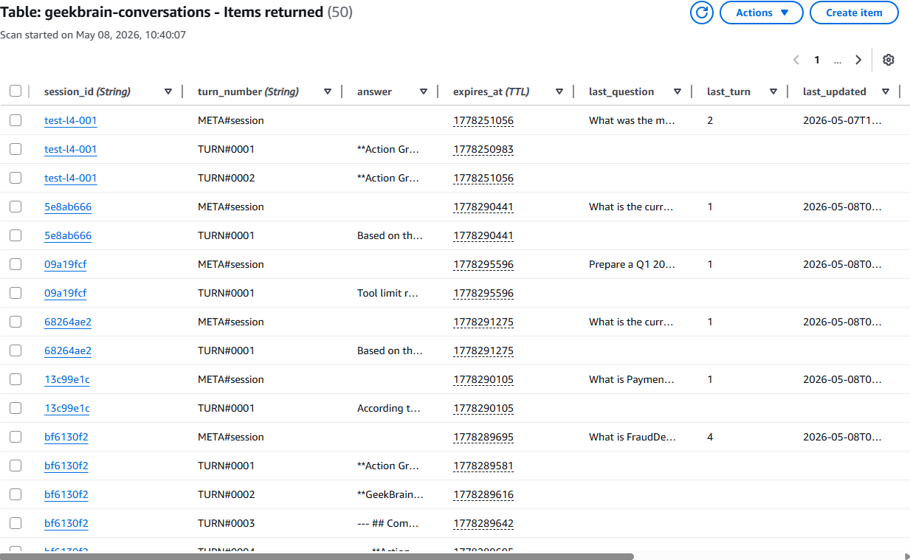
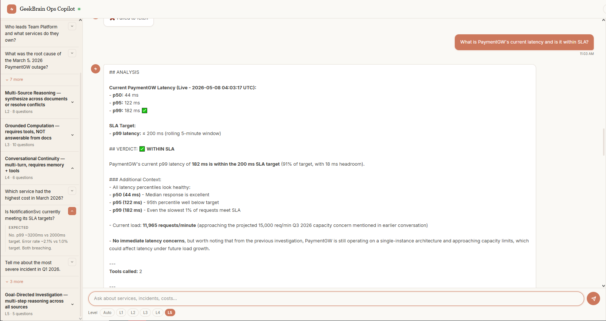
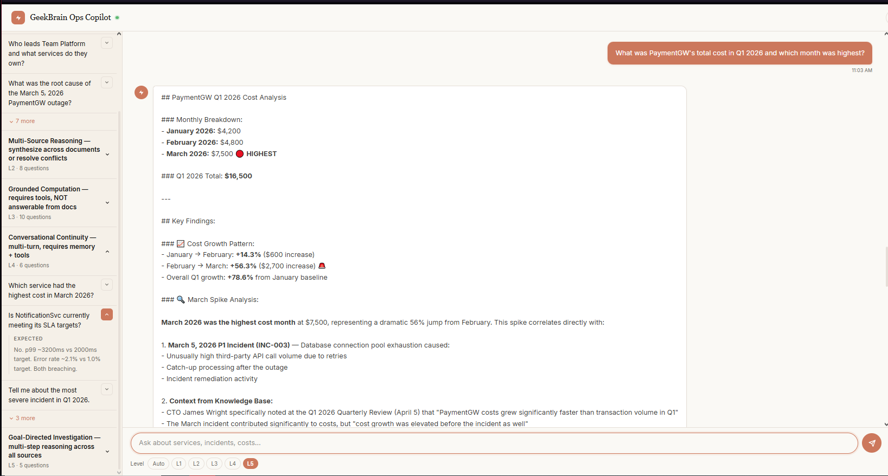
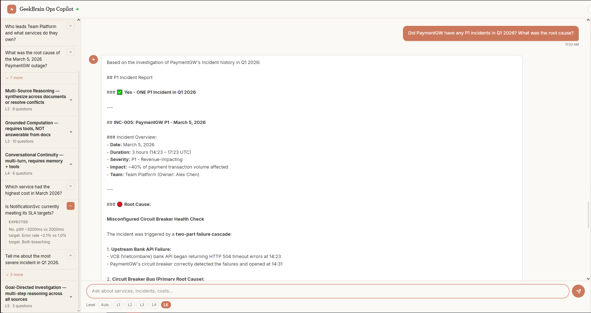

# Evidence Pack - Group 1

**Project:** GeekBrain AI Operations Copilot  
**Submission Date:** 08/05/2026  

---

## Section 1 — Cover

* **Group Number:** Group 1
* **Members:** Phan Thị Thủy Hiền, Hoàng Nhật Thành, Nguyễn Qúy Hưng, Nguyễn Hoàng Huy, Phạm Tùng Dương, Nguyễn Quang Phong, Trần Đình Minh Quân, Phan Nguyên Đạt, Võ Đức Vũ
* **LLM Used:** Claude 4.5 Sonnet (via Amazon Bedrock)
* **Framework:** Custom Agent (Raw API Orchestration via AWS Lambda)
* **Link Repository:** https://github.com/JaxTheDeveloper/techx_aws_resources.git

---

## Section 2 — Architecture Overview

### 1. System Architecture Diagram

Level 1-2:

Level 3-4:


### 2. Component List

* **API Gateway:** Receive request REST from Frontend.
* **Custom Agent Lambda:** Orchestrator perform loop to call Knowledge Base, process Tool Use and manage conversation with LLM.
* **Knowledge Base (KB):** Store 36 Markdown files of GeekBrain, provide semantic search capability.
* **DynamoDB(SQLite):** Store conversation history.
* **Claude 4.5 Sonnet:** Main LLM perform reasoning, extract data and summarize the answer.
* **OpenSearch Vector Store:** Store vectorized chunks of Knowledge Base.

### 3. Screenshot System Running
[GeekBrain](http://w4-geekbrain-test-ui.s3-website-us-east-1.amazonaws.com)

---

## Section 3 — Decision Log
### KB retrieval strat
The chunking strategy for our Knowledge Base (KB) directly influenced our choice of retrieval method, balancing autonomy with ease of deployment. Since our primary goal was a native AWS integration (rejecting on-prem FAISS), we optimized for **semantic chunking**:

*   **L1 (Simple RAG):** Utilizes `RetrieveAndGenerate()`. This was necessary because a standard `Retrieve()` only fetched the first child chunk, which impeded overall context quality.
*   **L2–L5 (Advanced RAG):** Employs the `Retrieve()` API with a higher density of **10 chunks** to provide richer context for complex queries.

### Structured data querying for L3-L5
We evaluated three storage options for structured data, prioritizing the transition from PoC to production:

1.  **SQLite (Current PoC):** Implemented as a Lambda Layer for rapid development and low latency.
2.  **S3 + Amazon Athena:** Offers low storage costs but was rejected for L5 iterations due to a **1–5s cold start** latency.
3.  **Amazon Aurora (PostgreSQL):** The long-term target for production. While the environment is provisioned, data population is pending. 
    *   *Note: While SQLite served the PoC, Aurora is the designated "best practice" for performance and scalability.*


*Figure : Provisioned Amazon Aurora PostgreSQL instance intended for production-grade data persistence.*

### API Hosting and Deployment
Our hosting strategy evolved to overcome infrastructure overhead:

*   **Development Workaround:** During early development, the team temporarily hosted the API on **port 8000** via an **ngrok dev domain** to bypass Fargate setup complexity and iterate quickly.
*   **Current Solution:** The monitoring API is containerized and deployed on **AWS Fargate**, exposed via a stable Fargate task endpoint. The Lambda function reads the endpoint from an environment variable, as shown below:
```py
#/lambda/chat_handler.py

from geekbrain.prompts import (
    L1_SYSTEM_PROMPT,
    L2_SYSTEM_PROMPT,
    L3_SYSTEM_PROMPT,
    L5_SYSTEM_PROMPT
)

KNOWLEDGE_BASE_ID = os.environ.get("KB_ID", "YOUR_KB_ID")
MODEL_ID = "us.anthropic.claude-sonnet-4-5-20250929-v1:0"
MONITORING_API_URL = os.environ.get("MONITORING_API_URL", "http://YOUR_FARGATE_IP:8000") # points to the Fargate task public IP
GUARDRAIL_ID = os.environ.get("GUARDRAIL_ID", "")
GUARDRAIL_VERSION = os.environ.get("GUARDRAIL_VERSION", "DRAFT")
```
*   **Result:** Deploying on Fargate provided a persistent, cloud-native endpoint, allowing L3–L5 modules to execute reliably without dependency on a local tunnel.
---


*Figure : Monitoring URL environment variable pointing to the AWS Fargate task endpoint.*

## Section 4 — Per-Level Evidence

### L1 Evidence
* **Question:** "Who leads Team Platform and what services do they own?"
* **Screenshot Output:**

* **Retrieval Evidence:**
 ```json
{
  "level": "L1 - Simple RAG",
  "answer": "Alex Chen leads Team Platform as the Engineering Lead. The team owns two critical services: PaymentGW (payment gateway processing credit cards and bank transfers) and AuthSvc (OAuth2/JWT authentication serving all other services). (source: team_platform.md)",
  "kb_sources": [
    "team_platform.md"
  ],
  "chunks_retrieved": 1,
  "chunks_detail": [],
  "tools_used": []
}
```

### L2 Evidence
* **Question:** "What is the API rate limit for PaymentGW?"
* **Screenshot:**

* **Processing Evidence:** "The v2 documentation supersedes v1 (which was explicitly archived in March 2025). The v2 document is marked as "CURRENT" and is the official reference as of March 2025. The v1 document even includes a note acknowledging that "v2.0 raises this limit.""

### L3 Evidence
* **Question:** "Which service had the highest total cost in March 2026?"
* **Screenshot:**

* **Tool Call Evidence:**
```json
{
  "level": "L3 - RAG + Tools",
  "answer": "**Answer:** **PaymentGW** had the highest total cost in March 2026 at **$7,500**.\n\nThis aligns with the context from the Knowledge Base documents, which noted that:\n- PaymentGW has \"the highest absolute infrastructure cost of any service\"\n- CTO James Wright raised concerns at the Q1 2026 quarterly review that PaymentGW costs grew significantly faster than transaction volume\n- The March 5 P1 incident likely contributed to elevated March costs due to retries, fallback routing, and incident remediation activity\n\n**Tool used:** `database_query` from Action Group 2 (DatabaseQuery) - querying the monthly_costs table for March 2026 data.",
  "tools_used": [
    {
      "step": 1,
      "action_group": "AG2-DatabaseQuery",
      "tool": "database_query",
      "api_endpoint": "SQLite /opt/geekbrain.db",
      "input": {
        "query": "SELECT service, total_cost FROM monthly_costs WHERE month = '2026-03' ORDER BY total_cost DESC LIMIT 1"
      },
      "result": {
        "results": [
          {
            "service": "PaymentGW",
            "total_cost": 7500
          }
        ],
        "count": 1
      },
      "status": "success"
    }
  ]
}
```

### L4 Evidence
* **Question:** "What is the total cost of PaymentGW in January 2026?"
* **Screenshot:**




* **Memory Strategy:**
One big table DynamoDB is chosen for context storage in favor for fast retrieval with efficient data modelling stategy. Adjacency table data pattern is used to store both conversation ID and turn ID. L5 also uses this memory strategy, since L5 is what L1-L4 has been doing, wrapped in a loop with an end state. Recall the defintion of classical AI agents. 


### L5 Evidence (Bonus B — Agent Reasoning)

> L5 is a goal-directed investigation mode: the agent plans its own approach, pulls data from multiple sources in sequence, and produces a structured report with visible reasoning steps. It is the accumulation of L1–L4 wrapped in an autonomous planning loop.

* **Question series (multi-step investigation on PaymentGW):**
  1. *"What is PaymentGW's current latency and is it within SLA?"*
  2. *"What was PaymentGW's total cost in Q1 2026 and which month was highest?"*
  3. *"Did PaymentGW have any P1 incidents in Q1 2026? What was the root cause?"*

* **Screenshots:**


*Figure: Agent queries live monitoring API (2 tool calls). PaymentGW p99 = 182 ms — WITHIN the 200 ms SLA target. Structured verdict with percentile breakdown returned.*


*Figure: Agent queries `monthly_costs` table via Database Query tool. Q1 total = **$16,500**. March ($7,500) identified as highest-cost month with a 56.3% spike attributed to the March 5 P1 incident.*


*Figure: Agent calls Incident History tool + synthesizes postmortem from KB. INC-005 confirmed as the sole P1 in Q1 2026 — root cause: misconfigured circuit-breaker health check causing a 3-hour outage affecting ~40% of payment volume.*

* **Agent Reasoning Strategy:**
  - The agent operates in a **planning loop**: it breaks the user's goal into sub-questions, determines which tool/source each sub-question requires, executes in order, and synthesizes a final structured report.
  - Each turn at L5 can invoke **multiple tool calls** (live metrics + DB + KB) before responding — unlike L3 which routes to a single tool per query.
  - Memory from the L4 DynamoDB session context is carried forward so the agent can reference findings from earlier turns (e.g., referencing the March spike identified in Turn 2 when explaining the incident in Turn 3).

---

## Section 5 — Reflection
* Transform the project from a playground-based PoC into a production system: ditch bad practices of attaching .sqlite files directly on lambda, into Aurora Postgres. 
* Define additional API schemes especially for Level 5: current system relies on REST, which is stateless and does not persist connections for more than 10-30 seconds. Further work will introduce an additional scheme using Websocket to handle MCP properly.
* API service has been successfully deployed to **AWS Fargate**; next steps include attaching an Application Load Balancer (ALB) and enabling auto-scaling for production readiness.