# MH2 — Network Firewall Hardening

## Path Chosen: Path A + Path B

**Path A rationale:** Lambda functions (`Market_Updater`, `Asset_Reader`, `Data_Aggregation_Worker`) in VPC-1 private application subnets route outbound traffic through NAT Gateways to reach AWS services (Bedrock, EventBridge, Secrets Manager, S3). Because internet egress exists via NAT Gateway, Path A (AWS Network Firewall) is required.

**Path B rationale:** In addition to the firewall, all Security Groups follow strict least-privilege with zero `0.0.0.0/0` inbound rules on any port, and all three NACLs enforce explicit DENY rules at subnet boundaries. Negative tests confirm traffic is blocked at both the NACL and SG layers independently.


*VPC-1 (10.1.0.0/16): Lambda functions in Private Application Subnet → Firewall Endpoint (Firewall Subnet 10.1.130.0/24) → NAT Gateway (Public Subnet 10.1.128.0/24) → Internet Gateway → Internet / AWS services.*

---

## Path A — AWS Network Firewall

### Firewall Configuration

**Firewall name:** `Xbrain-week-5-network-firewall`
**Region:** us-west-2
**VPC:** vpc-0c521a78e400424de (VPC-1, Application VPC)
**Firewall ARN:** `arn:aws:network-firewall:us-west-2:916586394009:firewall/Xbrain-week-5-network-firewall`

The firewall is deployed in dedicated firewall subnets in both AZs:

| AZ | Subnet Name | Subnet ID | CIDR | Firewall Endpoint ID |
|----|------------|-----------|------|----------------------|
| us-west-2a | Xbrain-w5-vpc1-az1-firewall | subnet-0dc035bc2b1100f9a | 10.1.130.0/24 | vpce-004b3004c1178900b |
| us-west-2b | Xbrain-w5-vpc1-az2-firewall | subnet-0d39802c7caf5bc30 | 10.1.131.0/24 | vpce-0fda99bbab15064eb |

---

### Stateful Rule Group

**Rule group name:** `Xbrain-week-5-egress-allowlist`
**Type:** STATEFUL (Suricata-compatible) | **Capacity:** 100

```
pass tls $HOME_NET any -> $EXTERNAL_NET 443 (tls.sni; content:"amazonaws.com"; endswith; msg:"Allow AWS APIs"; sid:1000001; rev:1;)
pass tls $HOME_NET any -> $EXTERNAL_NET 443 (tls.sni; content:"amazon.com"; endswith; msg:"Allow Amazon"; sid:1000002; rev:1;)
pass http $HOME_NET any -> $EXTERNAL_NET 80 (http.host; content:"amazonaws.com"; endswith; msg:"Allow AWS HTTP"; sid:1000003; rev:1;)
drop tls $HOME_NET any -> $EXTERNAL_NET 443 (msg:"Block all other TLS"; sid:1000099; rev:1;)
drop http $HOME_NET any -> $EXTERNAL_NET 80 (msg:"Block all other HTTP"; sid:1000098; rev:1;)
```

**Policy name:** `Xbrain-week-5-firewall-policy`
- Stateless default action: `aws:forward_to_sfe`
- Stateless fragment default action: `aws:forward_to_sfe`

---

### Route Tables — Traffic Path Through Firewall

Traffic path: **Lambda (private app subnet) → Firewall Endpoint → NAT Gateway → Internet**

| Route Table | Destination | Target | Purpose |
|-------------|-------------|--------|---------|
| Private App AZ-1 (`rtb-02ef961503435574f`) | 10.1.0.0/16 | local | VPC-1 local |
| | 10.2.0.0/16 | tgw-01871daf7792d3740 | VPC-2 via TGW |
| | 0.0.0.0/0 | vpce-004b3004c1178900b | All egress → Firewall AZ-1 |
| Private App AZ-2 (`rtb-09d4004101096a5fc`) | 10.1.0.0/16 | local | VPC-1 local |
| | 10.2.0.0/16 | tgw-01871daf7792d3740 | VPC-2 via TGW |
| | 0.0.0.0/0 | vpce-0fda99bbab15064eb | All egress → Firewall AZ-2 |
| Firewall Subnet AZ-1 (`rtb-0681d990fd063a5be`) | 0.0.0.0/0 | nat-09cac987171644a36 | After inspection → NAT AZ-1 |
| Firewall Subnet AZ-2 (`rtb-0efa808498bca5700`) | 0.0.0.0/0 | nat-09976d31fc2395af7 | After inspection → NAT AZ-2 |

---

### Firewall Flow Logs — Allowed Traffic Evidence

**Alert log group:** `/aws/network-firewall/Xbrain-week-5/alert`
**Flow log group:** `/aws/network-firewall/Xbrain-week-5/flow`
**Retention:** 7 days | **Destination:** CloudWatch Logs


*CloudWatch log group `/aws/network-firewall/Xbrain-w5/flow` — active FLOW log entries from `Xbrain-w5-network-firewall` in both `us-west-2a` and `us-west-2b`. Confirms live traffic is being inspected and passed through both AZ firewall endpoints.*

---

## Path B — Hardened SG + NACL

### NACL Hardening

Three custom NACLs enforce least-privilege at the subnet boundary across both VPCs.

---

#### NACL 1 — VPC-1 Firewall Subnets (`acl-0739b5f8e8cd44928 / Xbrain-w5-nacl-vpc1-firewall`)

Only allows traffic between the private app subnets and the public NAT subnets — the two legs of the firewall inspection path. All other traffic is denied.

**Subnet Associations:**

| Subnet Name | Subnet ID | AZ | CIDR |
|-------------|-----------|-----|------|
| Xbrain-w5-vpc1-az1-firewall | subnet-0dc035bc2b1100f9a | us-west-2a | 10.1.130.0/24 |
| Xbrain-w5-vpc1-az2-firewall | subnet-0d39802c7caf5bc30 | us-west-2b | 10.1.131.0/24 |

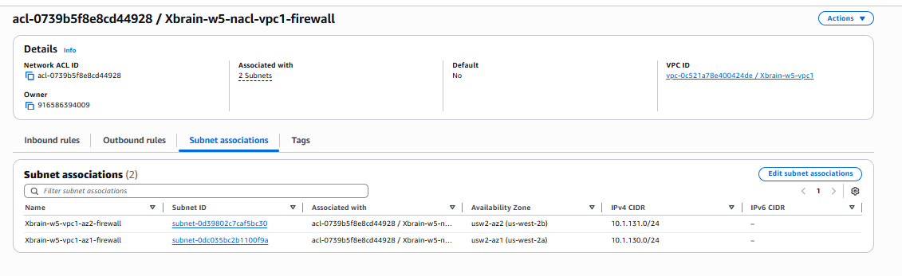

**Inbound Rules:**

| Rule # | Type | Protocol | Port Range | Source | Allow/Deny |
|--------|------|----------|-----------|--------|-----------|
| 100 | HTTPS (443) | TCP (6) | 443 | 10.1.0.0/18 | Allow |
| 110 | HTTPS (443) | TCP (6) | 443 | 10.1.64.0/18 | Allow |
| 120 | HTTP (80) | TCP (6) | 80 | 10.1.0.0/18 | Allow |
| 130 | HTTP (80) | TCP (6) | 80 | 10.1.64.0/18 | Allow |
| 140 | Custom TCP | TCP (6) | 1024–65535 | 10.1.128.0/24 | Allow |
| 150 | Custom TCP | TCP (6) | 1024–65535 | 10.1.129.0/24 | Allow |
| * | All traffic | All | All | 0.0.0.0/0 | **Deny** |

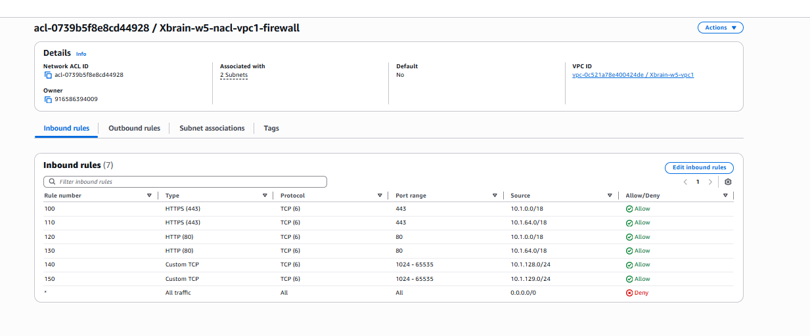

**Outbound Rules:**

| Rule # | Type | Protocol | Port Range | Destination | Allow/Deny |
|--------|------|----------|-----------|-------------|-----------|
| 100 | HTTPS (443) | TCP (6) | 443 | 10.1.128.0/24 | Allow |
| 110 | HTTPS (443) | TCP (6) | 443 | 10.1.129.0/24 | Allow |
| 120 | HTTP (80) | TCP (6) | 80 | 10.1.128.0/24 | Allow |
| 130 | HTTP (80) | TCP (6) | 80 | 10.1.129.0/24 | Allow |
| 140 | Custom TCP | TCP (6) | 1024–65535 | 10.1.0.0/18 | Allow |
| 150 | Custom TCP | TCP (6) | 1024–65535 | 10.1.64.0/18 | Allow |
| * | All traffic | All | All | 0.0.0.0/0 | **Deny** |

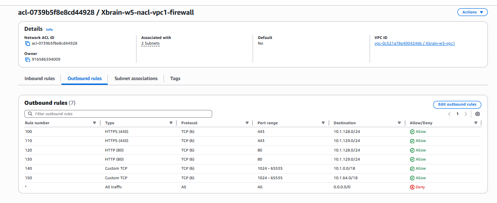

---

#### NACL 2 — VPC-1 Private App Subnets (`acl-02fd0c05070f08a58 / Xbrain-w5-nacl-vpc1-private-app`)

Applied to the Lambda private application subnets. Only HTTPS egress and ephemeral return traffic is permitted. No SSH, RDP, or unrestricted inbound.

**Subnet Associations:**

| Subnet Name | Subnet ID | AZ | CIDR |
|-------------|-----------|-----|------|
| Xbrain-w5-vpc1-az1-private-app | subnet-03b9b2f3aa7e06cf2 | us-west-2a | 10.1.0.0/18 |
| Xbrain-w5-vpc1-az2-private-app | subnet-0b192d902a75be1ad | us-west-2b | 10.1.64.0/18 |

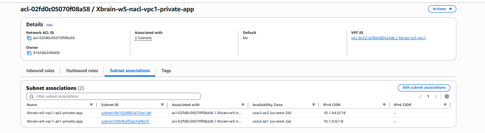

**Inbound Rules:**

| Rule # | Type | Protocol | Port Range | Source | Allow/Deny |
|--------|------|----------|-----------|--------|-----------|
| 100 | HTTPS (443) | TCP (6) | 443 | 10.1.0.0/18 | Allow |
| 101 | HTTPS (443) | TCP (6) | 443 | 10.1.64.0/18 | Allow |
| 110 | Custom TCP | TCP (6) | 1024–65535 | 10.2.0.0/16 | Allow |
| 120 | Custom TCP | TCP (6) | 1024–65535 | 0.0.0.0/0 | Allow |
| * | All traffic | All | All | 0.0.0.0/0 | **Deny** |

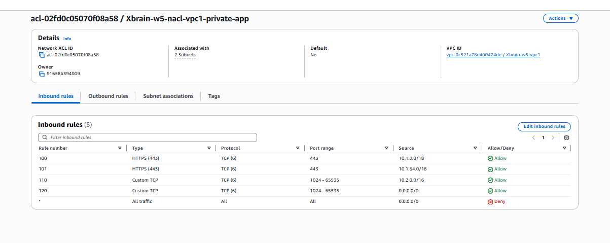

**Outbound Rules:**

| Rule # | Type | Protocol | Port Range | Destination | Allow/Deny |
|--------|------|----------|-----------|-------------|-----------|
| 100 | HTTPS (443) | TCP (6) | 443 | 0.0.0.0/0 | Allow |
| 110 | Custom TCP | TCP (6) | 1024–65535 | 0.0.0.0/0 | Allow |
| * | All traffic | All | All | 0.0.0.0/0 | **Deny** |

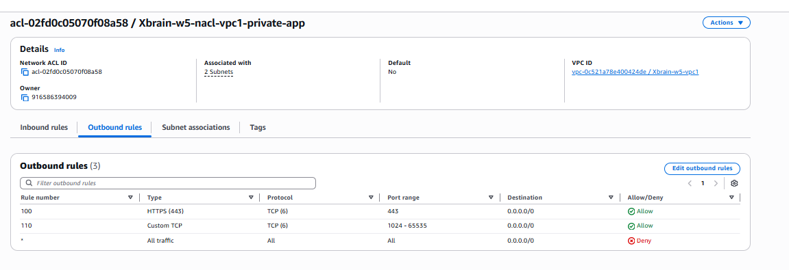

**Key design decisions:**
- No rule allows port 22 (SSH) or 3389 (RDP) — both fall through to the implicit `*` DENY.
- Outbound `*` DENY ensures Lambda can only egress on HTTPS (443) and ephemeral return ports.
- Rule 110 inbound allows ephemeral return traffic from VPC-2 (database responses via Transit Gateway).

---

#### NACL 3 — VPC-2 Isolated Subnets (`acl-076106d54b7bee5d5 / Xbrain-w5-nacl-vpc2-isolated`)

Applied to the RDS/database subnets in VPC-2. Only allows TCP traffic from VPC-1 (10.1.0.0/16). Completely isolated from the internet in both directions.

**Subnet Associations:**

| Subnet Name | Subnet ID | AZ | CIDR |
|-------------|-----------|-----|------|
| Xbrain-w5-vpc2-az1-isolated | subnet-0f02114db7f181399 | us-west-2a | 10.2.0.0/24 |
| Xbrain-w5-vpc2-az2-isolated | subnet-07e17323203d99384 | us-west-2b | 10.2.1.0/24 |

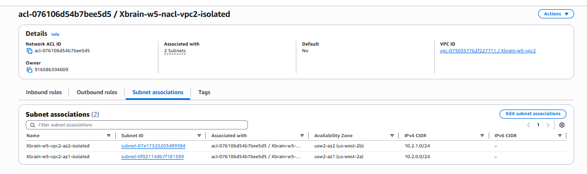

**Inbound Rules:**

| Rule # | Type | Protocol | Port Range | Source | Allow/Deny |
|--------|------|----------|-----------|--------|-----------|
| 50 | All TCP | TCP (6) | All | 10.1.0.0/16 | Allow |
| 100 | All traffic | All | All | 0.0.0.0/0 | **Deny** |
| * | All traffic | All | All | 0.0.0.0/0 | **Deny** |

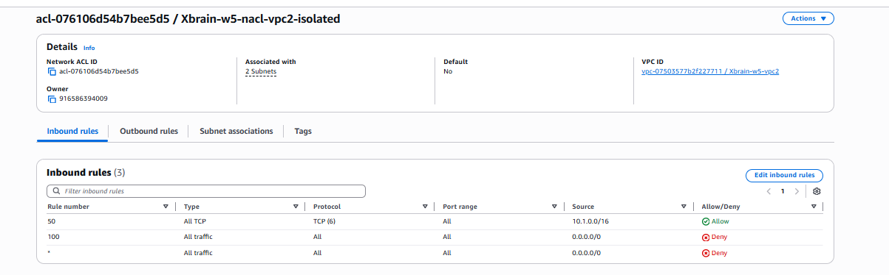

**Outbound Rules:**

| Rule # | Type | Protocol | Port Range | Destination | Allow/Deny |
|--------|------|----------|-----------|-------------|-----------|
| 50 | All TCP | TCP (6) | All | 10.1.0.0/16 | Allow |
| 100 | All traffic | All | All | 0.0.0.0/0 | **Deny** |
| * | All traffic | All | All | 0.0.0.0/0 | **Deny** |

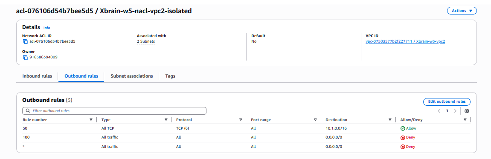

---

### Security Group Hardening

All Security Groups follow strict least-privilege. **No `0.0.0.0/0` inbound rules exist on any port (including 22/SSH and 3389/RDP) in any SG across the entire stack.**

---

#### SG-1 — `sg-0a93ba195b205064c / Xbrain-w5-lambda-sg` (VPC-1)

*Description: Lambda functions — no inbound, controlled outbound only*

**Inbound Rules (1):**

| Type | Protocol | Port | Source | Description |
|------|----------|------|--------|-------------|
| HTTPS | TCP | 443 | sg-0a93ba195b205064c (self) | Allow HTTPS from Lambda |

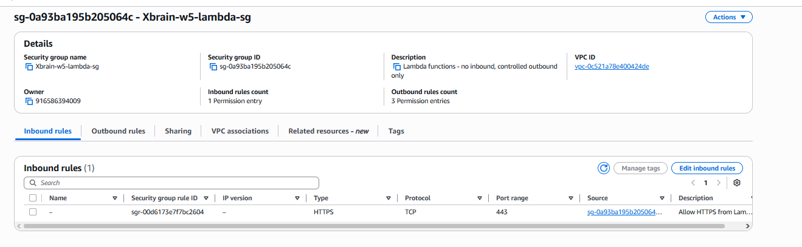

**Outbound Rules (3):**

| Type | Protocol | Port | Destination | Description |
|------|----------|------|-------------|-------------|
| NFS | TCP | 2049 | 10.1.0.0/16 | NFS to EFS mount target |
| HTTPS | TCP | 443 | 0.0.0.0/0 | HTTPS to AWS managed services |
| PostgreSQL | TCP | 5432 | 10.2.0.0/16 | PostgreSQL to RDS Proxy |

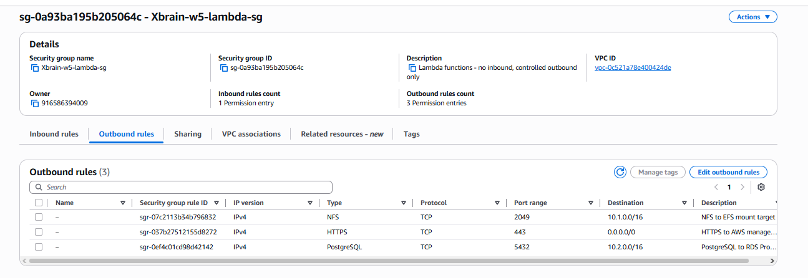

---

#### SG-2 — `sg-025119ba0da1d5577 / SG-EFS` (VPC-1)

*Description: Security Group for EFS*

**Inbound Rules (2):**

| Type | Protocol | Port | Source | Description |
|------|----------|------|--------|-------------|
| NFS | TCP | 2049 | 10.1.64.0/18 | NFS from AZ-2 private app subnet |
| NFS | TCP | 2049 | 10.1.0.0/18 | NFS from AZ-1 private app subnet |

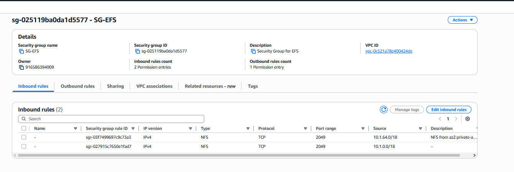

**Outbound Rules (1):**

| Type | Protocol | Port | Destination | Description |
|------|----------|------|-------------|-------------|
| All traffic | All | All | 0.0.0.0/0 | — |

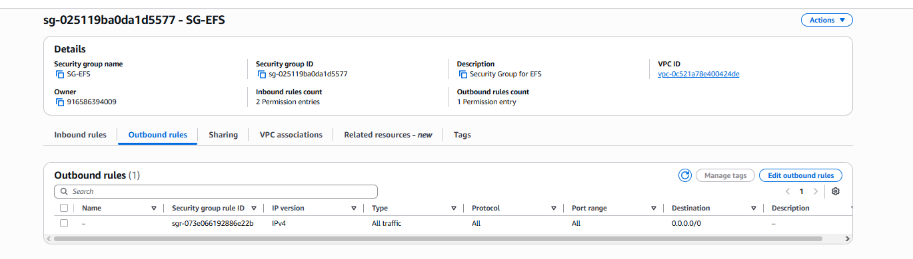

---

#### SG-3 — `sg-0862dce3cb5cfb6fc / w5-proxy-sg` (VPC-2)

*Description: Allow Lambda connect to RDS Proxy*

**Inbound Rules (1):**

| Type | Protocol | Port | Source | Description |
|------|----------|------|--------|-------------|
| PostgreSQL | TCP | 5432 | 10.1.0.0/16 | From VPC-1 Lambda |

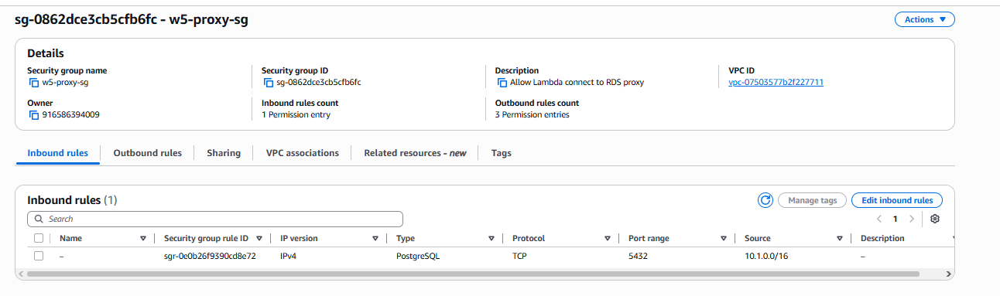

**Outbound Rules (3):**

| Type | Protocol | Port | Destination | Description |
|------|----------|------|-------------|-------------|
| HTTPS | TCP | 443 | sg-0768a685121ae7f9b | VPC endpoint |
| PostgreSQL | TCP | 5432 | sg-0598f87828325757e | To RDS SG |
| PostgreSQL | TCP | 5432 | 10.2.0.0/16 | To RDS subnet |

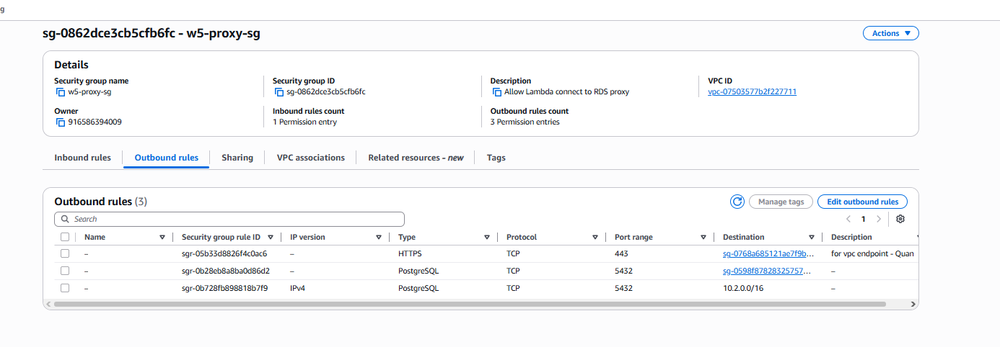

---

#### SG-4 — `sg-0598f87828325757e / w5-rds-sg` (VPC-2)

*Description: Allow RDS Proxy connect to RDS*

**Inbound Rules (2):**

| Type | Protocol | Port | Source | Description |
|------|----------|------|--------|-------------|
| PostgreSQL | TCP | 5432 | sg-0862dce3cb5cfb6fc | From RDS Proxy SG |
| PostgreSQL | TCP | 5432 | 10.1.0.0/16 | Lambda functions from VPC-1 |

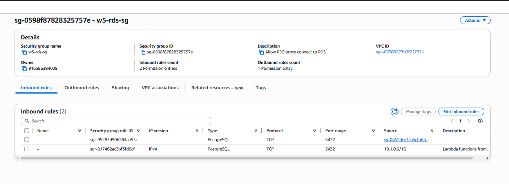

**Outbound Rules (1):**

| Type | Protocol | Port | Destination | Description |
|------|----------|------|-------------|-------------|
| All traffic | All | All | 0.0.0.0/0 | Allow all outbound |

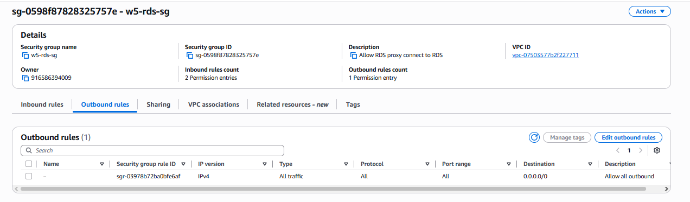

---

#### SG-5 — `sg-0b8e83da2ec1527f4 / Xbrain-week-5-vpc1-endpoint-sg` (VPC-1)

*Description: Allow inbound HTTPS from VPC1 Lambda to SQS/SNS endpoints*

**Inbound Rules (1):**

| Type | Protocol | Port | Source | Description |
|------|----------|------|--------|-------------|
| HTTPS | TCP | 443 | sg-0a93ba195b205064c (lambda-sg) | From Lambda SG |

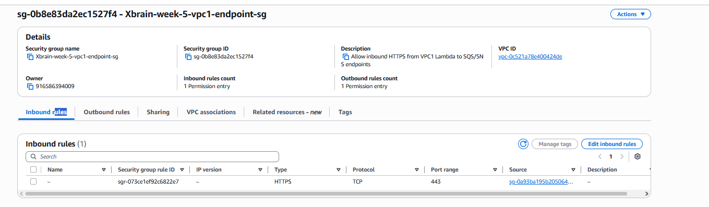

**Outbound Rules (1):**

| Type | Protocol | Port | Destination | Description |
|------|----------|------|-------------|-------------|
| All traffic | All | All | 0.0.0.0/0 | — |

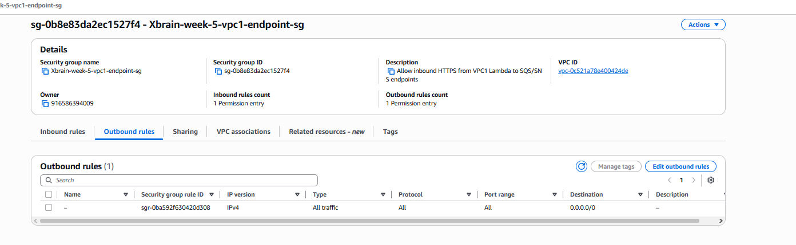

---

## Negative Security Tests

### Test 1 — NACL blocks inbound traffic from 192.168.99.0/24 (Reachability Analyzer summary)

**Method:** AWS VPC Reachability Analyzer. Source ENI address 192.168.99.1/32, destination ENI in VPC-1 private app subnet, port 443, TCP.

**Expected result:** Not reachable — no NACL inbound rule covers 192.168.99.0/24; falls to implicit `*` DENY.

**Result:** ❌ Not reachable — confirmed.


*Path `nip-01ea409b472be07d0` — Reachability status: **Not reachable**. NACL `acl-02fd0c05070f08a58` does not allow inbound traffic from subnet-03b9b2f3aa7e06cf2 to vpc-0c521a78e400424de. None of the ingress rules in security group `sg-0a93ba195b205064c` apply.*

---

### Test 2 — Full path: blocked at NACL and SG layers independently

**Method:** Reachability Analyzer full hop-by-hop path analysis.

**Result:** ❌ Blocked at two independent layers — NACL `SUBNET_ACL_RESTRICTION` (primary) and Security Group `ENI_SG_RULES_MISMATCH` (secondary).


*Full path for `nip-01ea409b472be07d0`:*
- *Source ENI `eni-0ebd24bfb6424f1a7` — `ENI_SOURCE_DEST_CHECK_RESTRICTION`: source 192.168.99.1/32 ≠ NI private address 10.2.0.17/32*
- *NACL `acl-076106d54b7bee5d5` — rule 60, outbound allow, 10.1.0.0/16, TCP*
- *Route Table — destination 10.1.0.0/16 via VPC Peering `pcx-0b573410d22e61f9f` (active)*
- *NACL `acl-02fd0c05070f08a58` — ❌ **SUBNET_ACL_RESTRICTION**: does not allow inbound from subnet-03b9b2f3aa7e06cf2*
- *Destination ENI `eni-0299d21f04eef3ec7` — ❌ **ENI_SG_RULES_MISMATCH**: none of the ingress rules in `sg-0a93ba195b205064c` apply*

---

### Test 3 — Firewall FLOW logs confirm all egress routes through firewall endpoints

**Method:** Inspected CloudWatch log group `/aws/network-firewall/Xbrain-w5/flow` for active entries from both AZ firewall endpoints.

**Result:** ✅ Confirmed — entries from both `us-west-2a` and `us-west-2b`.


*CloudWatch `/aws/network-firewall/Xbrain-w5/flow` — entries from both `us-west-2a` and `us-west-2b` confirm all egress traffic is inspected by the firewall before reaching NAT Gateway.*

---

## Summary

| Control | Status | Evidence |
|---------|--------|---------|
| AWS Network Firewall deployed (both AZs) | ✅ | `assets/Firewall.png` |
| Stateful egress allowlist — blocks non-AWS TLS/HTTP | ✅ | `terraform/network_firewall.tf` |
| Private app route tables `0.0.0.0/0` → Firewall Endpoint | ✅ | Route table above |
| Firewall Subnet `0.0.0.0/0` → NAT Gateway | ✅ | Route table above |
| Flow + Alert logging to CloudWatch (7-day retention) | ✅ | `assets/Firewall_Flowlog.png` |
| NACL — VPC1 Firewall subnets (7 in + 7 out, `*` DENY) | ✅ | `assets/vpc1_firewall_inbound.png`, `assets/vpc1_firewall_outbound.png` |
| NACL — VPC1 Private App subnets (5 in + 3 out, `*` DENY) | ✅ | `assets/vpc1_private_inbound.png`, `assets/vpc1_private_outbound.png` |
| NACL — VPC2 Isolated subnets (VPC-1 only, deny all else) | ✅ | `assets/vpc2_isolated_inbound.png`, `assets/vpc2_isolated_outbound.png` |
| No `0.0.0.0/0` inbound on 22/3389 in lambda-sg | ✅ | `assets/lambda_sg_inbound.png` |
| No `0.0.0.0/0` inbound on 22/3389 in SG-EFS | ✅ | `assets/efs_sg_inbound.png` |
| No `0.0.0.0/0` inbound on 22/3389 in w5-proxy-sg | ✅ | `assets/proxy_sg_inbound.png` |
| No `0.0.0.0/0` inbound on 22/3389 in w5-rds-sg | ✅ | `assets/rds_sg_inbound.png` |
| No `0.0.0.0/0` inbound on 22/3389 in vpc1-endpoint-sg | ✅ | `assets/vpc1_endpoint_sg_inbound.png` |
| Negative test 1 — Reachability Analyzer: Not reachable | ✅ | `assets/Deny_Negative_test.png` |
| Negative test 2 — NACL + SG both block independently | ✅ | `assets/ENI_SOURCE_DEST_CHECK_RESTRICTION.png` |
| Negative test 3 — Firewall FLOW logs active both AZs | ✅ | `assets/Firewall_Flowlog.png` |
