**Flowlogs**

Set up VPC Flow Logs for both VPCs (App and DB) to monitor all network traffic passing through ENI.

- **Aggregation Interval:** 1 minute (To ensure the highest real-time accuracy).
- **Destination:** CloudWatch Logs Group `/aws/vpc/flow-logs/xbrain-w5-app` and `/aws/vpc/flow-logs/xbrain-w5-db`.

[image1]: ../assets/flowlogs1.png
[image2]: ../assets/flowlogs2.png

Separating Log Groups for each VPC and setting a 1-minute interval makes troubleshooting and auditing more accurate, meeting observability requirements.  
[image3]: ../assets/flowlogs3.png

[image4]: ../assets/flowlogs4.png

Use CloudWatch Logs Insights to query and confirm that traffic from the App Tier (VPC1) has successfully connected to the Database Tier (VPC2).

**Evidence analysis:**

- **Source IP:** 10.1.47.229 (Located within the VPC1 subnet).
- **Destination IP:** 10.2.0.116 (Located within the VPC2 subnet \- where RDS is hosted).
- **Destination Port:** 5432 (PostgreSQL protocol).
- **Action: ACCEPT**.

[image5]: ../assets/flowlogs5.png

Implement granular security controls within the Database VPC to enforce the Principle of Least Privilege and prevent lateral movement.

**Evidence Analysis:**

- **Source IP:** 10.2.0.150 (Internal resource within DB VPC).
- **Destination IP:** 10.2.1.158 (Database instance).
- **Destination Port:** 5432 (PostgreSQL).
- **Action:** **REJECT**.

[image6]: ../assets/flowlogs6.png

##

---

# MH3:

The Amazon EFS (Regional) file system is initialized to optimize high availability and automatic scalability. The system is fully secured through on-premises data encryption (Encryption at rest) with AWS KMS, and includes Lifecycle Management policies to optimize storage costs over time.  
[image7]: ../assets/efs1.png

Establish Mount Targets across the Multi-Availability Zones (Multi-AZ) of VPC1. Implementing Security Group (SG-EFS) helps tightly control traffic from different resource tiers, ensuring that only valid connections can interact with the storage system.  
[image8]: ../assets/efs2.png

Configure the Access Point (AP-MarketData) to manage file access permissions at a granular level. By enforcing POSIX identity (UID/GID: 1000\) and root directory permissions (0755), this configuration completely eliminates permission conflicts when multiple services access data simultaneously.  
[image9]: ../assets/efs3.png

The EFS was successfully mounted to the AWS Lambda function via the Access Point at /mnt/efs. The actual log results show the ACCEPT status on the data streams, confirming that the system is network-ready and operational.  
[image10]: ../assets/efs4.png

**BACKUPS**

AWS Backup Vault Management

- Setting up the Backup Vault: Initialize Huy-Test-Vault as the central recovery point management hub. The system is protected by specialized AWS KMS encryption, ensuring absolute integrity and security for backup data.
  - Managing Recovery Points: The vault currently manages 8 diverse recovery points for core resources:
  - EFS (EFS-W5): Completed scheduled backups.
  - RDS (xbrain-w5-postgresql): Supports both snapshots and continuous backup capabilities, optimizing RPO (Recovery Point Objective).
  - S3 (my-frontend-bucket-w5): Successful snapshot taken for the user interface layer.

[image11]: ../assets/efs5.png

Backup Rule Configuration

- Backup Rule (Huy-test-backup-rule): Establish an automatic and consistent backup strategy for the entire infrastructure.

Schedule and Frequency:

- Frequency: Hourly backups, starting at 09:15 (Vietnam Time \- UTC+07:00).
- Backup Window: Set the start time to 1 hour and the completion time to 2 hours to avoid impacting system performance.
- Recovery Feature (PITR): Enable Continuous Backups, allowing point-in-time data recovery for critical services such as RDS and S3.

Cross-Region Copy Strategy:

- Destination: Automatically create a copy in the US East (N. Virginia) region within the Huy-test-Backup-Region2 vault. Objective: Ensure disaster recovery capabilities even in the event of a failure across the entire primary region.
- Lifecycle and Storage: Establish flexible retention periods for copies, optimizing costs between warm and cold storage.
  [image12]: ../assets/efs6.png

Backup Resource Assignment  
Assigning strategic resources to the Backup Plan is done through the IAM Role (backup-role), ensuring consistent execution permissions across the entire infrastructure:

- S3 Resource Group (Huy-Test3-resource)
- Core Services Resource Group (Huy_backup_resource_RDSandEFS):
  - File System (EFS): fs-0bac19e89f1687dd5.
  - Database (RDS): xbrain-w5-postgresql.

  [image13]: ../assets/efs7.png
  [image14]: ../assets/efs8.png

Evidence: Backup Execution Results (Backup Jobs)

- Status: System is operating stably with most tasks achieving Completed (Success).
- Resources: Backup successful for the entire infrastructure including RDS, EFS, and S3.
- Policy: Synchronized data retention period of 35 days.
- Error resolution: The "Access denied" error (May 14th) has been completely resolved; the latest backups (May 15th) were successful, ensuring data availability.

[image15]: ../assets/efs9.png

The backups have been restored.

[image16]: ../assets/efs10.png
[image17]: ../assets/efs11.png

---

# MH4 — API Gateway + Auth + Throttling

### 1. API Gateway Resource Tree:
The structural deployment tree and Stage configuration for the w5-BE-api on AWS API Gateway. The active prod stage exposes two core routes mapped to their respective backend services: POST /market-push for ingesting data streams and GET /reader-asset for retrieving database payloads.
 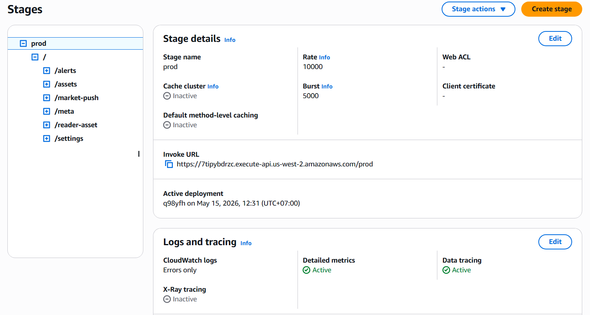
### 2. Usage Plan:
Throttling and quota configuration for the w5-usage-plan (ID: eeo2tc). It establishes strict API utilization boundaries—setting a steady rate of 20 requests per second, a maximum burst of 50 requests, and a monthly quota of 50,000 requests—enforced across the prod stage of the w5-BE-api.
 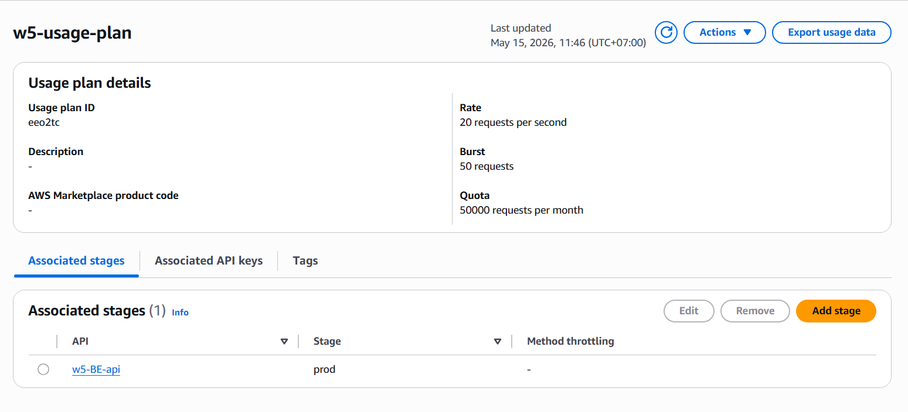
### 3. API Key:
Configuration details of the AWS API Gateway API Key named w5-api-key in an Active status. The key has been successfully created and linked to the w5-usage-plan, allowing authenticated access to the target API stage.
 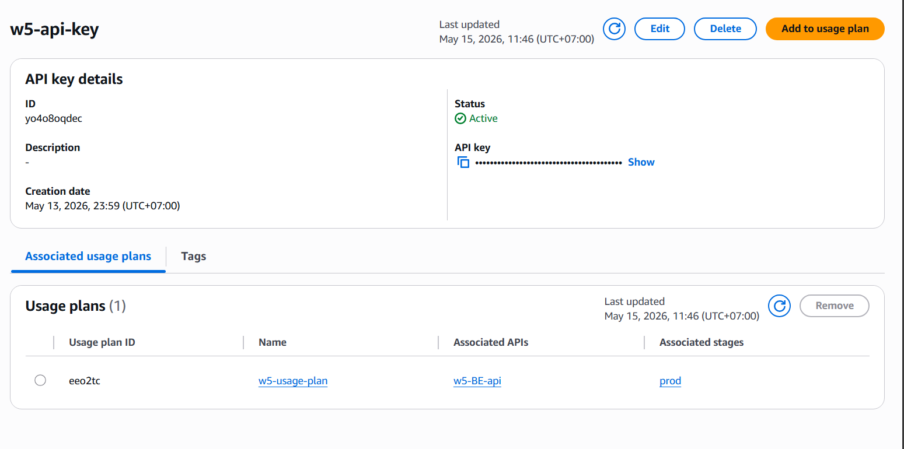
### 4. Request Có Xác Thực (200):
Successful end-to-end integration test of the GET /reader-asset endpoint returning an HTTP/1.1 200 OK status code. The API Gateway successfully authenticates the request via the x-api-key header and passes it to the Lambda function, which fetches and returns the raw JSON payload from the Amazon RDS PostgreSQL database (w5).
 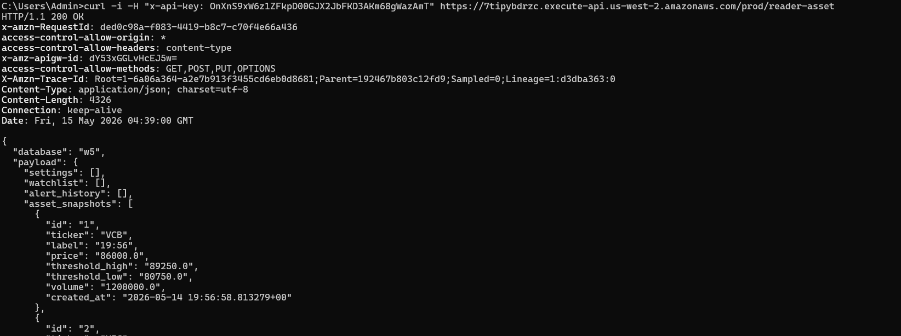
### 5. Request Không Có Xác Thực (403):
Verification of the API Gateway's built-in security and authentication mechanism. When a client attempts to invoke the /reader-asset endpoint without a valid API Key in the headers, the Gateway automatically blocks the request and rejects it with an HTTP/1.1 403 Forbidden error to protect backend resources.
 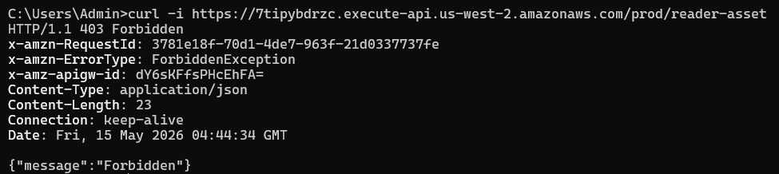
### 6. Thay Đổi Code Ứng Dụng ở FE:
Frontend source code implementation for the asynchronous requestJson function using the Native Fetch API. The base URL is configured dynamically via the VITE_API_BASE_URL environment variable to target the AWS API Gateway endpoint, automatically appending standard application/json content-type headers
 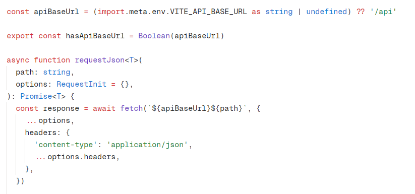

---

# MH5:

## Serverless Scaling Pattern — Handle Load Correctly

### Why choose Async Invocation + Dead Letter Queue?

Lambda runs on a schedule and scans for price anomalies. If it crashes mid-run -> we don't want to lose the data we've already processed. With async invocation and dead letter queue, we can ensure that our data is not lost even if the function crashes. Lambda will automatically retry the failed invocations and send the failed events to the dead letter queue so that we can investigate and fix the issue. This is better than synchronous invocation because it allows the function to continue processing other events while waiting for the failed ones to be retried.

---

## Evidence

### 1. Lambda Configuration — Async Invocation + DLQ

`AnomalyLoggingService` is configured with **Retry attempts: 2** and **Dead-letter queue: AnomalyLoggingService_DLQ**. This means on failure, Lambda retries 2 more times (3 total) before sending the event to SQS.

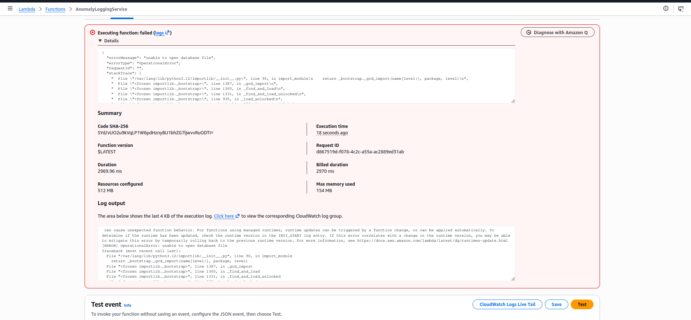

---

### 2. Failed Invocation Result (Test tab)

A manual test invocation from the Lambda console shows **"Executing function: failed"** with `OperationalError: unable to open database file`. This is the intentional failure used to demonstrate the retry + DLQ pattern.

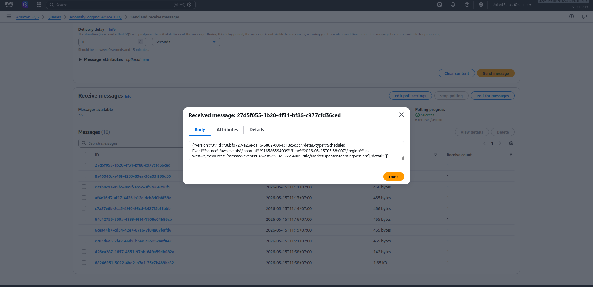

---

### 3. CloudWatch Logs — 3 Retry Attempts

CloudWatch shows **3 separate START/END/REPORT entries** for the same `RequestId: a0dad215-dc0c-4917-a341-c3ff9af16da7`, each with `Status: error`. This confirms Lambda attempted the invocation 3 times (original + 2 retries) before giving up.

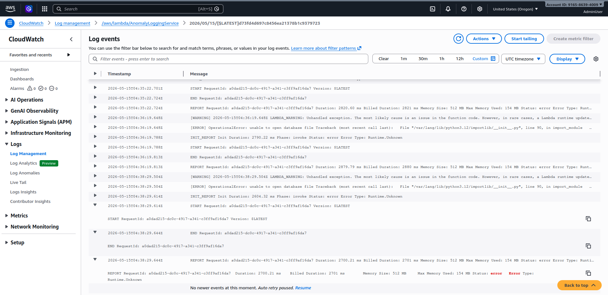

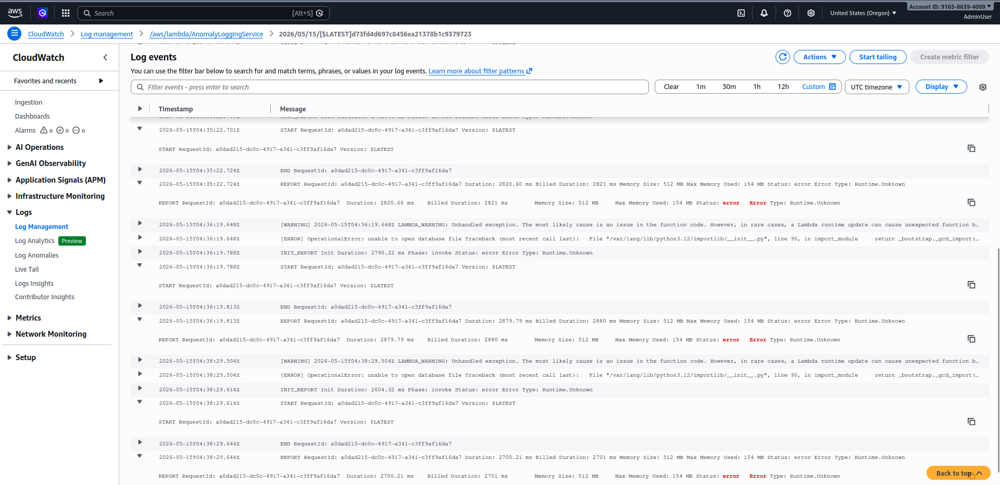

---

### 4. Failed Event in DLQ

After all 3 attempts failed, the original event was automatically sent to `AnomalyLoggingService_DLQ`. The message body contains the original EventBridge scheduled event payload, confirming nothing was silently lost.

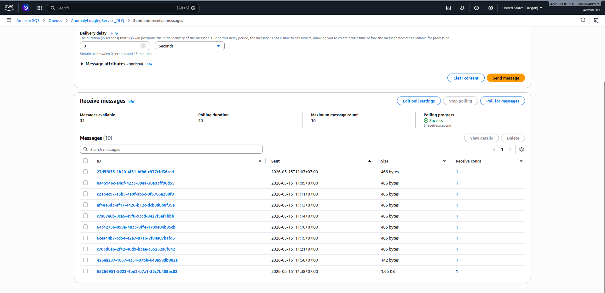

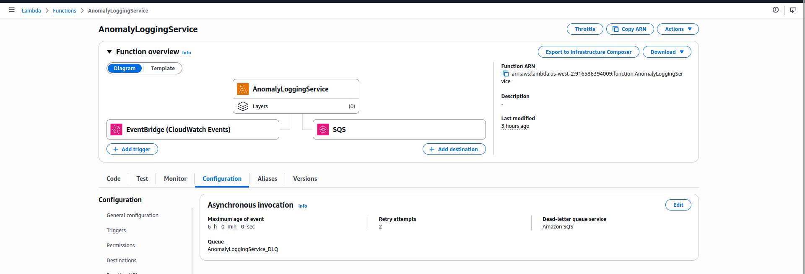
