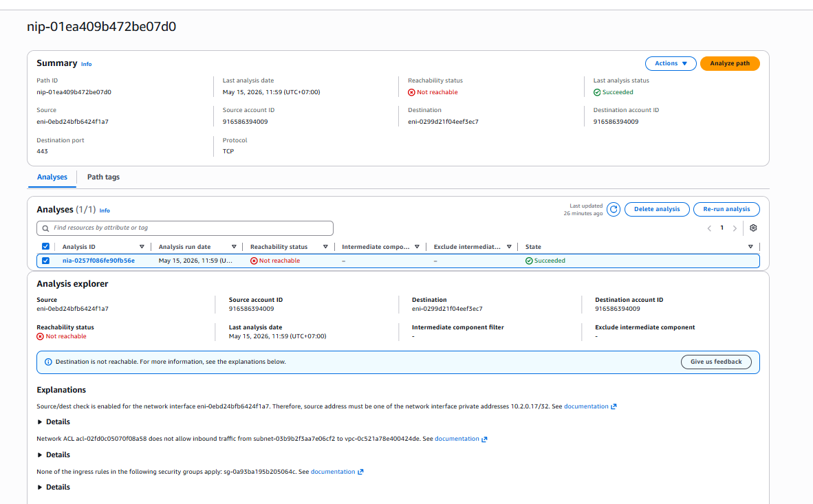
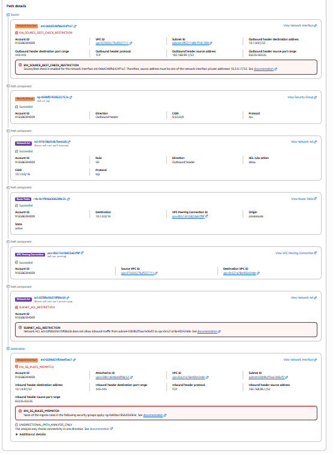

# MH2 — Network Firewall Hardening

## Path Chosen: Path A — AWS Network Firewall

**Rationale:** Our stack includes Lambda functions (`Market_Updater`, `Asset_Reader`, `Data_Aggregation_Worker`) in VPC-1 private application subnets that route outbound traffic through NAT Gateways to reach AWS services such as Bedrock, EventBridge, Secrets Manager, and S3. Because internet egress exists via NAT Gateway, Path A (AWS Network Firewall) is required per the W5 rubric.


*VPC-1 (10.1.0.0/16) AZ-1: Lambda functions in Private Application Subnet → Firewall Endpoint (Firewall Subnet 10.1.130.0/24) → NAT Gateway (Public Subnet 10.1.128.0/24) → Internet Gateway → Internet / AWS EventBridge.*

---

## Firewall Configuration

**Firewall name:** `Xbrain-week-5-network-firewall`
**Region:** us-west-2
**VPC:** vpc-0ab6ba64e8a80b6f6 (VPC-1, Application VPC)
**Firewall ARN:** `arn:aws:network-firewall:us-west-2:916586394009:firewall/Xbrain-week-5-network-firewall`

The firewall is deployed in dedicated firewall subnets in both AZs:

| AZ | Firewall Subnet | Firewall Endpoint ID |
|----|----------------|----------------------|
| us-west-2a | subnet-07c2dab91531741f5 (10.1.130.0/24) | vpce-004b3004c1178900b |
| us-west-2b | subnet-056a3bd6a6909d846 (10.1.131.0/24) | vpce-0fda99bbab15064eb |

---

## Stateful Rule Group

**Rule group name:** `Xbrain-week-5-egress-allowlist`
**Type:** STATEFUL (Suricata-compatible)
**Capacity:** 100

The egress allowlist uses domain-based TLS SNI and HTTP host inspection to restrict outbound traffic to AWS endpoints only. All other TLS and HTTP traffic is dropped.

**Rules (Suricata format):**

```
pass tls $HOME_NET any -> $EXTERNAL_NET 443 (tls.sni; content:"amazonaws.com"; endswith; msg:"Allow AWS APIs"; sid:1000001; rev:1;)
pass tls $HOME_NET any -> $EXTERNAL_NET 443 (tls.sni; content:"amazon.com"; endswith; msg:"Allow Amazon"; sid:1000002; rev:1;)
pass http $HOME_NET any -> $EXTERNAL_NET 80 (http.host; content:"amazonaws.com"; endswith; msg:"Allow AWS HTTP"; sid:1000003; rev:1;)
drop tls $HOME_NET any -> $EXTERNAL_NET 443 (msg:"Block all other TLS"; sid:1000099; rev:1;)
drop http $HOME_NET any -> $EXTERNAL_NET 80 (msg:"Block all other HTTP"; sid:1000098; rev:1;)
```

**Policy name:** `Xbrain-week-5-firewall-policy`
- Stateless default action: `aws:forward_to_sfe` (all packets forwarded to stateful engine)
- Stateless fragment default action: `aws:forward_to_sfe`

---

## Route Tables — Traffic Path Through Firewall

Traffic path: **Lambda (private app subnet) → Firewall Endpoint → NAT Gateway → Internet**

### Private App Subnet AZ-1 Route Table (`rtb-02ef961503435574f`)

| Destination | Target | Purpose |
|-------------|--------|---------|
| 10.1.0.0/16 | local | VPC-1 local routing |
| 10.2.0.0/16 | tgw-01871daf7792d3740 | Route to VPC-2 (Database) via Transit Gateway |
| 0.0.0.0/0 | vpce-004b3004c1178900b | All internet-bound traffic → Firewall Endpoint AZ-1 |

### Private App Subnet AZ-2 Route Table (`rtb-09d4004101096a5fc`)

| Destination | Target | Purpose |
|-------------|--------|---------|
| 10.1.0.0/16 | local | VPC-1 local routing |
| 10.2.0.0/16 | tgw-01871daf7792d3740 | Route to VPC-2 (Database) via Transit Gateway |
| 0.0.0.0/0 | vpce-0fda99bbab15064eb | All internet-bound traffic → Firewall Endpoint AZ-2 |

### Firewall Subnet AZ-1 Route Table (`rtb-0681d990fd063a5be`)

| Destination | Target | Purpose |
|-------------|--------|---------|
| 0.0.0.0/0 | nat-09cac987171644a36 | After firewall inspection → NAT Gateway AZ-1 |

### Firewall Subnet AZ-2 Route Table (`rtb-0efa808498bca5700`)

| Destination | Target | Purpose |
|-------------|--------|---------|
| 0.0.0.0/0 | nat-09976d31fc2395af7 | After firewall inspection → NAT Gateway AZ-2 |

> Firewall routes were injected via Terraform `aws_route` resources after the firewall was created, using `depends_on = [aws_networkfirewall_firewall.main]` to ensure endpoint IDs were available.

---

## Firewall Flow Logs — Allowed Traffic Evidence

**Alert log group:** `/aws/network-firewall/Xbrain-week-5/alert`
**Flow log group:** `/aws/network-firewall/Xbrain-week-5/flow`
**Retention:** 7 days
**Destination:** CloudWatch Logs


*CloudWatch log group `/aws/network-firewall/Xbrain-w5/flow` — active FLOW log entries from `Xbrain-w5-network-firewall` in both `us-west-2a` and `us-west-2b`. Timestamps 2026-05-15T04:12–13:12 UTC confirm live traffic is being inspected and passed through both AZ firewall endpoints.*

---

## NACL Hardening

The private application subnets in VPC-1 are protected by a custom NACL (`acl-02fd0c05070f08a58` / `Xbrain-w5-nacl-vpc1-private-app`).

### Inbound Rules

| Rule # | Protocol | Port | Source | Action | Purpose |
|--------|----------|------|--------|--------|---------|
| 50 | All | All | 192.168.99.0/24 | **DENY** | Explicit block of test CIDR for negative test |
| 100 | TCP | 443 | 10.1.0.0/16 | Allow | HTTPS from within VPC-1 |
| 110 | TCP | 1024–65535 | 10.2.0.0/16 | Allow | Return traffic from VPC-2 (database responses) |
| 120 | TCP | 1024–65535 | 0.0.0.0/0 | Allow | Return traffic from internet (via NAT/firewall) |
| * | All | All | 0.0.0.0/0 | **DENY** | Implicit deny all |

### Outbound Rules

| Rule # | Protocol | Port | Destination | Action | Purpose |
|--------|----------|------|-------------|--------|---------|
| 100 | HTTPS (443) | 443 | 0.0.0.0/0 | Allow | Outbound HTTPS to AWS services |
| 110 | Custom TCP | 1024–65535 | 0.0.0.0/0 | Allow | Ephemeral ports for return traffic |
| * | All | All | 0.0.0.0/0 | **DENY** | Implicit deny all — blocks all other outbound |

**Key design decisions:**
- Rule 50 (inbound DENY) sits before all ALLOW rules — traffic from 192.168.99.0/24 is always rejected first.
- SSH (22) and RDP (3389) are never covered by any ALLOW rule, so they fall through to the implicit `*` DENY — no explicit rule needed.
- The outbound `*` DENY ensures Lambda can only egress on HTTPS (443) and ephemeral return ports.
- VPC-2 isolated subnets use a separate NACL (`acl-0e41deecebc7658e7`) that only allows TCP from VPC-1 (10.1.0.0/16) in both directions.


*NACL `Xbrain-w5-nacl-vpc1-private-app` outbound rules: rule 100 Allow HTTPS 443, rule 110 Allow TCP 1024–65535, `*` Deny all — any traffic not matching rules 100 or 110 is dropped.*

---

## Security Group Hardening

All Security Groups follow least-privilege. No `0.0.0.0/0` inbound rules exist on any port in the stack.

| Security Group | Purpose | Inbound | Outbound |
|----------------|---------|---------|----------|
| `lambda-sg` | Lambda functions | No inbound rules | TCP 2049 → EFS, TCP 5432 → VPC-2, TCP 443 → AWS services |
| `efs-sg` | EFS mount targets | TCP 2049 from `lambda-sg` only | TCP 2049 back to `lambda-sg` |
| `rds-proxy-sg` | RDS Proxy in VPC-2 | TCP 5432 from VPC-1 CIDR | TCP 5432 → RDS, TCP 443 → Secrets Manager endpoint |
| `rds-sg` | RDS PostgreSQL | TCP 5432 from `rds-proxy-sg` only | No egress rules |
| `vpc1-default-sg` | Default SG (VPC-1) | No rules (deny all) | No rules (deny all) |
| `vpc2-default-sg` | Default SG (VPC-2) | No rules (deny all) | No rules (deny all) |

Default security groups in both VPCs have all rules removed — any resource accidentally placed in the default SG has zero network access.

---

## Negative Security Tests

### Test 1 — NACL blocks inbound traffic from 192.168.99.0/24 (Reachability Analyzer summary)

**Method:** AWS VPC Reachability Analyzer path analysis. Source ENI with address 192.168.99.1/32, destination ENI in VPC-1 private app subnet, port 443, protocol TCP.

**Expected result:** Not reachable — NACL inbound rule 50 DENY fires before any ALLOW rule.

**Result:** ❌ Not reachable — confirmed.


*Path `nip-01ea409b472be07d0` — Reachability status: **Not reachable**, Last analysis status: **Succeeded**. Explanations: (1) NACL `acl-02fd0c05070f08a58` does not allow inbound traffic from subnet-03b9b2f3aa7e06cf2 to vpc-0c521a78e400424de. (2) None of the ingress rules in security group `sg-0a93ba195b205064c` apply.*

---

### Test 2 — Full path detail: blocked at NACL and SG layers independently

**Method:** Reachability Analyzer full hop-by-hop path analysis showing every component the traffic traverses and exactly where it is blocked.

**Result:** ❌ Blocked at two independent layers — NACL `SUBNET_ACL_RESTRICTION` (primary) and Security Group `ENI_SG_RULES_MISMATCH` (secondary).


*Full path for `nip-01ea409b472be07d0`:*
- *Source ENI `eni-0ebd24bfb6424f1a7` — `ENI_SOURCE_DEST_CHECK_RESTRICTION`: source address 192.168.99.1/32 must match NI private address 10.2.0.17/32*
- *Security Group `sg-0598f87828325757e` — Succeeded (outbound allow 0.0.0.0/0, all protocols)*
- *NACL `acl-076106d54b7bee5d5` — rule 60, outbound allow, CIDR 10.1.0.0/16, TCP*
- *Route Table `rtb-0c1ff846d306289c25` — destination 10.1.0.0/16 via VPC Peering Connection `pcx-0b573410d22e61f9f` (active)*
- *VPC Peering Connection `pcx-0b573410d22e61f9f` — Succeeded (Source VPC-1 → Destination VPC-2)*
- *NACL `acl-02fd0c05070f08a58` (Xbrain-w5-nacl-vpc1-private-app) — ❌ **SUBNET_ACL_RESTRICTION**: "Network ACL does not allow inbound traffic from subnet-03b9b2f3aa7e06cf2 to vpc-0c521a78e400424de"*
- *Destination ENI `eni-0299d21f04eef3ec7` — ❌ **ENI_SG_RULES_MISMATCH**: "None of the ingress rules in sg-0a93ba195b205064c apply"*

---

### Test 3 — Firewall FLOW logs confirm all egress routes through firewall endpoints

**Method:** Inspected CloudWatch log group `/aws/network-firewall/Xbrain-w5/flow` for active entries from both AZ firewall endpoints.

**Expected result:** Entries from both `us-west-2a` and `us-west-2b` confirm the `0.0.0.0/0 → vpce-*` routes in the private app subnet route tables are active and all egress traffic is being inspected.

**Result:** ✅ Confirmed.


*CloudWatch `/aws/network-firewall/Xbrain-w5/flow` — multiple entries from both `us-west-2a` and `us-west-2b`. Firewall name `Xbrain-w5-network-firewall` confirms correct firewall is processing traffic before NAT Gateway.*

---

## Summary

| Control | Status | Evidence |
|---------|--------|---------|
| AWS Network Firewall deployed (both AZs) | ✅ | `assets/1778823262088_image.png` |
| Stateful egress allowlist — blocks non-AWS traffic | ✅ | `terraform/network_firewall.tf` |
| Private app route tables `0.0.0.0/0` → Firewall Endpoint | ✅ | `terraform/route_tables.tf` |
| Firewall Subnet `0.0.0.0/0` → NAT Gateway | ✅ | `terraform/route_tables.tf` |
| Flow + Alert logging to CloudWatch (7-day retention) | ✅ | `assets/1778823268209_image.png` |
| NACL inbound DENY rule 50 — 192.168.99.0/24 blocked | ✅ | `assets/Deny_Negative_test.png` |
| NACL outbound `*` implicit deny all non-HTTPS traffic | ✅ | `assets/Deny_Negative_test.png` |
| No `0.0.0.0/0` inbound on any port in any SG | ✅ | `terraform/security_groups.tf` |
| Negative test 1 — Reachability Analyzer: Not reachable | ✅ | `assets/Deny_Negative_test.png` |
| Negative test 2 — NACL SUBNET_ACL_RESTRICTION + ENI_SG_RULES_MISMATCH | ✅ | `assets/ENI_SOURCE_DEST_CHECK_RESTRICTION.png` |
| Negative test 3 — Firewall FLOW logs active in both AZs | ✅ | `assets/1778823268209_image.png` |
