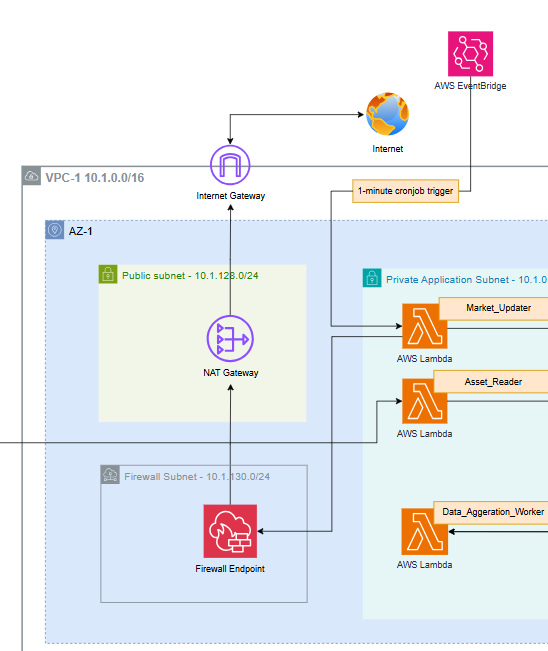
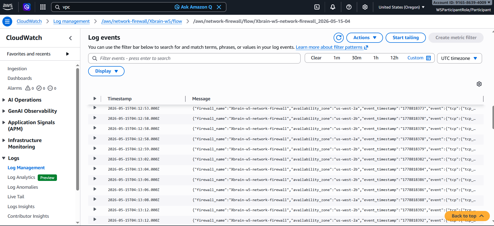

# MH2 — Network Firewall Hardening

## Path Chosen: Path A — AWS Network Firewall

**Rationale:** Our stack includes Lambda functions in VPC-1 private application subnets that route outbound traffic through NAT Gateways (nat-09cac987171644a36 in AZ-1, nat-09976d31fc2395af7 in AZ-2) to reach AWS services such as Bedrock, Secrets Manager, EventBridge, and S3. Because internet egress exists via NAT, Path A (AWS Network Firewall) is required per the W5 rubric.

---

## Firewall Configuration

**Firewall name:** `Xbrain-week-5-network-firewall`
**Region:** us-west-2
**VPC:** vpc-0ab6ba64e8a80b6f6 (VPC-1, Application VPC)
**Firewall ARN:** `arn:aws:network-firewall:us-west-2:916586394009:firewall/Xbrain-week-5-network-firewall`

The firewall is deployed in dedicated firewall subnets in both AZs:

| AZ | Firewall Subnet | Firewall Endpoint (VPC Endpoint ID) |
|----|----------------|--------------------------------------|
| us-west-2a | subnet-07c2dab91531741f5 (10.1.130.0/24) | vpce-004b3004c1178900b |
| us-west-2b | subnet-056a3bd6a6909d846 (10.1.131.0/24) | vpce-0fda99bbab15064eb |


*AWS Console: Network Firewall `Xbrain-week-5-network-firewall` — both AZ endpoints in READY state.*

---

## Stateful Rule Group

**Rule group name:** `Xbrain-week-5-egress-allowlist`
**Type:** STATEFUL (Suricata-compatible)
**Capacity:** 100

The egress allowlist uses domain-based TLS SNI and HTTP host inspection to restrict outbound traffic to AWS endpoints only. All other TLS and HTTP traffic is dropped.

**Rules (Suricata format):**

```
pass tls $HOME_NET any -> $EXTERNAL_NET 443 (tls.sni; content:"amazonaws.com"; endswith; msg:"Allow AWS APIs"; sid:1000001; rev:1;)
pass tls $HOME_NET any -> $EXTERNAL_NET 443 (tls.sni; content:"amazon.com"; endswith; msg:"Allow Amazon"; sid:1000002; rev:1;)
pass http $HOME_NET any -> $EXTERNAL_NET 80 (http.host; content:"amazonaws.com"; endswith; msg:"Allow AWS HTTP"; sid:1000003; rev:1;)
drop tls $HOME_NET any -> $EXTERNAL_NET 443 (msg:"Block all other TLS"; sid:1000099; rev:1;)
drop http $HOME_NET any -> $EXTERNAL_NET 80 (msg:"Block all other HTTP"; sid:1000098; rev:1;)
```

**Policy name:** `Xbrain-week-5-firewall-policy`
- Stateless default action: `aws:forward_to_sfe` (all packets forwarded to stateful engine)
- Stateless fragment default action: `aws:forward_to_sfe`

---

## Route Tables — Traffic Path Through Firewall

Traffic path: **Lambda (private app subnet) → Firewall Endpoint → NAT Gateway → Internet**

### Private App Subnet AZ-1 Route Table (`rtb-02ef961503435574f`)

| Destination | Target | Purpose |
|-------------|--------|---------|
| 10.1.0.0/16 | local | VPC-1 local routing |
| 10.2.0.0/16 | tgw-01871daf7792d3740 | Route to VPC-2 (Database) via Transit Gateway |
| 0.0.0.0/0 | vpce-004b3004c1178900b | All internet-bound traffic → Firewall Endpoint AZ-1 |

### Private App Subnet AZ-2 Route Table (`rtb-09d4004101096a5fc`)

| Destination | Target | Purpose |
|-------------|--------|---------|
| 10.1.0.0/16 | local | VPC-1 local routing |
| 10.2.0.0/16 | tgw-01871daf7792d3740 | Route to VPC-2 (Database) via Transit Gateway |
| 0.0.0.0/0 | vpce-0fda99bbab15064eb | All internet-bound traffic → Firewall Endpoint AZ-2 |

### Firewall Subnet AZ-1 Route Table (`rtb-0681d990fd063a5be`)

| Destination | Target | Purpose |
|-------------|--------|---------|
| 0.0.0.0/0 | nat-09cac987171644a36 | After firewall inspection, forward to NAT GW |

### Firewall Subnet AZ-2 Route Table (`rtb-0efa808498bca5700`)

| Destination | Target | Purpose |
|-------------|--------|---------|
| 0.0.0.0/0 | nat-09976d31fc2395af7 | After firewall inspection, forward to NAT GW |

> The firewall routes were injected via Terraform `aws_route` resources after the firewall was created and endpoint IDs were available, using `depends_on = [aws_networkfirewall_firewall.main]`.

---

## Firewall Logging

**Alert log group:** `/aws/network-firewall/Xbrain-week-5/alert`
**Flow log group:** `/aws/network-firewall/Xbrain-week-5/flow`
**Retention:** 7 days
**Destination:** CloudWatch Logs


*CloudWatch log group `/aws/network-firewall/Xbrain-w5/flow` — active FLOW entries from `Xbrain-w5-network-firewall` in both us-west-2a and us-west-2b. Timestamps 2026-05-15T04:12–13:12 UTC confirm live traffic is being inspected by both AZ firewall endpoints.*

---

## NACL Hardening

The private application subnets in VPC-1 are protected by a custom NACL (`acl-02fd0c05070f08a58` / `Xbrain-w5-nacl-vpc1-private-app`) with the following rules:

### Inbound Rules

| Rule # | Protocol | Port | Source | Action | Purpose |
|--------|----------|------|--------|--------|---------|
| 50 | All | All | 192.168.99.0/24 | **DENY** | Explicit block of test CIDR for negative test evidence |
| 60 | TCP | 22 | 0.0.0.0/0 | **DENY** | Block inbound SSH from internet |
| 70 | TCP | 3389 | 0.0.0.0/0 | **DENY** | Block inbound RDP from internet |
| 100 | TCP | 443 | 10.1.0.0/16 | Allow | HTTPS from within VPC-1 |
| 110 | TCP | 1024–65535 | 10.2.0.0/16 | Allow | Return traffic from VPC-2 (database responses) |
| 120 | TCP | 1024–65535 | 0.0.0.0/0 | Allow | Return traffic from internet (via NAT/firewall) |
| * | All | All | 0.0.0.0/0 | Deny | Implicit deny all |

### Outbound Rules

| Rule # | Protocol | Port | Destination | Action | Purpose |
|--------|----------|------|-------------|--------|---------|
| 100 | HTTPS | 443 | 0.0.0.0/0 | Allow | Outbound HTTPS to AWS services |
| 110 | TCP | 1024–65535 | 0.0.0.0/0 | Allow | Ephemeral ports for return traffic |
| * | All | All | 0.0.0.0/0 | Deny | Implicit deny all |

**Key design decisions:**
- Rule 50 is placed before all ALLOW rules to ensure the blocked test CIDR (192.168.99.0/24) is always denied regardless of later ALLOW rules.
- SSH (22) and RDP (3389) are explicitly denied at the NACL level as a defense-in-depth layer — even if a Security Group were misconfigured to allow them, the NACL blocks these ports.
- VPC-2 isolated subnets use a separate NACL (`acl-0e41deecebc7658e7`) that only allows TCP traffic from VPC-1 (10.1.0.0/16) inbound and outbound — all other traffic is denied.


*AWS Console: NACL `Xbrain-w5-nacl-vpc1-private-app` inbound rules — rule 50 DENY all from 192.168.99.0/24, rule 60 DENY TCP 22, rule 70 DENY TCP 3389.*

---

## Security Group Hardening

All Security Groups follow least-privilege principles. No `0.0.0.0/0` inbound rules exist on port 22 or 3389 on any SG in the stack.

| Security Group | Purpose | Inbound | Outbound |
|----------------|---------|---------|----------|
| `lambda-sg` | Lambda functions | No inbound rules | TCP 2049 → EFS, TCP 5432 → VPC-2, TCP 443 → AWS services |
| `efs-sg` | EFS mount targets | TCP 2049 from `lambda-sg` only | TCP 2049 back to `lambda-sg` |
| `rds-proxy-sg` | RDS Proxy in VPC-2 | TCP 5432 from VPC-1 CIDR | TCP 5432 → RDS, TCP 443 → Secrets Manager endpoint |
| `rds-sg` | RDS PostgreSQL | TCP 5432 from `rds-proxy-sg` only | No egress rules |
| `vpc1-default-sg` | Default SG (VPC-1) | No rules (deny all) | No rules (deny all) |
| `vpc2-default-sg` | Default SG (VPC-2) | No rules (deny all) | No rules (deny all) |

Default security groups in both VPCs have all rules removed, ensuring any resource accidentally placed in the default SG has no network access.

---

## Negative Security Tests

### Test 1 — NACL blocks traffic from 192.168.99.0/24

**Method:** AWS VPC Reachability Analyzer path analysis from a source ENI in the 192.168.99.0/32 address space targeting an ENI in the VPC-1 private app subnet on port 443.

**Expected result:** Not reachable — NACL Rule 50 DENY fires.

**Result:** ❌ Not reachable — confirmed.


*Reachability Analyzer path `nip-01ea409b472be07d0`: Reachability status **Not reachable**, Analysis status **Succeeded**.*


*Path detail: traffic traverses Security Group → NACL (VPC-2 egress allow, rule 50) → Route Table → VPC Peering → NACL `acl-02fd0c05070f08a58` → **SUBNET_ACL_RESTRICTION** fired. "Network ACL does not allow inbound traffic from subnet-03b9b2f3aa7e06cf2." Destination ENI also shows `ENI_SG_RULES_MISMATCH` — blocked at both NACL and SG layers.*

### Test 2 — SSH (port 22) blocked at NACL level

**Method:** NACL inbound rule 60 explicitly denies all TCP port 22 traffic from 0.0.0.0/0 to the private app subnets.

**Expected result:** Any SSH connection attempt to any Lambda ENI or other resource in the private app subnet is dropped by the NACL before reaching any Security Group.

**Result:** ❌ Blocked — confirmed by NACL rule configuration (inbound rule 60, action DENY).


*NACL inbound rules: rule 60 DENY TCP 22 from 0.0.0.0/0.*

### Test 3 — RDP (port 3389) blocked at NACL level

**Method:** NACL inbound rule 70 explicitly denies all TCP port 3389 traffic from 0.0.0.0/0 to the private app subnets.

**Result:** ❌ Blocked — confirmed by NACL rule configuration (inbound rule 70, action DENY).


*NACL inbound rules: rule 70 DENY TCP 3389 from 0.0.0.0/0.*

### Test 4 — Firewall flow logs confirm traffic routing through firewall endpoints

**Method:** Inspected CloudWatch log group `/aws/network-firewall/Xbrain-w5/flow` for active FLOW log entries.

**Expected result:** Flow logs show traffic from private app subnet ENIs appearing in both AZ firewall endpoints, confirming the `0.0.0.0/0 → vpce-*` routes are active and traffic is being inspected.

**Result:** ✅ Confirmed — flow log entries show `firewall_name: Xbrain-w5-network-firewall` with `availability_zone: us-west-2a` and `us-west-2b` entries, proving both AZ firewall endpoints are processing traffic.


*CloudWatch log group `/aws/network-firewall/Xbrain-w5/flow` — active entries from both us-west-2a and us-west-2b.*

---

## Summary

| Control | Status | Evidence |
|---------|--------|---------|
| AWS Network Firewall deployed (both AZs) | ✅ | `assets/Firewall.png` |
| Stateful egress allowlist rule group | ✅ | `terraform/network_firewall.tf` |
| Private app route tables → Firewall Endpoint | ✅ | `terraform/route_tables.tf` |
| Firewall Subnet → NAT Gateway | ✅ | `terraform/route_tables.tf` |
| Alert + Flow logging to CloudWatch | ✅ | `assets/FlowLog.png` |
| NACL DENY rule for 192.168.99.0/24 (rule 50) | ✅ | `assets/Deny_Negative_test.jfif` |
| SSH/RDP blocked at NACL (rules 60/70) | ✅ | `assets/Deny_Negative_test.jfif` |
| No 0.0.0.0/0 inbound on port 22/3389 in any SG | ✅ | `terraform/security_groups.tf` |
| Negative test — 192.168.99.0/24 blocked (Reachability Analyzer) | ✅ | `assets/Showing_Block.jfif` |
| Firewall flow logs active in both AZs | ✅ | `assets/FlowLog.png` |
