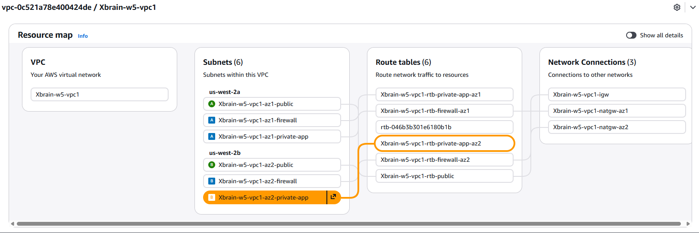
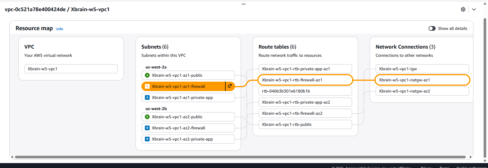
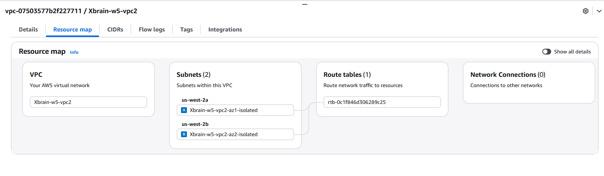
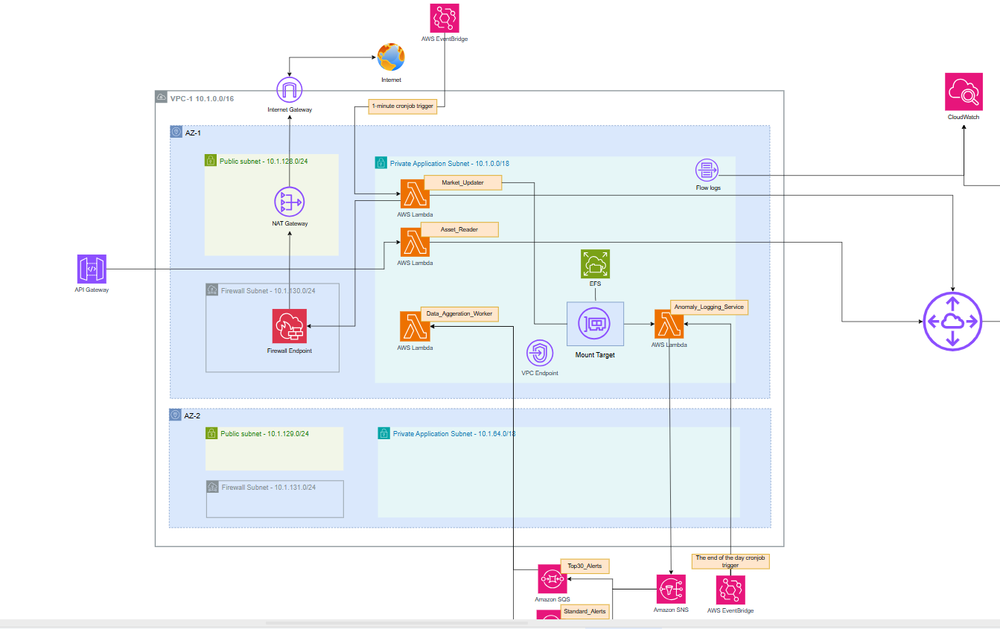
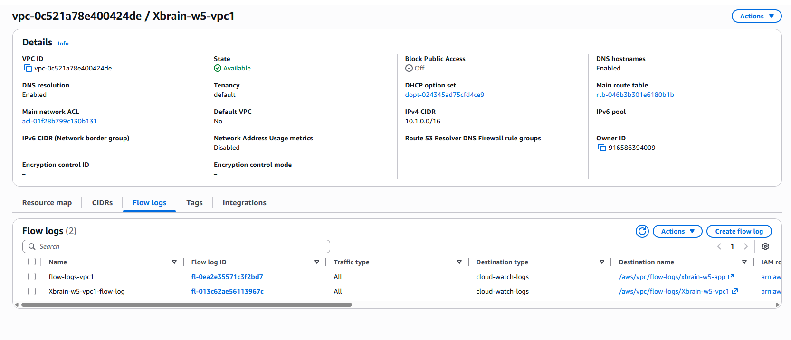

## Section 2 — Cover

The following diagrams show the complete network architecture, the network is in two VPC, one dedicated for lambdas (application); the other is for RDS + RDS proxy.

For upcoming requirements, additional VPC flow logs are created for logging. The following image shows the flow logs available on VPC-1 (application), which is important for later hurdles, which is to trace packet journey, and to verify success/failure of a packet. FLow logs are used extensively by the team to debug Route table/NACL issues.

