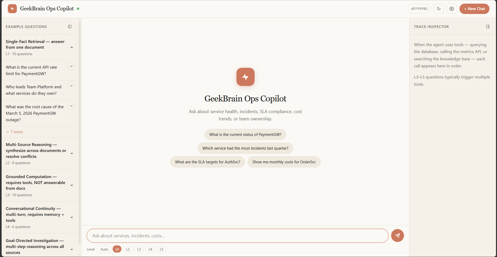
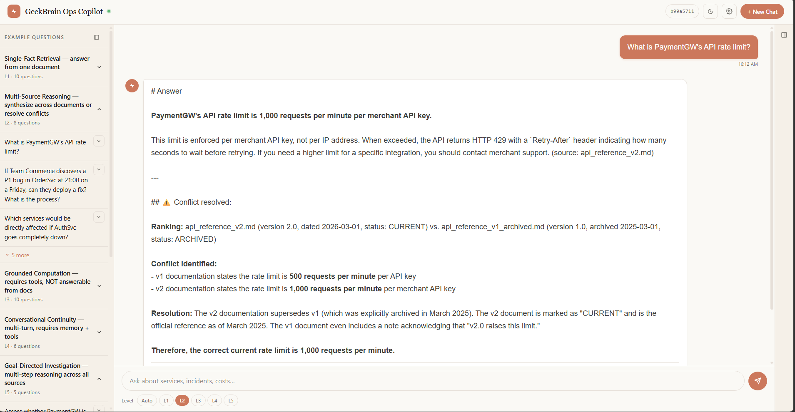
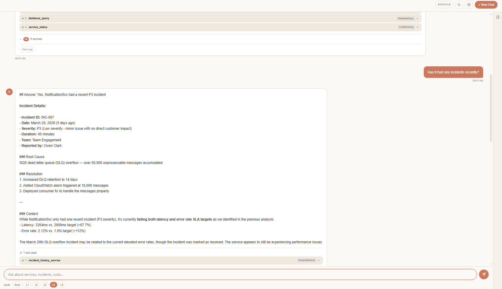
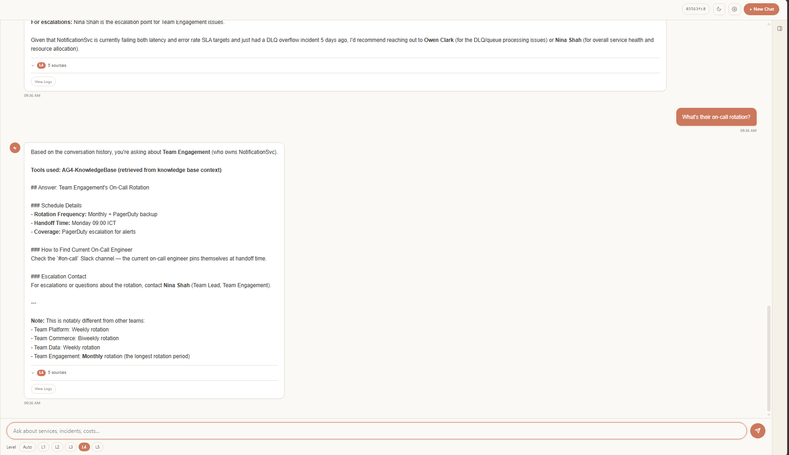

# Evidence Pack - Group 1

**Project:** GeekBrain AI Operations Copilot  
**Submission Date:** 08/05/2026  

---

## Section 1 — Cover

* **Group Number:** Group 1
* **Members:** [Member 1], [Member 2]
* **LLM Used:** Claude 4.5 Sonnet (via Amazon Bedrock)
* **Framework:** Custom Agent (Raw API Orchestration via AWS Lambda)
* **Link Repository:** https://github.com/JaxTheDeveloper/techx_aws_resources.git

---

## Section 2 — Architecture Overview

### 1. System Architecture Diagram

Level 1-2:

Level 3:


### 2. Danh sách Component

* **API Gateway:** Receive request REST from Frontend.
* **Custom Agent Lambda:** Orchestrator perform loop to call Knowledge Base, process Tool Use and manage conversation with LLM.
* **Knowledge Base (KB):** Store 36 Markdown files of GeekBrain, provide semantic search capability.
* **DynamoDB(SQLite):** Store history data of Cost, Incidents and SLA.
* **Claude 4.5 Sonnet:** Main LLM perform reasoning, extract data and summarize the answer.

### 3. Screenshot System Running


---

## Section 3 — Decision Log


---

## Section 4 — Per-Level Evidence

### L1 Evidence
* **Question:** "Who leads Team Platform and what services do they own?"
* **Screenshot Output:**

* **Retrieval Evidence:**
 ```json
{
  "level": "L1 - Simple RAG",
  "answer": "Alex Chen leads Team Platform as the Engineering Lead. The team owns two critical services: PaymentGW (payment gateway processing credit cards and bank transfers) and AuthSvc (OAuth2/JWT authentication serving all other services). (source: team_platform.md)",
  "kb_sources": [
    "team_platform.md"
  ],
  "chunks_retrieved": 1,
  "chunks_detail": [],
  "tools_used": []
}
```

### L2 Evidence
* **Question:** "What is the API rate limit for PaymentGW?"
* **Screenshot:**

* **Processing Evidence:** "The v2 documentation supersedes v1 (which was explicitly archived in March 2025). The v2 document is marked as "CURRENT" and is the official reference as of March 2025. The v1 document even includes a note acknowledging that "v2.0 raises this limit.""

### L3 Evidence
* **Question:** "Which service had the highest total cost in March 2026?"
* **Screenshot:**

* **Tool Call Evidence:**
```json
{
  "level": "L3 - RAG + Tools",
  "answer": "**Answer:** **PaymentGW** had the highest total cost in March 2026 at **$7,500**.\n\nThis aligns with the context from the Knowledge Base documents, which noted that:\n- PaymentGW has \"the highest absolute infrastructure cost of any service\"\n- CTO James Wright raised concerns at the Q1 2026 quarterly review that PaymentGW costs grew significantly faster than transaction volume\n- The March 5 P1 incident likely contributed to elevated March costs due to retries, fallback routing, and incident remediation activity\n\n**Tool used:** `database_query` from Action Group 2 (DatabaseQuery) - querying the monthly_costs table for March 2026 data.",
  "tools_used": [
    {
      "step": 1,
      "action_group": "AG2-DatabaseQuery",
      "tool": "database_query",
      "api_endpoint": "SQLite /opt/geekbrain.db",
      "input": {
        "query": "SELECT service, total_cost FROM monthly_costs WHERE month = '2026-03' ORDER BY total_cost DESC LIMIT 1"
      },
      "result": {
        "results": [
          {
            "service": "PaymentGW",
            "total_cost": 7500
          }
        ],
        "count": 1
      },
      "status": "success"
    }
  ]
}
```

### L4 Evidence
* **Question:** "What is the total cost of PaymentGW in January 2026?"
* **Screenshot:**




* **Memory Strategy:**

### L5 Evidence
* **Question:** "What is the total cost of PaymentGW in January 2026?"
* **Screenshot:**

* **Memory Strategy:**

---

## Section 5 — Reflection
