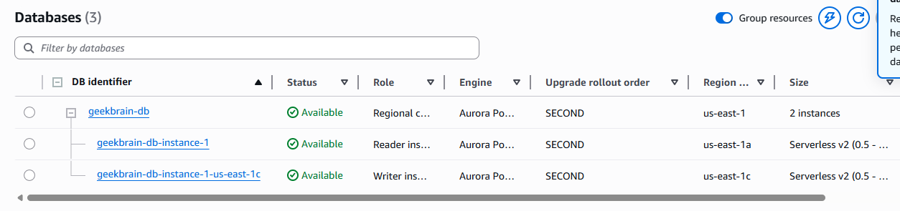
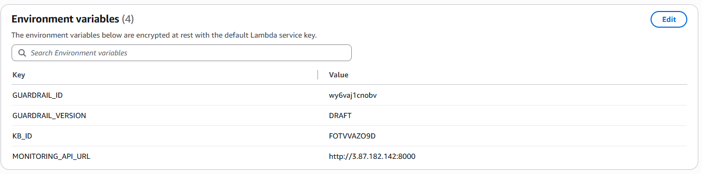

# Evidence Pack - Group 1

**Project:** GeekBrain AI Operations Copilot  
**Submission Date:** 08/05/2026  

---

## Section 1 — Cover

* **Group Number:** Group 1
* **Members:**
Phan Thị Thủy Hiền
Hoàng Nhật Thành
Nguyễn Qúy Hưng
Nguyễn Hoàng Huy
Phạm Tùng Dương
Nguyễn Quang Phong
Trần Đình Minh Quân
Phan Nguyên Đạt
Võ Đức Vũ
* **LLM Used:** Claude 4.5 Sonnet (via Amazon Bedrock)
* **Framework:** Custom Agent (Raw API Orchestration via AWS Lambda)
* **Link Repository:** https://github.com/JaxTheDeveloper/techx_aws_resources.git

---

## Section 2 — Architecture Overview

### 1. System Architecture Diagram

Level 1-2:

Level 3-4:


### 2. Component List

* **API Gateway:** Receive request REST from Frontend.
* **Custom Agent Lambda:** Orchestrator perform loop to call Knowledge Base, process Tool Use and manage conversation with LLM.
* **Knowledge Base (KB):** Store 36 Markdown files of GeekBrain, provide semantic search capability.
* **DynamoDB(SQLite):** Store conversation history.
* **Claude 4.5 Sonnet:** Main LLM perform reasoning, extract data and summarize the answer.
* **OpenSearch Vector Store:** Store vectorized chunks of Knowledge Base.

### 3. Screenshot System Running
[GeekBrain](http://w4-geekbrain-test-ui.s3-website-us-east-1.amazonaws.com)

---

## Section 3 — Decision Log
### KB retrieval strat
The chunking strategy for our Knowledge Base (KB) directly influenced our choice of retrieval method, balancing autonomy with ease of deployment. Since our primary goal was a native AWS integration (rejecting on-prem FAISS), we optimized for **semantic chunking**:

*   **L1 (Simple RAG):** Utilizes `RetrieveAndGenerate()`. This was necessary because a standard `Retrieve()` only fetched the first child chunk, which impeded overall context quality.
*   **L2–L5 (Advanced RAG):** Employs the `Retrieve()` API with a higher density of **10 chunks** to provide richer context for complex queries.

### Structured data querying for L3-L5
We evaluated three storage options for structured data, prioritizing the transition from PoC to production:

1.  **SQLite (Current PoC):** Implemented as a Lambda Layer for rapid development and low latency.
2.  **S3 + Amazon Athena:** Offers low storage costs but was rejected for L5 iterations due to a **1–5s cold start** latency.
3.  **Amazon Aurora (PostgreSQL):** The long-term target for production. While the environment is provisioned, data population is pending. 
    *   *Note: While SQLite served the PoC, Aurora is the designated "best practice" for performance and scalability.*


*Figure : Provisioned Amazon Aurora PostgreSQL instance intended for production-grade data persistence.*

### API Hosting and Deployment
Our hosting strategy evolved to overcome infrastructure overhead:

*   **Initial Plan:** Deploy containers via **AWS Fargate** using `api_mapping.py`. Remnants of Fargate installation is evident on the lambda code.
```py
#/lambda/chat_handler.py

from geekbrain.prompts import (
    L1_SYSTEM_PROMPT,
    L2_SYSTEM_PROMPT,
    L3_SYSTEM_PROMPT,
    L5_SYSTEM_PROMPT
)

KNOWLEDGE_BASE_ID = os.environ.get("KB_ID", "YOUR_KB_ID")
MODEL_ID = "us.anthropic.claude-sonnet-4-5-20250929-v1:0"
MONITORING_API_URL = os.environ.get("MONITORING_API_URL", "http://YOUR_FARGATE_IP:8000") # remnants of Fargate installation
GUARDRAIL_ID = os.environ.get("GUARDRAIL_ID", "")
GUARDRAIL_VERSION = os.environ.get("GUARDRAIL_VERSION", "DRAFT")
```
*   **Current Solution:** To bypass Fargate setup complexity during development, the team hosted the API on **port 8000** via an **ngrok dev domain**.
*   **Result:** This approach allowed L3–L5 modules to execute perfectly with a stable endpoint.
---


*Figure : Monitoring URL is an ip address pointing to ngrok dev domain.*

## Section 4 — Per-Level Evidence

### L1 Evidence
* **Question:** "Who leads Team Platform and what services do they own?"
* **Screenshot Output:**

* **Retrieval Evidence:**
 ```json
{
  "level": "L1 - Simple RAG",
  "answer": "Alex Chen leads Team Platform as the Engineering Lead. The team owns two critical services: PaymentGW (payment gateway processing credit cards and bank transfers) and AuthSvc (OAuth2/JWT authentication serving all other services). (source: team_platform.md)",
  "kb_sources": [
    "team_platform.md"
  ],
  "chunks_retrieved": 1,
  "chunks_detail": [],
  "tools_used": []
}
```

### L2 Evidence
* **Question:** "What is the API rate limit for PaymentGW?"
* **Screenshot:**

* **Processing Evidence:** "The v2 documentation supersedes v1 (which was explicitly archived in March 2025). The v2 document is marked as "CURRENT" and is the official reference as of March 2025. The v1 document even includes a note acknowledging that "v2.0 raises this limit.""

### L3 Evidence
* **Question:** "Which service had the highest total cost in March 2026?"
* **Screenshot:**

* **Tool Call Evidence:**
```json
{
  "level": "L3 - RAG + Tools",
  "answer": "**Answer:** **PaymentGW** had the highest total cost in March 2026 at **$7,500**.\n\nThis aligns with the context from the Knowledge Base documents, which noted that:\n- PaymentGW has \"the highest absolute infrastructure cost of any service\"\n- CTO James Wright raised concerns at the Q1 2026 quarterly review that PaymentGW costs grew significantly faster than transaction volume\n- The March 5 P1 incident likely contributed to elevated March costs due to retries, fallback routing, and incident remediation activity\n\n**Tool used:** `database_query` from Action Group 2 (DatabaseQuery) - querying the monthly_costs table for March 2026 data.",
  "tools_used": [
    {
      "step": 1,
      "action_group": "AG2-DatabaseQuery",
      "tool": "database_query",
      "api_endpoint": "SQLite /opt/geekbrain.db",
      "input": {
        "query": "SELECT service, total_cost FROM monthly_costs WHERE month = '2026-03' ORDER BY total_cost DESC LIMIT 1"
      },
      "result": {
        "results": [
          {
            "service": "PaymentGW",
            "total_cost": 7500
          }
        ],
        "count": 1
      },
      "status": "success"
    }
  ]
}
```

### L4 Evidence
* **Question:** "What is the total cost of PaymentGW in January 2026?"
* **Screenshot:**


* **Memory Strategy:**
One big table DynamoDB is chosen for context storage in favor for fast retrieval with efficient data modelling stategy. Adjacency table data pattern is used to store both conversation ID and turn ID. L5 also uses this memory strategy, since L5 is what L1-L4 has been doing, wrapped in a loop with an end state. Recall the defintion of classical AI agents. 


---

## Section 5 — Reflection
