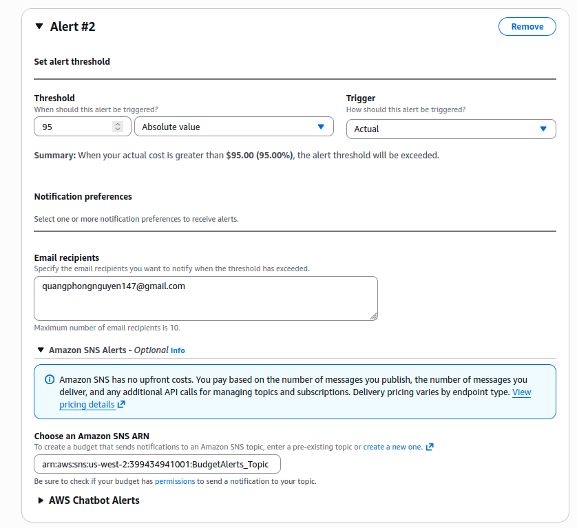

# W7 Capstone - Cost Management Evidence

**Team:** DocHub (ProductivityTech - AI Document Hub)
**Live URL:** https://docs4hub.tech

---

## Setting Up Cost Guardrails Before We Spend Anything

Before deploying anything, we set up guardrails to prevent accidentally exceeding the $100 cap.

### Step 1: AWS Budget with Alert at $80

We created a budget in the AWS Billing console set to **$100 total cost**, with an **alert at $80 (80%)**. This gives us $20 of breathing room to shut things down before hitting the cap.

The screenshot shows the budget configuration: budget name, amount ($100), email alerts at 80% threshold, and the current spend vs budget tracking.

### Step 2: Connecting the Alert to Email via SNS

A budget alert is useless without a delivery channel. We created an SNS topic, subscribed an email, and linked the topic to the budget alert action.

The screenshot shows the SNS subscription confirmation email - we had to click "Confirm subscription" to activate it.

The screenshot shows the SNS subscription entry in the console after confirmation.

### Step 3: Turning On Cost Anomaly Detection

AWS Cost Anomaly Detection is a free ML-powered feature that flags unusual spend patterns (e.g., a service costing 5x more than yesterday). We enabled it at account level.

The screenshot shows the anomaly detection dashboard. No anomalies were detected during our build period - costs were stable and predictable.

---

## Tagging Everything So We Can Track It

Tagging was the boring-but-important work we did before creating any resources. Every single billable resource got the same set of tags so we could filter by them in Cost Explorer later.

### The Tag Schema

Every billable resource received these tags (30+ resources tagged):

| Tag Key | Value | Purpose |
|---------|-------|---------|
| Project | W7Capstone | Group all costs in Cost Explorer |
| Team | G1 | Identify team ownership |
| Environment | hackathon | Distinguish from production |
| Owner | quangphongnguyen147@gmail.com | Personal accountability |

### Activating Cost Allocation Tags

Tags are invisible in Cost Explorer until activated as cost allocation tags. We activated the `Project` tag in the Billing console so Cost Explorer can group and filter costs by project.

### Verifying Coverage with Resource Groups

To verify every resource was tagged, we created a resource group that queries `Owner: quangphongnguyen147@gmail.com`. Any resource missing the tag won't appear - a quick way to catch untagged resources.

The screenshot shows the resource group with all 30+ tagged resources visible. Every Lambda, S3 bucket, DynamoDB table, API Gateway, and VPC component appears here - if it were missing a tag, it wouldn't show up.

### Enforcing Tags with Tag Policies

We applied an Organizations tag policy that requires `Project=W7Capstone` on all resources. New resources created without this tag are flagged for remediation.

The screenshot shows the tag policy rules configured in the AWS Organizations console.

---

## Tracking Free Tier Usage

AWS Free Tier covers many services up to certain limits (1M Lambda requests/month, 25GB DynamoDB storage, 5GB S3, 1TB CloudFront outbound). We tracked usage to stay within these limits and avoid unexpected bills.

The screenshot shows the Free Tier dashboard overview - all services were well within their limits.

The screenshot shows the detailed breakdown by service. Lambda and DynamoDB - the two services most likely to exceed free tier under load - remained well within limits.

---

## What We Actually Spent

Most services are covered by AWS Free Tier at our usage level - they cost $0:

| Service | Cost | Why |
|---------|------|-----|
| Lambda (backend + reingest) | $0 | Free tier (1M requests/month) |
| API Gateway HTTP API | $0 | Free tier |
| DynamoDB (on-demand) | $0 | Free tier (25GB storage) |
| S3 (documents + frontend + dependencies) | $0 | Free tier (5GB) |
| CloudFront (CDN) | $0 | Free tier (1TB outbound) |
| Cognito User Pool | $0 | Free tier (50K MAU) |
| Bedrock Knowledge Base (embedding during sync) | $0 | Covered by Bedrock Free Tier (100K embeddings) |
| EventBridge + SNS | $0 | Free tier (100+ events/month) |
| OpenSearch Serverless (KB vector store) | ~$0.15 | Not free tier - 2 OCU minimum |
| Bedrock Claude Haiku (inference) | ~$0.02 | Pay-as-you-go, no free tier |
| KMS CMK (S3 encryption) | ~$0.02 | $1/key/month prorated |

Total real cash spent so far is under **$0.20** - all from services outside free tier (OpenSearch Serverless minimum OCU, Bedrock pay-as-you-go inference, KMS prorated key cost). Well under the $100 cap.

---

## Teardown

All resources will be deleted by Sunday 1/6 EOD. A post-teardown Cost Explorer screenshot showing $0 ongoing spend and a deletion log will be included in `teardown_confirmation.md`.
