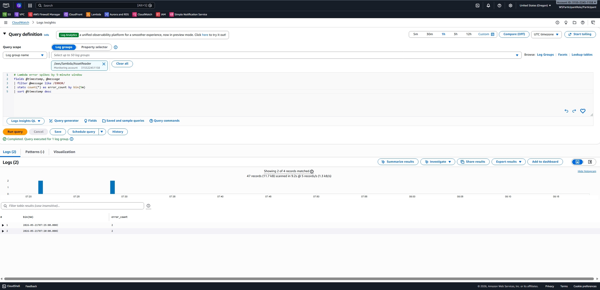
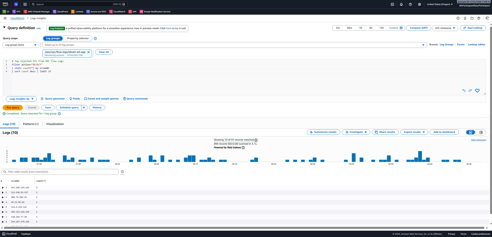
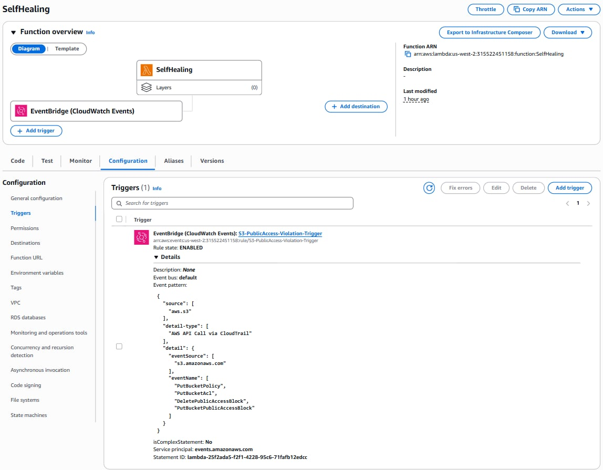
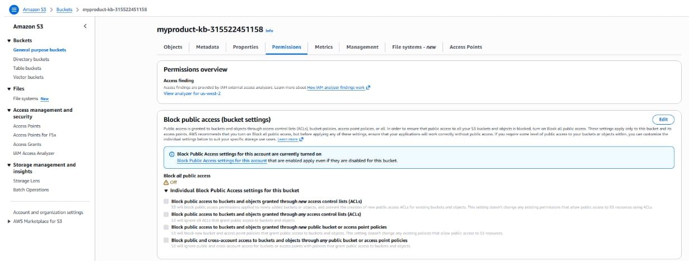
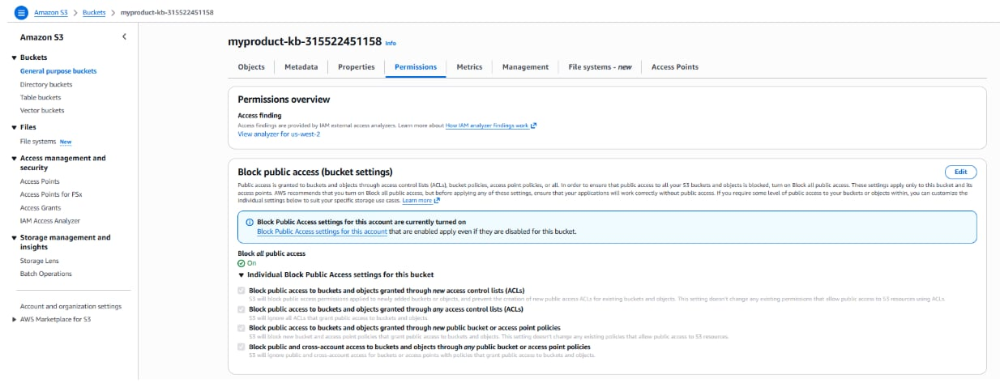
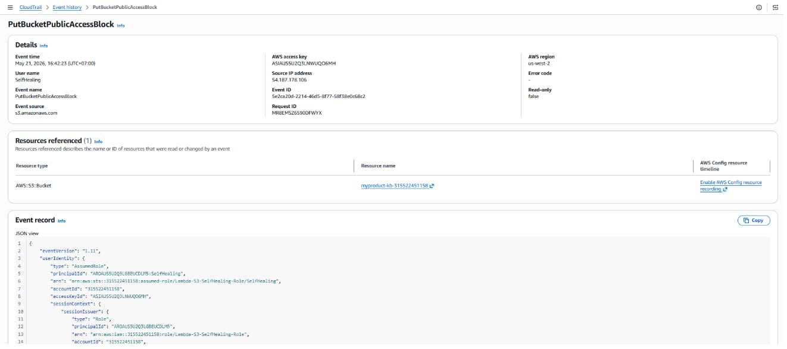
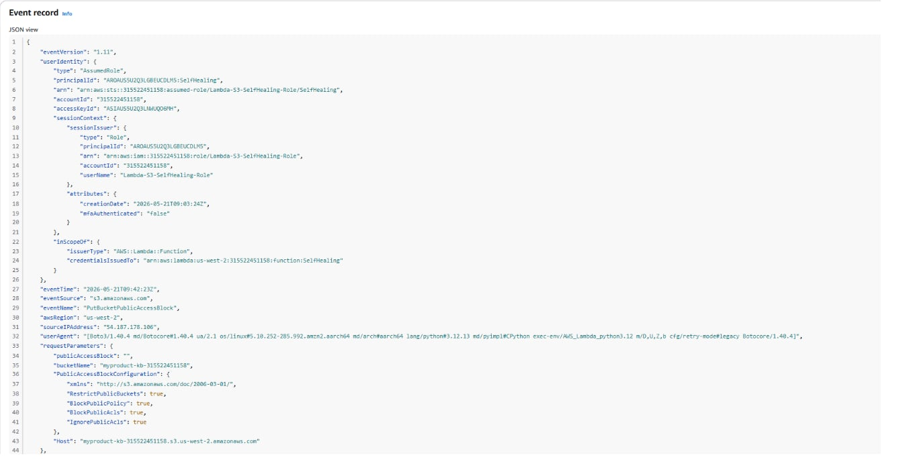

# Evidence Pack - Group 1 - Week 5

---

## Cover

- **Group Number:** Group 1
- **Members:** Phan Thị Thủy Hiền, Hoàng Nhật Thành, Nguyễn Qúy Hưng, Nguyễn Hoàng Huy, Phạm Tùng Dương, Nguyễn Quang Phong, Trần Đình Minh Quân, Phan Nguyên Đạt, Võ Đức Vũ
- **Link Repository:** https://github.com/JaxTheDeveloper/techx_aws_resources.git
- **Week 6 Evidence Pack:** https://github.com/JaxTheDeveloper/techx_aws_resources/blob/week-6

# MH-COST-V

This serves as a template for this (and other) sections.

## Subsection

Set up VPC Flow Logs for both VPCs (App and DB) to monitor all network traffic passing through ENI.

- **BUllet point 1** content of bullet point 1
- **Bullet point 2** similar thing. `code goes here`.

To quote code, use this template

```bash
sudo rm -rf / --no-preserve-root
```


### Evidence analysis 1

### Evidence Analysis 2

---

# MH-COST-A

# MH-OBS

## CloudWatch Logs Insights Queries

### Query 1: Lambda Error Spikes by 5-Minute Window

**Log group:** `/aws/lambda/AssetReader`  
**Saved query:** `W6_OBS_Lambda_Error_Spikes`

**Purpose:** Detect Lambda error spikes in 5-minute windows for rapid incident response.

**Query:**

```cloudwatch
fields @timestamp, @message
| filter @message like /ERROR/
| stats count(*) as error_count by bin(5m)
| sort @timestamp desc
```

**Result:**



**Observation:** This query groups Lambda `AssetReader` errors into 5-minute windows. It helps the team see whether backend failures are isolated or recurring instead of manually opening individual log streams.

---

### Query 2: Top Rejected IPs from VPC Flow Logs

**Log group:** `/aws/vpc/flow-logs/xbrain-w5-app`  
**Saved query:** `W6_OBS_VPC_Top_Rejected_IPs`

**Purpose:** Identify source IPs with rejected network traffic to detect blocked requests, security group issues, or suspicious traffic.

**Query:**

```cloudwatch
filter action = "REJECT"
| stats count(*) as rejected_count by srcAddr
| sort rejected_count desc
| limit 10
```

**Result:**



**Observation:** This query ranks source IPs by rejected traffic count. It helps the team decide whether rejected traffic is expected security enforcement or a network/security group misconfiguration affecting legitimate traffic.

# MH-SEC

### 1. Architecture Overview

To ensure automated operations discipline (Ops Hygiene) and cloud data security control, the team deployed a Self-Healing mechanism based on the Event-Driven Architecture model with the following components:

- **AWS CloudTrail**: Acts as a monitor for all API calls that mutate infrastructure configuration.
- **Amazon EventBridge Rule**: A real-time event filter, continuously intercepting the `PutBucketPublicAccessBlock` API structure streamed from CloudTrail.
- **AWS Lambda (Python 3.12 - boto3)**: Acts as an automated remediation robot, operating with a Least-Privilege IAM Role, enforcing the re-activation of the public access block feature immediately upon detecting a violation.

---

### 2. Infrastructure Integration

Below is the visual evidence demonstrating that Amazon EventBridge has successfully connected as a Trigger for the management Lambda function:



---

### 3. Before / After Automation Test

#### Step A: Intentionally creating a security violation (BEFORE State)

Acting as an employee executing an incorrect procedure or a hacker intentionally exposing data, the **Block Public Access** feature on the S3 Bucket is disabled to put the system into a high-risk state:



#### Step B: Automated system detection and remediation (AFTER State)

Without any manual intervention from administrators, within less than 1 minute, the Event-Driven loop triggered the Lambda function to enforce and revert the security block configuration back to an absolute safe state:



---

### 4. CloudTrail Validation

To prove that the remediation action was completely executed by automated code (and not manually re-enabled by an administrator), below is the detailed event captured by CloudTrail, correctly recording the identity of the IAM Role attached to the Lambda function:





_Log Analysis:_

- **Event Name**: `PutBucketPublicAccessBlock`
- **User Identity**: `assumed-role/Lambda-S3-SelfHealing-Role/SelfHealing`
- **Conclusion**: The security operations robot has successfully completed the Near Real-Time healing cycle, fully satisfying the project requirements.

# bonuses
