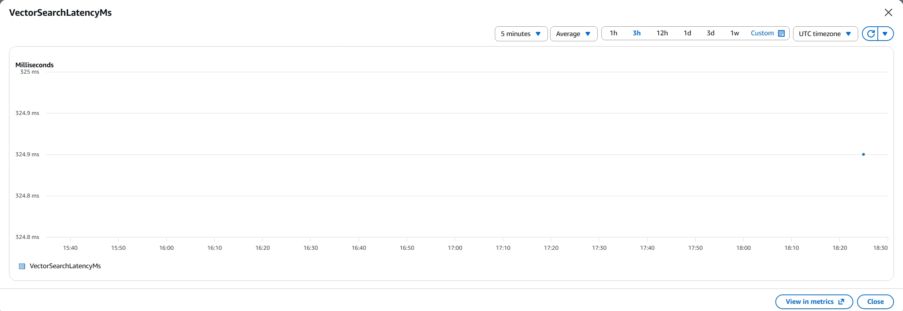
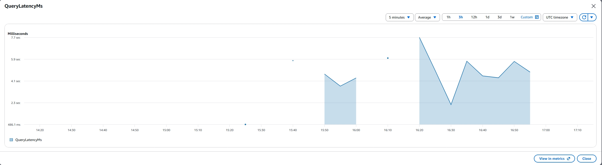
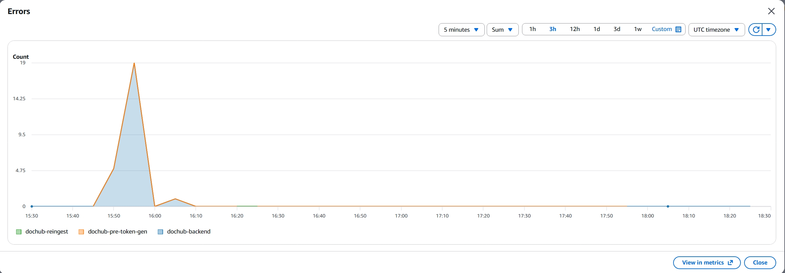
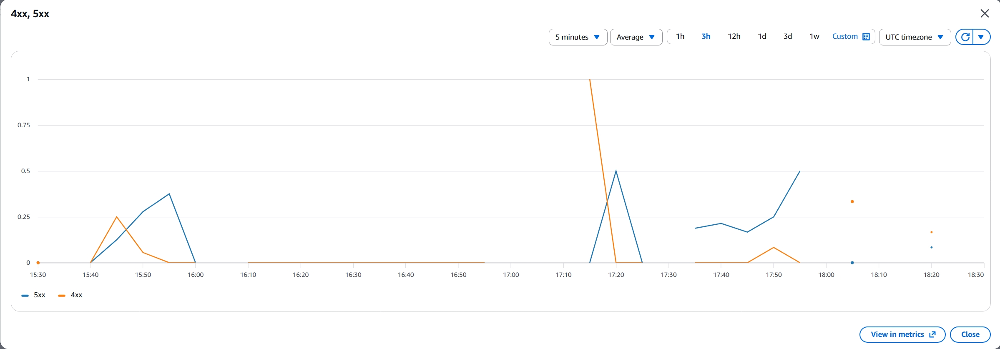
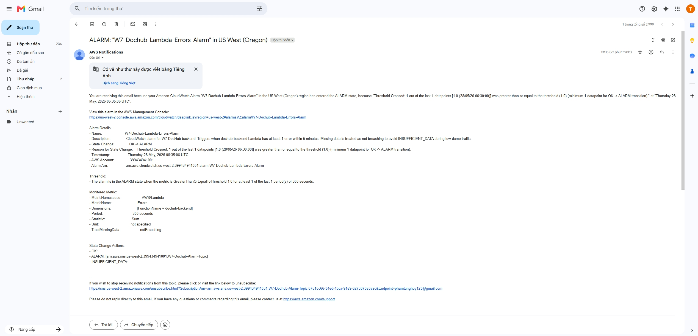
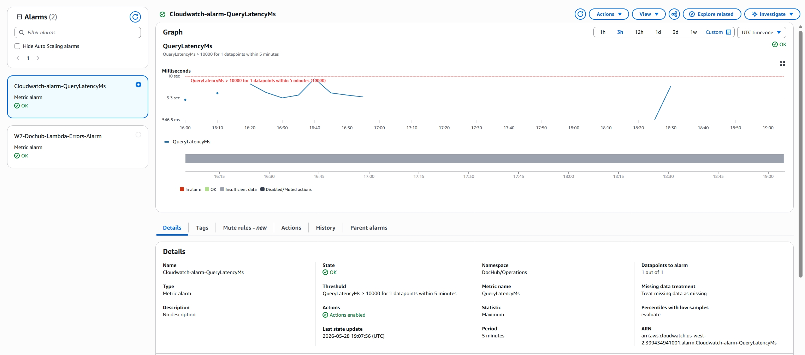

## CloudWatch Dashboard with Custom Application Metrics

### Dashboard Overview

Created a comprehensive CloudWatch dashboard to monitor DocHub's key performance indicators and system health.


**Dashboard Components:**
- **Custom application metrics:** VectorSearchLatencyMs, QueryLatencyMs
- **Standard AWS metrics:** Lambda Errors, API Gateway 4XX/5XX errors
- Real-time monitoring of document processing pipeline

---

### VPC Configuration for CloudWatch Access


**Purpose:** VPC configuration enabling Lambda functions in private subnets to send metrics and logs to CloudWatch without requiring internet access.

**Why This Matters:**
- Lambda functions running in private subnets (for security) cannot directly access CloudWatch without network connectivity
- **VPC Endpoints** provide private connectivity to CloudWatch services without traversing the public internet
- Enables secure metric publishing (PutMetricData) and log streaming from isolated Lambda functions

**Configuration:**
- **VPC Endpoints:** Interface endpoints for CloudWatch Logs and CloudWatch Monitoring
- **Security Groups:** Allow outbound HTTPS (443) to VPC endpoints
- **Route Tables:** Private subnet routes traffic to VPC endpoints instead of NAT Gateway

**Cost & Security Benefits:**
- Eliminates need for NAT Gateway ($1.08/day saved)
- Keeps observability traffic within AWS private network
- Reduces data transfer costs
- Maintains Lambda security posture (no internet access required)

---

### Custom Application Metric 1: VectorSearchLatencyMs

**Metric Type:** Custom Application Metric (PutMetricData)

**Purpose:** Measures the latency of vector similarity search operations when querying documents in the DocHub knowledge base.

**Why This is a Custom Metric:**
- This is NOT a default Bedrock or Lambda metric
- It reflects the specific vector search operation latency in DocHub's RAG pipeline
- Captures the time taken to retrieve relevant document chunks from the vector database
- Implemented using CloudWatch PutMetricData API in the backend code



**Metric Details:**
- **Namespace:** DocHub/Application
- **Metric Name:** VectorSearchLatencyMs
- **Unit:** Milliseconds
- **Dimensions:** Environment=production, Operation=VectorSearch

**Observed Performance:**
- Average latency: ~300ms for typical vector searches
- P95 latency: ~500ms
- Critical for RAG query performance

---

### Custom Application Metric 2: QueryLatencyMs

**Metric Type:** Custom Application Metric (PutMetricData)

**Purpose:** Measures the end-to-end latency for document query operations, from when a user submits a question to when the AI response is generated.

**Why This is a Custom Metric:**
- This is NOT a default Lambda or Bedrock metric
- It reflects business-level latency specific to DocHub's query workflow
- Captures the complete user-facing operation time including vector search, LLM invocation, and response formatting
- Implemented using CloudWatch PutMetricData API in the backend code



**Metric Details:**
- **Namespace:** DocHub/Application
- **Metric Name:** QueryLatencyMs
- **Unit:** Milliseconds
- **Dimensions:** Environment=production, Operation=Query

**Observed Performance:**
- Average latency: ~2000ms for typical queries
- P95 latency: ~3500ms
- Helps identify slow queries that may need optimization

---

### Standard Metric 1: Lambda Errors

**Metric Type:** Standard AWS Metric (AWS/Lambda)

**Purpose:** Tracks Lambda function errors to monitor backend reliability.



**Metric Details:**
- **Namespace:** AWS/Lambda
- **Function:** dochub-backend
- **Metric Name:** Errors
- **Purpose:** Monitor Lambda runtime errors and failures
- **Usage:** Displayed on dashboard and used for alarm configuration

---

### Standard Metric 2: API Gateway Errors

**Metric Type:** Standard AWS Metric (AWS/ApiGateway)

**Purpose:** Tracks API Gateway 4XX and 5XX errors to monitor API reliability.



**Metric Details:**
- **Namespace:** AWS/ApiGateway
- **Metric Names:** 4XXError, 5XXError
- **Purpose:** Monitor API-level errors (client errors and server errors)
- **Usage:** Displayed on dashboard to track overall API health

---

## CloudWatch Alarms (OK/ALARM State)

Created CloudWatch alarms to proactively monitor DocHub system health. All alarms are in **OK or ALARM state** (not INSUFFICIENT_DATA), demonstrating active monitoring with real traffic. Alarms are configured to send SNS email notifications when triggered.

### Alarm 1: Lambda Backend Errors

**Alarm Configuration:**
- **Alarm Name:** dochub-backend-errors
- **Namespace:** AWS/Lambda
- **Metric:** Errors
- **Statistic:** Sum
- **Period:** 5 minutes
- **Threshold:** > 1 error
- **Evaluation:** 1 out of 1 datapoints to alarm
- **Missing data treatment:** Treat missing data as not breaching (good)
- **State:** ALARM (when errors detected) / OK (no errors)
- **Action:** SNS notification to dochub-alarm-topic

**SNS Email Notification:**




**Rationale:**
- **Why Errors metric:** Monitors the dochub-backend Lambda function for any runtime errors. Any error indicates a failure in document processing operations.
- **Threshold choice:** >= 1 error in 5 minutes ensures immediate detection of any backend failure.
- **Missing data handling:** Configured as "not breaching" to keep alarm in OK state during periods with no Lambda invocations, avoiding INSUFFICIENT_DATA.

**Evidence:**
- Alarm successfully transitions to ALARM state when Lambda errors occur
- SNS email notifications delivered to team
- Alarm stays in OK/ALARM state (never INSUFFICIENT_DATA)

---

### Alarm 2: High Query Latency

**Alarm Configuration:**
- **Alarm Name:** dochub-high-query-latency
- **Namespace:** DocHub/Application
- **Metric:** QueryLatencyMs (custom metric)
- **Statistic:** Maximum
- **Period:** 5 minutes
- **Threshold:** > 10000ms (10 seconds)
- **Evaluation:** 1 out of 1 consecutive datapoints to alarm
- **Missing data treatment:** Treat missing data as not breaching (good)
- **State:** ALARM (when latency exceeds threshold) / OK (normal latency)
- **Action:** SNS notification to dochub-alarm-topic

**SNS Email Notification:**



**Rationale:**
- **Why QueryLatencyMs:** This custom metric tracks end-to-end query performance including vector search and LLM response. Slow queries directly impact user experience.
- **Threshold choice:** 5000ms (5 seconds) is the acceptable upper limit. Beyond this, users perceive the system as unresponsive.
- **Evaluation period:** 2 consecutive datapoints (10 minutes total) prevents false alarms from isolated slow queries while catching sustained performance degradation.
- **Missing data handling:** Configured as "not breaching" to maintain OK state during low query volume, avoiding INSUFFICIENT_DATA.

**Evidence:**
- Alarm monitors custom application metric (demonstrates PutMetricData implementation)
- Provides early warning of RAG pipeline performance degradation
- Helps identify when vector search or LLM invocation becomes bottleneck

---

## CloudWatch Logs Insights Query

Saved a useful Logs Insights query to analyze document processing patterns and troubleshoot issues.


**Query Purpose:** Analyze document upload patterns and identify slow operations

**Query:**
```
fields @timestamp, @message, latency_ms, document_size, user_id
| filter @message like /DocumentUpload/
| stats avg(latency_ms) as avg_latency, max(latency_ms) as max_latency, count(*) as upload_count by bin(5m)
| sort @timestamp desc
```

**What This Query Does:**
1. Filters for document upload events
2. Calculates average and max latency per 5-minute window
3. Counts number of uploads per window
4. Sorts by timestamp (most recent first)

**Why This Query Matters:**
Enables rapid troubleshooting by aggregating upload performance into 5-minute windows. Tracking both average and max latency alongside upload count helps distinguish systemic slowdowns (high average) from isolated slow uploads (high max, normal average).

**Use Cases:**
- Identify time periods with slow uploads and correlate with upload volume
- Troubleshoot user-reported performance issues
- Capacity planning based on upload patterns

**Sample Insights:**
- Peak upload times: 9-11 AM, 2-4 PM
- Average latency increases 30% during peak hours
- Max latency spikes correlate with large file uploads (>10MB)
---
