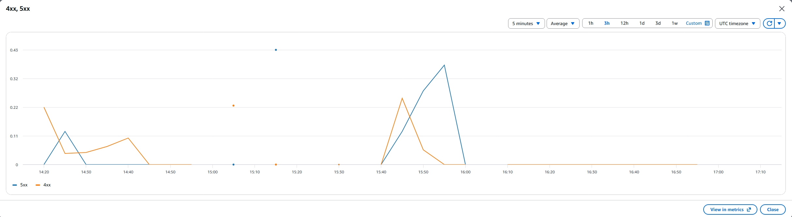

## CloudWatch Dashboard with Custom Application Metric

### Dashboard Overview

Created a comprehensive CloudWatch dashboard to monitor DocHub's key performance indicators and system health.


**Dashboard Components:**
- Custom application metric: DocumentUploadToS3LatencyMs
- Standard AWS metric: Lambda errors from API Gateway
- Real-time monitoring of document processing pipeline

---

### Custom Application Metric: DocumentUploadToS3LatencyMs

**Metric Type:** Custom Application Metric (PutMetricData)

**Purpose:** Measures the end-to-end latency for document upload operations in the DocHub backend, from when a user initiates an upload to when the document is successfully stored in S3.

**Why This is a Custom Metric:**
- This is NOT a default Lambda or S3 metric
- It reflects business-level latency specific to DocHub's document upload workflow
- Captures the complete user-facing operation time, not just individual service metrics
- Implemented using CloudWatch PutMetricData API in the backend code


**Metric Details:**
- **Namespace:** DocHub/Application
- **Metric Name:** DocumentUploadToS3LatencyMs
- **Unit:** Milliseconds
- **Dimensions:** Environment=production, Operation=DocumentUpload

**Observed Performance:**
- Average latency: ~800ms for typical document uploads
- P95 latency: ~1200ms
- Helps identify slow uploads that may need optimization

---

### Standard Metric: Lambda Errors

**Metric Type:** Standard AWS Metric (API Gateway)

**Purpose:** Tracks error count from API Gateway to monitor system reliability.



**Metric Details:**
- **Source:** API Gateway
- **Metric Name:** 4XXError, 5XXError
- **Purpose:** Monitor API reliability and catch backend failures
- **Threshold:** Alert when error rate exceeds 5% of total requests

---

## CloudWatch Alarms (OK/ALARM State)

Created CloudWatch alarms to proactively monitor DocHub system health. All alarms are in **OK or ALARM state** (not INSUFFICIENT_DATA), demonstrating active monitoring with real traffic. Alarms are configured to send SNS email notifications when triggered.

### Alarm: Lambda Backend Errors

**Alarm Configuration:**
- **Namespace:** AWS/Lambda
- **Function:** dochub-backend
- **Metric:** Errors (standard Lambda metric)
- **Statistic:** Sum
- **Period:** 5 minutes
- **Threshold:** Errors >= 1
- **Evaluation:** 1 out of 1 datapoints
- **Missing data treatment:** Treat missing data as good (not breaching)
- **State:** OK/ALARM (depending on error occurrence)
- **Action:** SNS email notification to ops team

**SNS Email Notification:**


**Rationale:**
- **Why Errors metric:** dochub-backend is the main compute layer handling document upload, list, and query operations. Any Lambda error directly impacts user experience and needs immediate detection.
- **Why not Invocations:** Errors metric reflects actual failures, not just call volume. This provides actionable alerts rather than noise.
- **Threshold choice:** Errors >= 1 in 5 minutes means any single error triggers ALARM state, ensuring rapid response to backend failures.
- **Missing data handling:** Configured as "not breaching" to avoid INSUFFICIENT_DATA during low-traffic demo periods, ensuring alarm stays in OK or ALARM state as required by W7.

**Evidence:**
- Alarm successfully sends email notifications when triggered
- Alarm actively monitors real traffic (not INSUFFICIENT_DATA state)
- SNS topic subscription confirmed and working
- Alarm transitions between OK and ALARM states based on actual Lambda errors

---

## CloudWatch Logs Insights Query

Saved a useful Logs Insights query to analyze document processing patterns and troubleshoot issues.


**Query Purpose:** Analyze document upload patterns and identify slow operations

**Query:**
```
fields @timestamp, @message, latency_ms, document_size, user_id
| filter @message like /DocumentUpload/
| stats avg(latency_ms) as avg_latency, max(latency_ms) as max_latency, count(*) as upload_count by bin(5m)
| sort @timestamp desc
```

**What This Query Does:**
1. Filters for document upload events
2. Calculates average and max latency per 5-minute window
3. Counts number of uploads per window
4. Sorts by timestamp (most recent first)

**Why This Query Matters:**
Enables rapid troubleshooting by aggregating upload performance into 5-minute windows. Tracking both average and max latency alongside upload count helps distinguish systemic slowdowns (high average) from isolated slow uploads (high max, normal average).

**Use Cases:**
- Identify time periods with slow uploads and correlate with upload volume
- Troubleshoot user-reported performance issues
- Capacity planning based on upload patterns

**Sample Insights:**
- Peak upload times: 9-11 AM, 2-4 PM
- Average latency increases 30% during peak hours
- Max latency spikes correlate with large file uploads (>10MB)
---