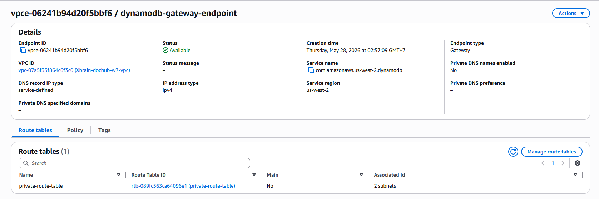
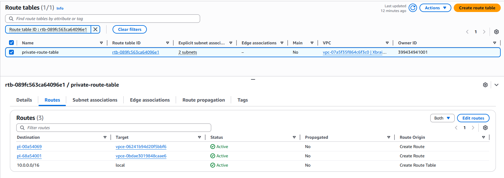

### Multi-tenant Isolation Design at the Data Layer

The system adopts a Single-Table Design strategy in DynamoDB, utilizing the `tenant_id` attribute as a physical isolation boundary between independent client organizations' data.

When a user uploads a document, the Lambda function extracts the JWT Token issued by the Cognito User Pool. The `custom:tenant_id` value is securely extracted from the API Gateway Authorizer layer and applied to the Partition Key attribute for data writing. During data query executions, the system strictly enforces an exact filter condition based on that tenant's identifier, comprehensively preventing cross-tenant data leak vulnerabilities.

---

### Network & Infrastructure Layer

- **VPC Endpoints Configuration:** The system has successfully established an Amazon VPC Gateway Endpoint for the DynamoDB service (`com.amazonaws.us-west-2.dynamodb`), clearly displaying an Available status. This endpoint ensures that all data traffic between the core Backend compute function and the database is entirely encapsulated within the AWS internal backbone network, completely bypassing the public Internet.

  

- **Route Table:** The routing table of the Private Subnet has been integrated with an automated routing rule. For any data access requests destined for the DynamoDB address range (represented by Prefix List ID `pl-00a54069`), the VPC network forwards the Target directly through the Gateway Endpoint.

  

- **Security Isolation Level:** The entire Backend compute component (AWS Lambda) and the Authorizer are securely isolated within the VPC's Private Subnet with no public Internet route, strictly satisfying the requirement that enterprise data must not be publicly exposed.

- **Optimal Cost Discipline:** The team decided to completely eliminate the NAT Gateway configuration—an expensive component with a fixed fee (~$1.50/day) that poses a risk of exceeding the budget limit. Replacing it with the free VPC Gateway Endpoint helps maintain infrastructure costs at an absolute minimum.

---

### Data & Security Layer

- **DynamoDB Table Overview Configuration:** The document metadata storage table `dochub-docs` is operating in an Active state. The primary key structure is explicitly defined, featuring the Partition Key as `tenant_id` (S) and the Sort Key as `sk` (S). The capacity management mode is set to On-demand (Pay-per-request) to optimize costs based on actual usage traffic.

  

- **At-Rest Data Encryption:** The secure Data Encryption at Rest mechanism for the `dochub-docs` table has been successfully configured to use a Customer managed key instead of the default AWS key. The encryption key is precisely specified via the KMS service ARN string.

  

- **KMS Key Rotation:** In the AWS KMS management console, the Key rotation tab for the CMK has been successfully enabled with the "Automatically rotate this KMS key every year" option.

  

- **Least-Privilege KMS Key Policy:** The JSON snippet configuring the Key Policy has established extremely strict access control boundaries in accordance with the Least-Privilege principle.

  
