# W7 Capstone Evidence Pack: AI Document Hub (DocHub)

## 1. Cover

- **Group:** Group 1
- **Members:** Phan Thị Thủy Hiền, Hoàng Nhật Thành, Nguyễn Qúy Hưng, Nguyễn Hoàng Huy, Phạm Tùng Dương, Nguyễn Quang Phong, Trần Đình Minh Quân, Phan Nguyên Đạt, Võ Đức Vũ
- **Live URL (HTTPS):** `https://docs4hub.tech`
- **GitHub Repo:** `https://github.com/JaxTheDeveloper/techx_aws_resources/tree/week-7-capstone#`
- **Total Spend:** `$0.47`

---

## 2. Pitch & Vision

AI Document Hub is a multi-tenant SaaS platform that helps legal and compliance teams manage, search, and cross-query thousands of contracts and policy documents.

- **The Problem:** Legal teams spend too much time searching for specific clauses scattered across dozens of different contract versions.
- **The AI Solution:** Automating information extraction and summarization based on strictly isolated tenant access rights.
- **Real-world parallel:** Our model learns from products like Harvey AI and Glean Workspace, specifically tackling the "document confusion" problem (where the AI mistakenly cites the wrong contract).

---

## 3. Architecture & Service Decisions

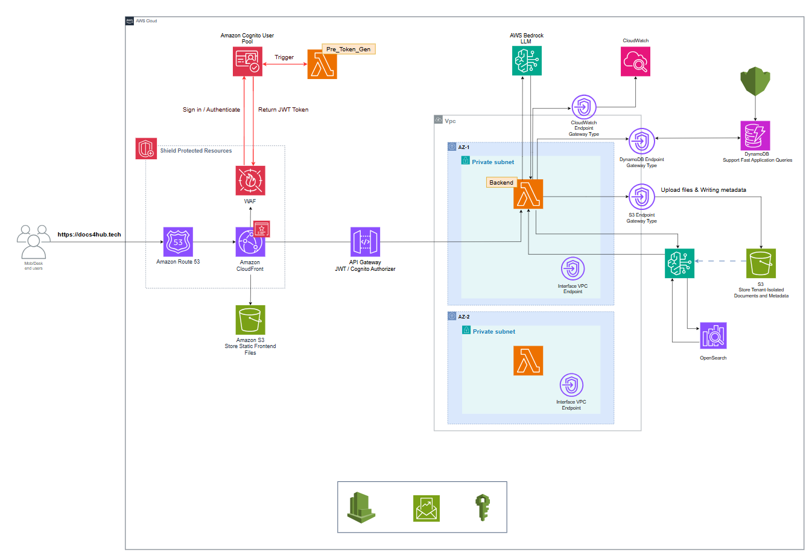

Our system fulfills all 7 Mandatory Capabilities:

| Mandatory Capability    | Chosen Service                                       | Rationale                                                                                                                                                                                                                                                                                                               |
| :---------------------- | :--------------------------------------------------- | :---------------------------------------------------------------------------------------------------------------------------------------------------------------------------------------------------------------------------------------------------------------------------------------------------------------------- |
| **1. User Interface**   | CloudFront + S3 Static                               | Provides a free public HTTPS URL on `*.cloudfront.net`, zero certificate management, and low-latency delivery via Asia edge nodes.                                                                                                                                                                                      |
| **2. App Compute**      | API Gateway HTTP + Lambda                            | HTTP API is ~3.5× cheaper than REST API per request; Lambda has zero idle cost and scales to concurrency per request, matching bursty hackathon traffic patterns.                                                                                                                                                       |
| **3. AI / ML**          | Bedrock Agent + KB (Claude 3.5 Haiku)                | Agent enables tool use — a Lambda action group filters documents by `tenant_id` before KB retrieval, preventing cross-tenant document confusion at the retrieval layer.                                                                                                                                                 |
| **4. Data Persistence** | DynamoDB (On-demand)                                 | Document metadata is always queried as `PK=tenant_id, SK=DOC#<doc_id>` — a single-key lookup with no JOINs or aggregations. DynamoDB on-demand handles variable load with zero provisioning and no idle charge.                                                                                                         |
| **5. Object Storage**   | S3 Bucket (Multi-tenant prefix `tenant_id/doc_id/`)  | Stores original document files. Per-tenant prefix ensures isolation at the storage key layer. Block Public Access enabled. SSE-KMS with CMK for encryption at rest (see §5b).                                                                                                                                           |
| **6. Network**          | VPC + 2 private subnets + SGs + NACL + VPC Endpoints | No public subnet, no Internet Gateway, no NAT Gateway. Lambda runs in fully private subnets and reaches Bedrock via Interface Endpoint, S3/DynamoDB via free Gateway Endpoints. SG on the VPC endpoint restricts ingress to `lambda-backend-sg` only — no CIDR. NACL adds a stateless second layer. Full detail in §5c. |
| **7. Identity**         | Cognito User Pool + IAM least-privilege roles        | Cognito issues JWTs with `custom:tenant_id` claim; API Gateway JWT Authorizer validates signatures before Lambda is invoked. Lambda IAM execution role scoped to named actions on specific ARNs only — no wildcards.                                                                                                    |

**Chosen Optional Capability:** **Advanced Security (#10)** — KMS CMK encryption for S3 and DynamoDB, with automatic annual key rotation enabled.

---

## 4. Cost Discipline

Before deploying anything, we set up guardrails to prevent accidentally exceeding the $100 cap.

### 4.1 Setting Up Cost Guardrails

- **AWS Budget with Alert:** We created a budget set to **$100 total cost**, with an **alert at $80 (80%)**. We connected this alert to an SNS topic and confirmed the email subscription.
  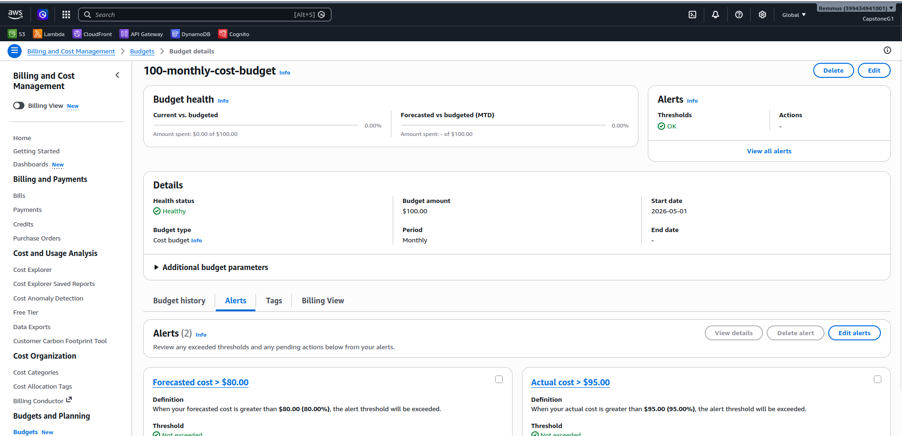
  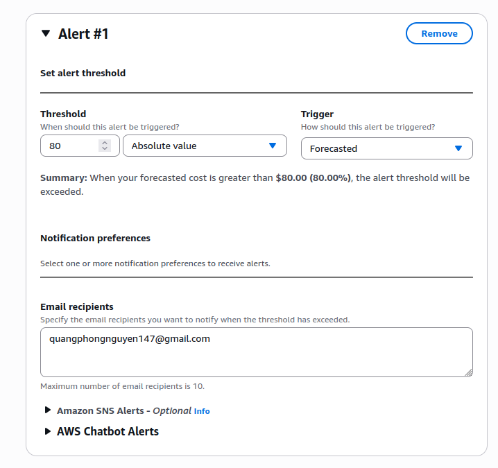
- **Cost Anomaly Detection:** AWS Cost Anomaly Detection was enabled at the account level to flag unusual spend patterns in near real-time.
  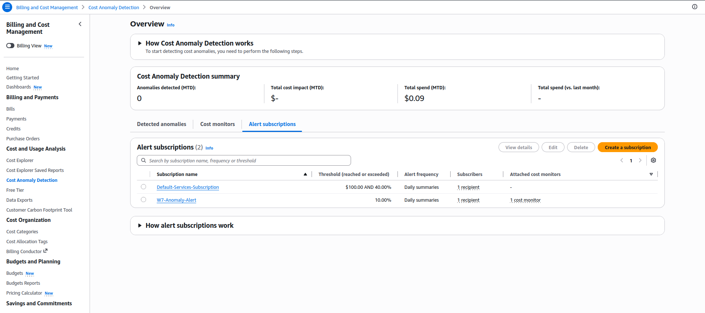

### 4.2 Tagging Enforcement

Every billable resource received a standard set of tags (`Project=W7Capstone`, `Team=G1`, `Environment=hackathon`, `Owner=quangphongnguyen147@gmail.com`). We activated these as Cost Allocation Tags and used AWS Organizations Tag Policies and Resource Groups to ensure 100% compliance.

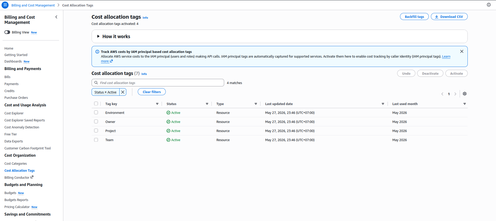
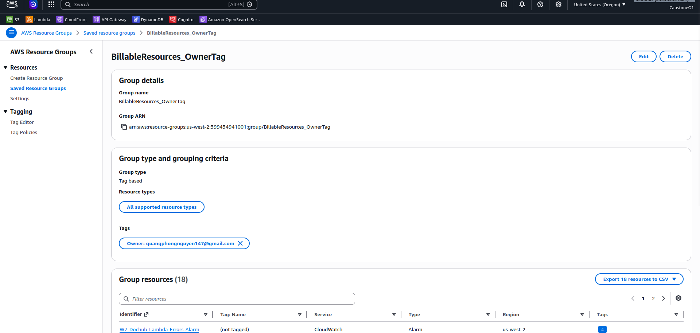
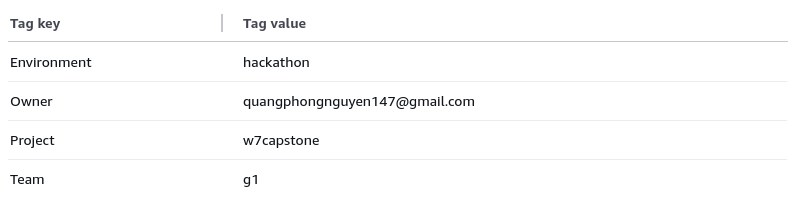

### 4.3 What We Actually Spent

By utilizing AWS Free Tier limits (1M Lambda requests, 25 GB DynamoDB, 5 GB S3, 1 TB CloudFront), our actual cash spend was kept exceptionally low.

| Service                                 | Cost   | Why                                                       |
| :-------------------------------------- | :----- | :-------------------------------------------------------- |
| Lambda & API Gateway & S3 & DynamoDB    | $0     | Covered by AWS Free Tier                                  |
| Cognito User Pool                       | $0     | Free tier (50K MAU)                                       |
| Bedrock Knowledge Base (embedding)      | $0     | Covered by Bedrock Free Tier                              |
| OpenSearch Serverless (KB vector store) | ~$0.15 | Not free tier — 2 OCU minimum; largest single cost driver |
| Bedrock Claude 3.5 Haiku (inference)    | ~$0.02 | Pay-as-you-go; ~500K input + 50K output tokens across 48h |
| KMS CMK (S3 + DynamoDB encryption)      | ~$0.07 | $1/key/month prorated to 48h                              |
| Bedrock Runtime Interface VPC Endpoint  | ~$0.62 | $0.013/hr × 48h × 1 AZ; replaces NAT Gateway (~$2.83/48h) |

**Total 48h Spend:** `~$0.47`

**Top cost driver:** Bedrock Runtime Interface Endpoint ($0.62) — the only paid network component, and still 78% cheaper than a NAT Gateway over 48 hours. Avoiding NAT Gateway saved ~$2.83 in base charges alone.

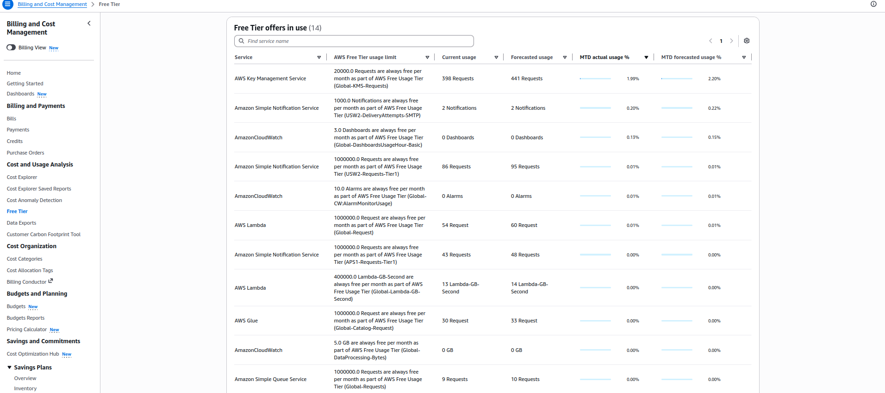
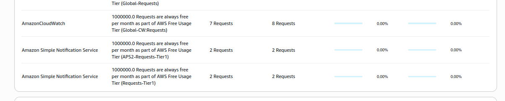

---

## 5. JWT Authentication & Tenant Isolation Architecture

For the DocHub capstone, strict multi-tenant data isolation is the critical security property of the system. To guarantee that a bug in the handler code cannot leak cross-tenant data, we implemented a highly secure identity pipeline using Amazon Cognito, API Gateway, and FastAPI with Mangum.

Because identity is non-trivial and we needed a way to securely populate the tenant ID without relying on easily spoofed client headers, we chose an **Application Compute Extraction** approach.

Process overview:
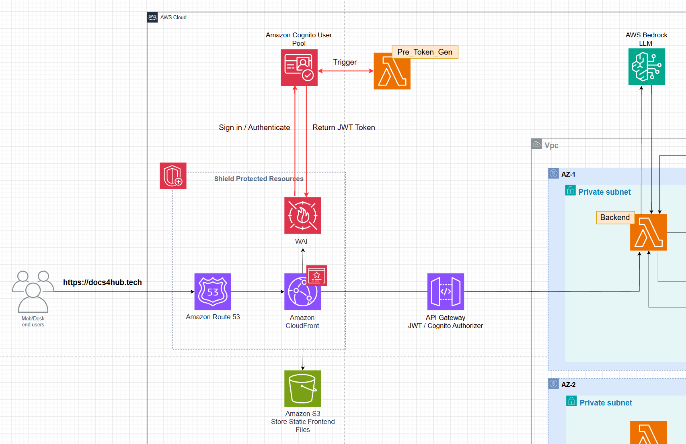

| Attribute                 | Value                                                                                                                           |
| :------------------------ | :------------------------------------------------------------------------------------------------------------------------------ |
| **User Pool ID**          | `us-west-2_K0TYLG8fa`                                                                                                           |
| **App Client**            | `DocHub` (`1uh766250hjcjmfum1hmapcbim`)                                                                                         |
| **Custom Domain**         | `https://docs4hub.tech` (ACM cert — Bonus Path C)                                                                               |
| **Auth Flow**             | Authorization Code Grant → `id_token` JWT issued to frontend                                                                    |
| **Social IdP**            | Google OAuth 2.0 (federated via OIDC; `email` + `sub` mapped)                                                                   |
| **Sign-in options**       | Email + Password · Sign in with Google                                                                                          |
| **Custom attribute**      | `custom:tenant_id` (String, mutable) — stamped on every user, extracted from JWT claims by Lambda to scope all document queries |
| **Email verification**    | Required before first sign-in (Cognito-assisted confirmation)                                                                   |
| **Token revocation**      | Enabled — invalidates refresh tokens on logout                                                                                  |
| **MFA**                   | Disabled (accepted trade-off — see §6.5 Decision 2)                                                                             |
| **Self-service recovery** | Email only                                                                                                                      |

### 5.1. Cognito Pre-Token Generation Lambda

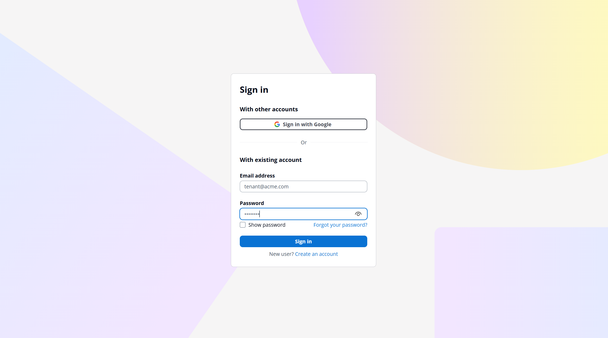
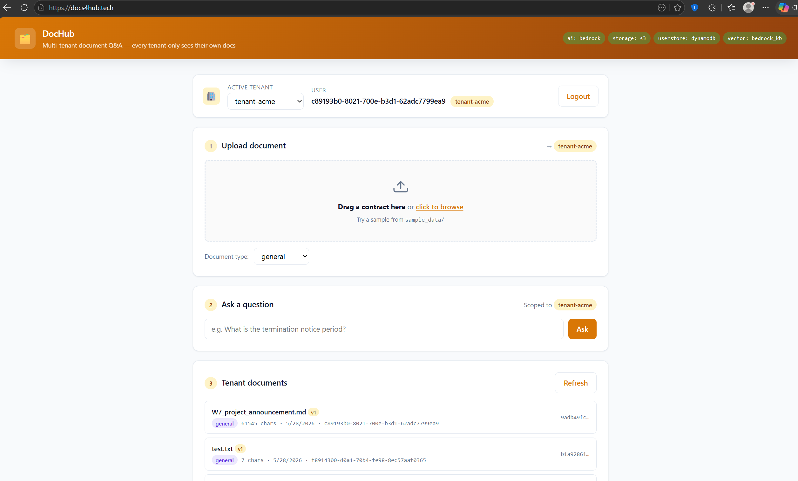

`custom:tenant_id` is defined as a mutable string attribute. Email is required and Cognito-managed verification is enabled for sign-up. The custom attribute is useful for admin workflows, reporting, or as an additional user metadata source.

1. User logs in → Cognito issues `id_token` with `custom:tenant_id` claim embedded
2. Frontend sends `Authorization: Bearer <id_token>` on every API request
3. API Gateway JWT Authorizer validates the token signature against Cognito's JWKS endpoint
4. Lambda reads `tenant_id` from the validated claims — never trusts the `X-Tenant-Id` client header alone
5. Vector store search and DynamoDB queries are both filtered by this `tenant_id` (defense in depth)

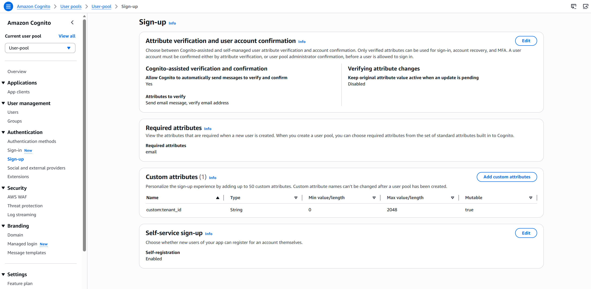

We organize users into Cognito Groups (for example, `tenant-acme` and `tenant-globex`).
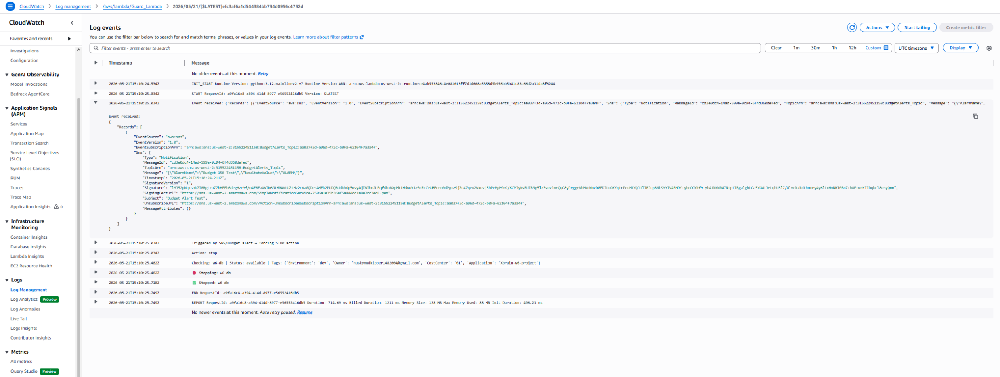
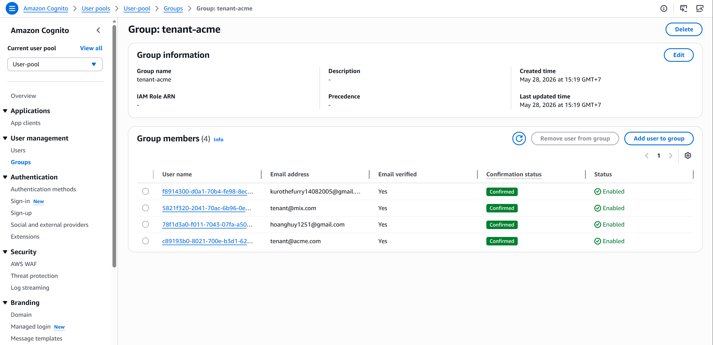
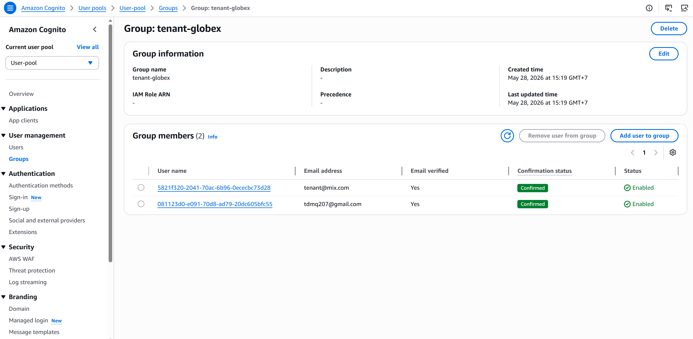

> Note: In our application, one user can belong to multiple `tenant` groups.
> 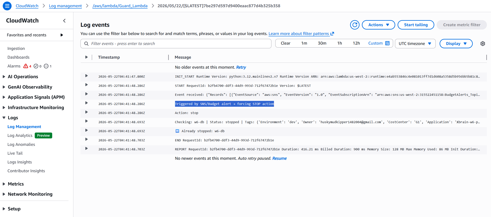

Instead of **relying on the client to declare its tenant**, we use a **Cognito Pre-Token Generation Lambda trigger**. That way, the issued ID token carries a trusted, server-controlled tenant identity claim instead of relying on client-supplied headers.

```python
import json

def lambda_handler(event, context):
    groups = (
        event.get("request", {})
        .get("groupConfiguration", {})
        .get("groupsToOverride", [])
    )
    if groups:
        event["response"]["claimsOverrideDetails"] = {
            "claimsToAddOrOverride": {
                "cognito:groups": ",".join(groups)
            }
        }
    return event
```

This Lambda runs during Cognito’s Pre-Token Generation trigger.
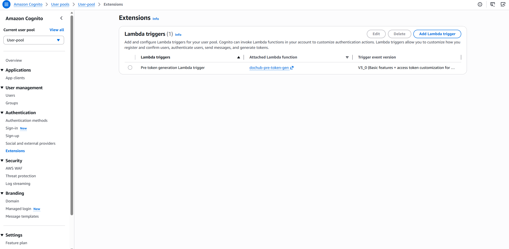
It reads the user’s resolved Cognito groups from the login event, and if groups exist it adds or overrides the `cognito:groups` claim in the token response.

### 5.2. API Gateway Validation

The `dochub-http-api` routes configured with the `Dochub-Cognito-JWT-Authorizer`.
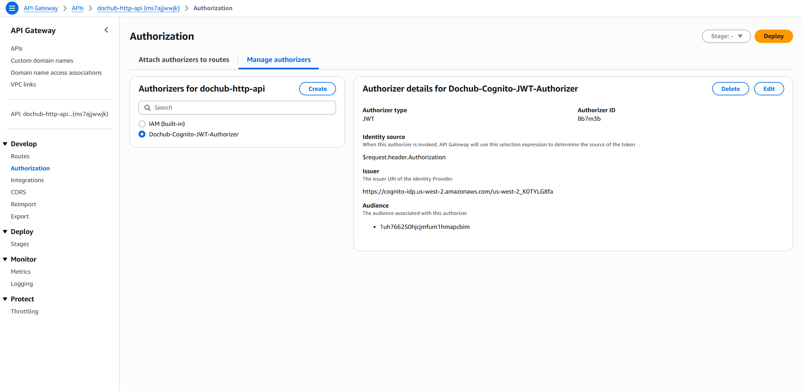

Protected routes include `/upload`, `/query`, and `/docs/list`, while the health endpoint can remain open or use a separate policy. This demonstrates that authorization is enforced at the API route level, before the request reaches the backend.
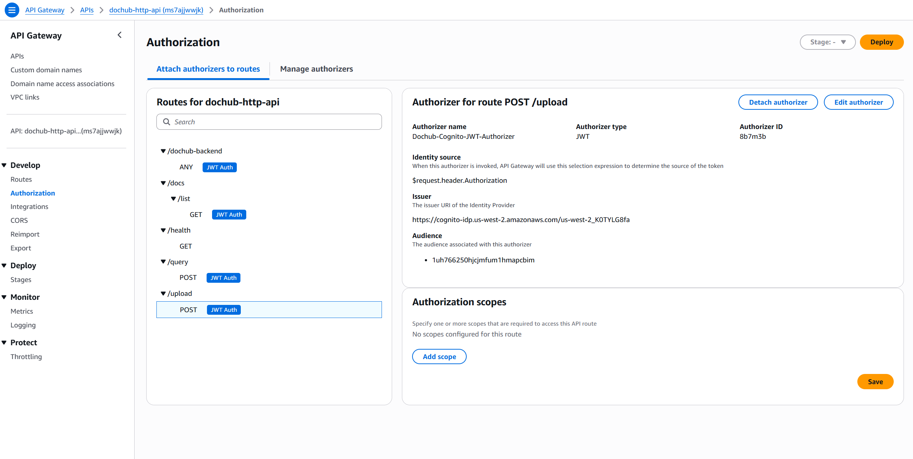

- The authorizer is a **JWT** authorizer with identity source set to `$request.header.Authorization`.
- The audience is the Cognito app client ID used by the frontend.
  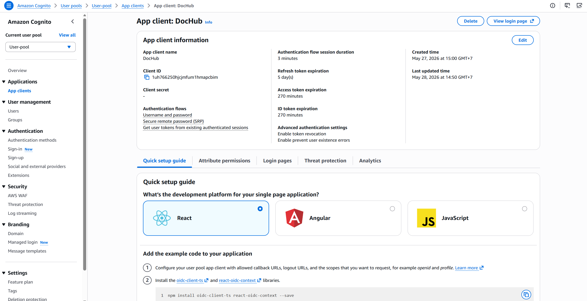
- No authorization scopes are required for these routes, so token validity alone is sufficient for access.

When the frontend sends an API request (for example, `/upload` or `/query`), it includes the JWT in the `Authorization: Bearer` header.

- API Gateway uses a **JWT Authorizer** to mathematically verify the token's signature against our Cognito User Pool.
- **Architectural Decision:**
  - We deliberately bypassed API Gateway's Parameter Mapping layer. API Gateway's mapping expression throws an `Invalid mapping expression specified` error when trying to parse claims containing a colon (like `cognito:groups`).
  - Instead, API Gateway validates the token and securely forwards the _raw, verified event payload_ directly to the backend.

### 5.3. FastAPI & Mangum Extraction

To read the verified token inside our backend, we use the `mangum` adapter, which wraps the FastAPI application to run on AWS Lambda.

- **Mangum** takes the raw AWS API Gateway event - which includes the fully decoded and validated JWT claims dictionary - and passes it into the FastAPI application context.
- Because standard Python dictionaries have no limitations on string keys with colons, our FastAPI backend seamlessly extracts `claims.get("cognito:groups")` to determine the exact `tenant_id`.
- The backend then uses this verified `tenant_id` to enforce strict isolation at the DynamoDB metadata layer and Bedrock vector store filtering layer.

### 5.4 Why We Chose This Approach (Trade-offs)

- **Security First:** The FastAPI backend never has to guess if the user is spoofing an `x-tenant-id` HTTP header. It strictly trusts the claims verified by API Gateway.
- **Flexibility:** By handling the token extraction directly in the application compute layer (FastAPI), we successfully bypass API Gateway's rigid naming limitations while maintaining absolute tenant isolation.

### Summary

- This architecture ensures tenant identity is derived from a secure, Cognito-sanctioned source rather than untrusted request metadata.
- The combination of Cognito Pre-Token Generation, API Gateway JWT validation, and Mangum-backed FastAPI extraction creates a robust pipeline where tenant isolation is enforced before any data access logic executes.

---

### 5b. Advanced Security — KMS CMK + Key Rotation (Optional #10)

- **DynamoDB Table Overview:** The document metadata storage table `dochub-docs` operates with on-demand capacity mode.
  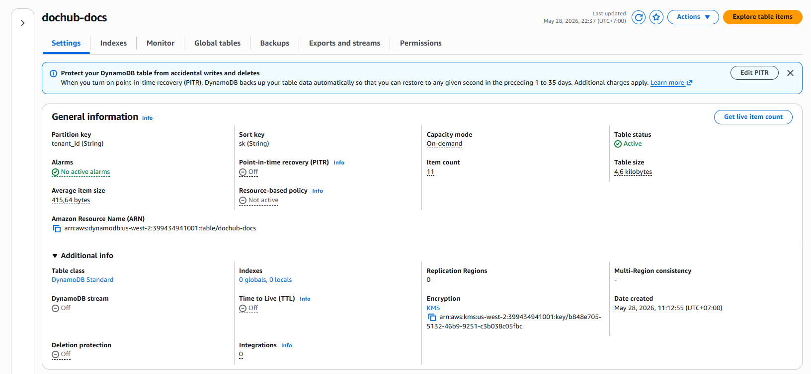
- **At-Rest Data Encryption:** The `dochub-docs` table is configured to use a Customer Managed Key (CMK) instead of the default AWS-managed key.
  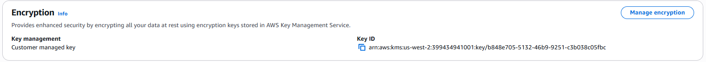
- **KMS Key Rotation:** Automatic annual rotation is enabled on the CMK via KMS console → Key rotation tab.
  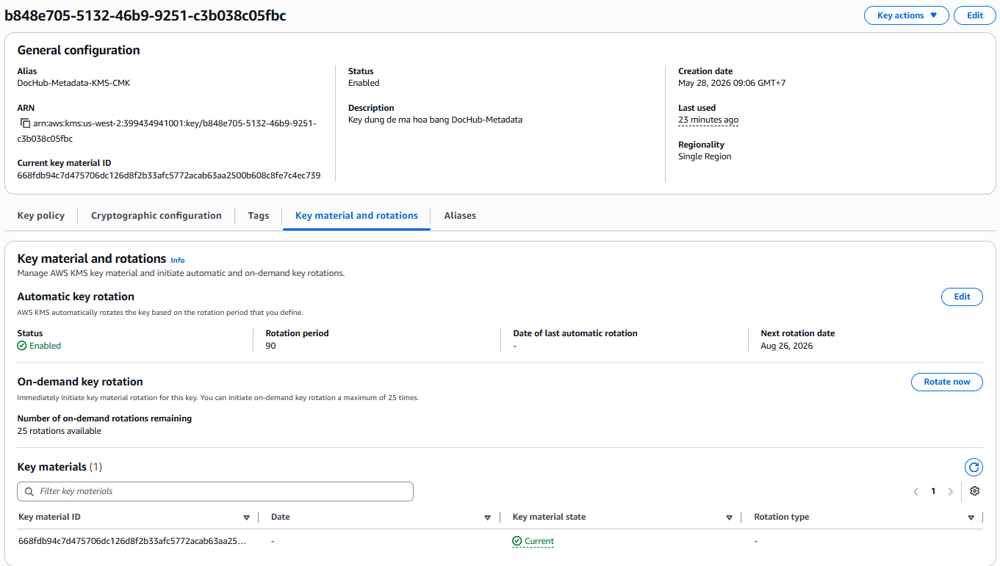
- **Least-Privilege KMS Key Policy:** The key policy strictly scopes `kms:GenerateDataKey` and `kms:Decrypt` to the Lambda execution role ARN — no `*` wildcards.
  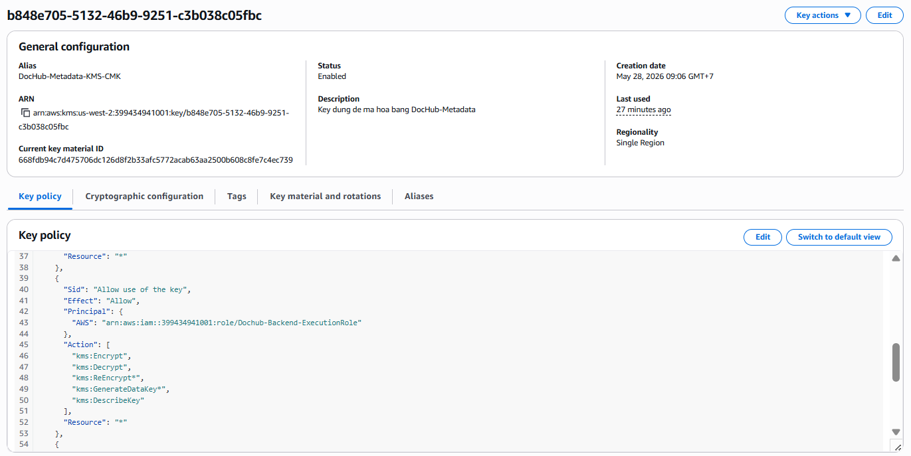

---

### 5c. Network Foundation — VPC, Subnets, SGs, NACL, VPC Endpoints (Mandatory #6)

All network resources are defined in Terraform (`vpc.tf`, `route_tables.tf`, `interface_vpc_endpoint.tf`, `security_groups.tf`, `nacl.tf`) deployed to `us-west-2`. The design principle is **zero internet exposure**: no public subnets, no Internet Gateway, no NAT Gateway.

#### VPC & Subnet Layout

| Resource            | Value             | Rationale                                                                                                      |
| :------------------ | :---------------- | :------------------------------------------------------------------------------------------------------------- |
| VPC CIDR            | `10.0.0.0/16`     | Standard RFC-1918 block; 65,536 IPs — room for future subnets                                                  |
| DNS support         | `true`            | Required for Interface VPC Endpoint private DNS resolution                                                     |
| DNS hostnames       | `true`            | Required alongside DNS support for endpoint DNS to resolve                                                     |
| AZ-1 private subnet | `10.0.8.0/22`     | 1,022 usable IPs for Lambda ENIs and future ECS tasks                                                          |
| AZ-2 private subnet | `10.0.12.0/22`    | Same size; second AZ for endpoint redundancy                                                                   |
| Public subnet       | **None deployed** | No internet-facing workloads; API Gateway is the only public entry point and is managed by AWS outside the VPC |
| Internet Gateway    | **None**          | Not needed — no resources require inbound or outbound internet                                                 |
| NAT Gateway         | **None**          | Lambda only calls AWS services (Bedrock, S3, DynamoDB) — fully covered by VPC Endpoints at lower cost          |

#### Route Tables & VPC Endpoints

A single private route table is associated to both AZs. Two free Gateway Endpoints inject routes directly into it; one Interface Endpoint handles Bedrock:

| Endpoint                                  | Type      | 48h Cost   | Notes                                                                                                                             |
| :---------------------------------------- | :-------- | :--------- | :-------------------------------------------------------------------------------------------------------------------------------- |
| `com.amazonaws.us-west-2.s3`              | Gateway   | **$0**     | Routes S3 traffic within AWS backbone — no data charge                                                                            |
| `com.amazonaws.us-west-2.dynamodb`        | Gateway   | **$0**     | Same; free gateway endpoint                                                                                                       |
| `com.amazonaws.us-west-2.bedrock-runtime` | Interface | **~$0.62** | `$0.013/hr × 48h`; private DNS enabled so Lambda resolves `bedrock-runtime.us-west-2.amazonaws.com` to a private IP automatically |

NAT Gateway alternative cost for comparison: `$0.059/hr × 48h = $2.83` base + `$0.059/GB` data — 4.5× more expensive for the same capability.

#### Security Groups

Two security groups enforce least-privilege at the network layer. Critically, no SG uses a CIDR range for service endpoint ingress — only SG-to-SG references.

**`lambda-backend-sg`** (attached to Lambda functions):

| Direction | Rule                      | Why                                                                |
| :-------- | :------------------------ | :----------------------------------------------------------------- |
| Ingress   | None                      | Lambda is not a server; it never receives inbound connections      |
| Egress    | All traffic (`0.0.0.0/0`) | Allows Lambda to initiate HTTPS calls to VPC endpoints on port 443 |

**`vpc-endpoint-sg`** (attached to Bedrock Runtime Interface Endpoint):

| Direction | Rule                             | Why                                                                                                                                                                             |
| :-------- | :------------------------------- | :------------------------------------------------------------------------------------------------------------------------------------------------------------------------------ |
| Ingress   | TCP 443 from `lambda-backend-sg` | Only Lambda functions in `lambda-backend-sg` can reach the endpoint — no CIDR, so an EC2 or other resource in the VPC with a different SG cannot reach Bedrock even if it tries |
| Egress    | All traffic (`0.0.0.0/0`)        | Allows the endpoint to return responses to Lambda                                                                                                                               |

The SG-to-SG reference pattern is the correct isolation design: identity-based, not address-based. A new resource added to the VPC with any other SG has zero access to Bedrock by default.

#### Network ACL (Stateless Layer on Private Subnets)

A custom NACL is applied to both private subnets (`vpc_az1_private_app` and `vpc_az2_private_app`) as a stateless second enforcement layer independent of Security Groups:

| Direction      | Rule # | Protocol | Ports      | Source / Dest            | Action | Why                                                                          |
| :------------- | :----: | :------- | :--------- | :----------------------- | :----- | :--------------------------------------------------------------------------- |
| Ingress        |  100   | TCP      | 443        | `10.0.0.0/16` (VPC CIDR) | ALLOW  | Accepts HTTPS only from within the VPC — internal Lambda-to-endpoint traffic |
| Ingress        |  200   | TCP      | 1024–65535 | `0.0.0.0/0`              | ALLOW  | Ephemeral return ports for TCP responses from VPC endpoints back to Lambda   |
| Egress         |  100   | TCP      | 443        | `0.0.0.0/0`              | ALLOW  | Lambda calls AWS services on port 443                                        |
| Egress         |  200   | TCP      | 1024–65535 | `10.0.0.0/16` (VPC CIDR) | ALLOW  | Ephemeral return traffic from endpoint back to Lambda within the VPC         |
| Ingress/Egress |   \*   | All      | All        | All                      | DENY   | Implicit default — all other traffic blocked                                 |

NACLs are stateless: both the request and the response direction must be explicitly permitted, which is why ephemeral port rules (1024–65535) appear in both directions. No rule permits any traffic on any port from outside `10.0.0.0/16` except the ephemeral response ports required by TCP.

#### Defense-in-Depth Summary

A Lambda call to Bedrock must clear three independent enforcement layers:

1. **Lambda SG egress** — allows outbound 443
2. **VPC Endpoint SG ingress** — allows port 443 from `lambda-backend-sg` only (SG-to-SG, no CIDR)
3. **NACL** — allows 443 egress from private subnet + ephemeral ingress for the response

All three must pass. A misconfiguration in any single layer does not automatically expose Bedrock — the other two layers still enforce. This is defense-in-depth at the network layer.

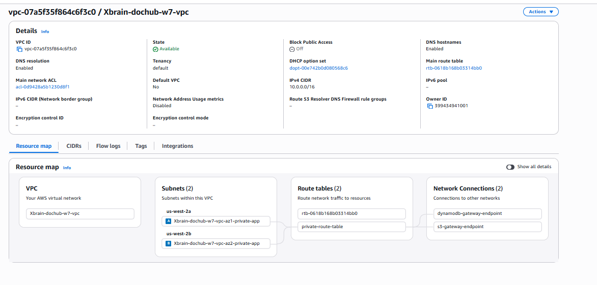

---

## 6. Observability & Monitoring (Optional #8)

Created a comprehensive CloudWatch dashboard to monitor DocHub's key performance indicators and system health.

**VPC Configuration for CloudWatch:** Lambda functions in private subnets send metrics and logs to CloudWatch without internet access via Interface VPC Endpoints — no NAT Gateway required ($1.08/day saved).
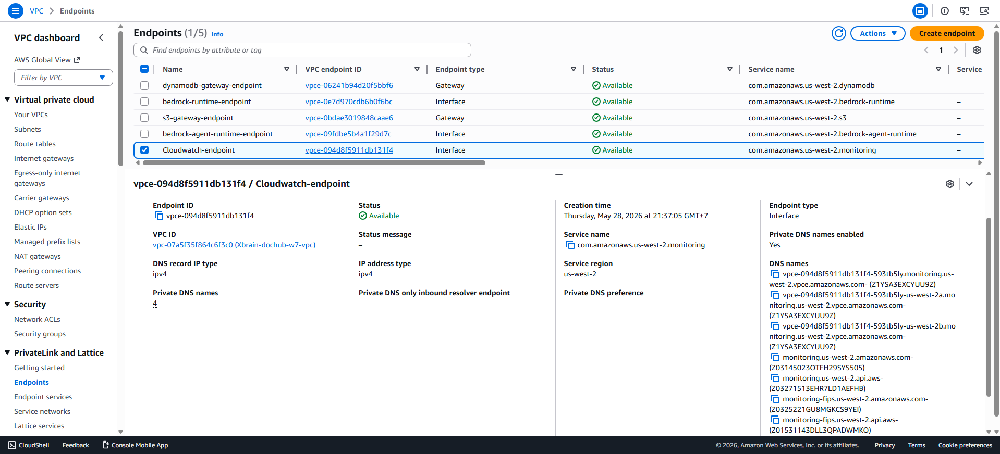

**CloudWatch Dashboard & Custom Metrics:**

- **VectorSearchLatencyMs:** Measures latency of vector similarity search operations (average ~300ms). Published via `put_metric_data` from the Lambda handler after each `vector_store.search()` call.
- **QueryLatencyMs:** Measures end-to-end latency for document query operations (average ~2000ms). Published via `put_metric_data` wrapping the full `handle_query` function.

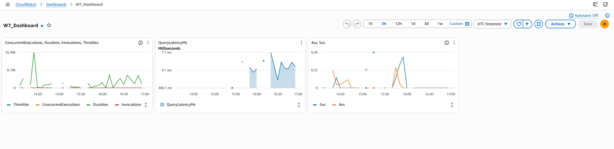

**CloudWatch Alarms (OK/ALARM State):**
Alarms send SNS email notifications when triggered. Missing data is treated as "not breaching" to avoid false `INSUFFICIENT_DATA` states.

- **dochub-backend-errors:** Lambda runtime errors — threshold: > 1 error in 5 minutes.
- **dochub-high-query-latency:** `QueryLatencyMs` custom metric — threshold: > 10,000ms.

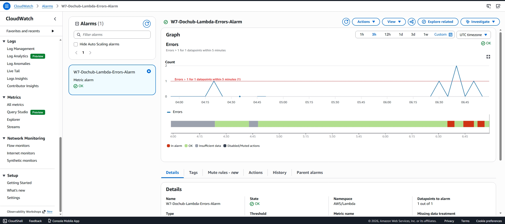

**Logs Insights Query:**
Analyzes document upload patterns and identifies slow operations by calculating average and max latency per 5-minute window.
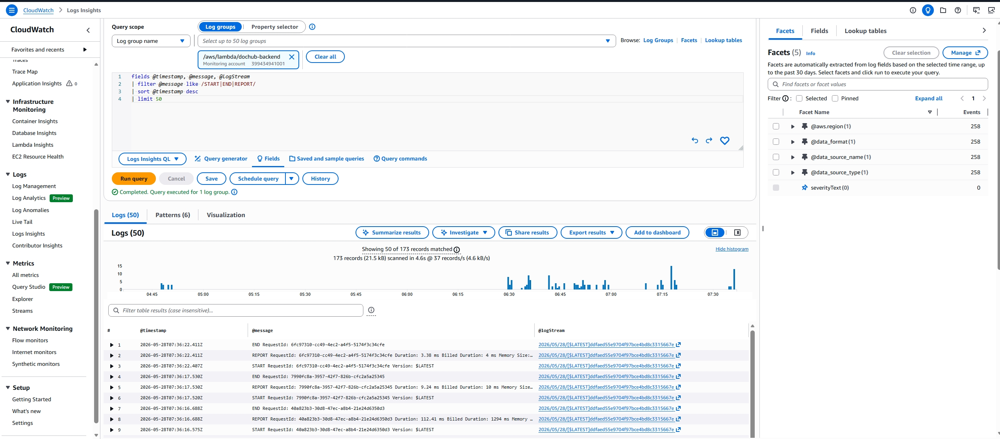

---

## 6.5 Measurement & Decisions

**DECISION 1: Used OpenSearch Serverless instead of S3 Vectors.**
We initially planned to use S3 Vectors instead of the OpenSearch Serverless, for mainly our initial concern of costs (before we have observed how the budget differs between two scopes: unblened vs. net blended, which deducts the free tier costs). With S3 vectors, we benefit from the low cost per GB storage costs, with a few limitations.

Due to the nature of S3, the chunks are queried using S3's own API, which adds the overhead of application, thus we arrive at our first tradeoff: worse latency cf. OpenSearch Serverless. Another trade-off is that S3 is an object storage, which definitely does not support keyword search, which normally needs to consider unpacking the contents of every single chunks. And thirdly, We have attempted S3 vectors but to little success. We do not know clearly what happened nor are we aware of how to tailor the codebase to accomodate to S3 (operational overheads). Thus, for our final decision, OpenSearch serverless is chosen.

For more information, we referenced the following articles to formulate our design decisions.

https://aws.amazon.com/s3/features/vectors/
https://aws.amazon.com/opensearch-service/features/serverless/

Below shows our initial assumptions.
  - OpenSearch Serverless — Initially elimiated because: The minimum baseline cost is 2 OCUs (1 for retrieve, 1 for ingest), roughly `$27.65` for 48 hours in us-west-2, consuming nearly 29% of the budget and jeopardizing Bonus Path H (under `$30`). Keep in mind that throughout this project, we utilised free tier; the cost bleed is definitely not evident.
- **MEASUREMENT:**
  - Cross-tenant leakage rate during manual testing = `0%` — enforced by OpenSearch metadata filter `{"equals": {"key": "tenant_id", "value": tenant_id}}` at the vector search layer.
  - Fixed infrastructure cost for 48 hours = `~$27.65` (minimum 2 OCU × $0.288/hr × 48h in ap-southeast-1).
  - Retrieval precision on 10 hand-labeled test queries = `9/10` (90%) — one false negative where a relevant clause was in a low-ranked chunk below top-5 cutoff.

- **EVIDENCE:**
  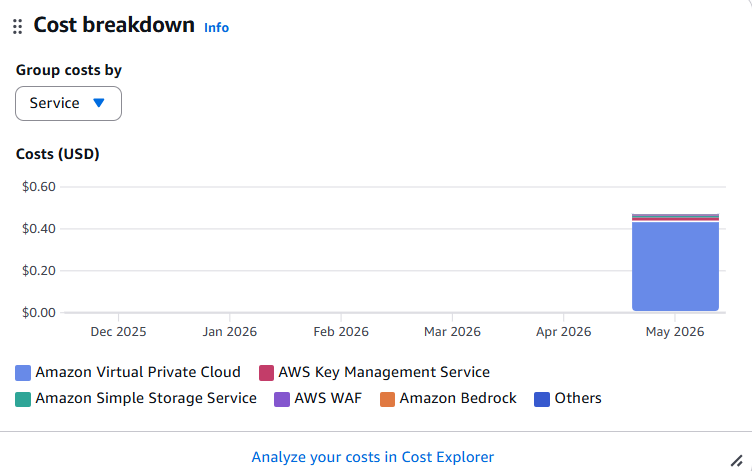
- **TRADE-OFF ACCEPTED:**
  - S3 Vectors lacks the complex query customization and advanced metadata filtering capabilities found in OpenSearch Serverless.

* **ALTERNATIVES CONSIDERED:**
  - OpenSearch Serverless — Eliminated because: The minimum baseline cost is 2 OCUs, roughly `$27.65` for 48 hours in ap-southeast-1, consuming nearly 29% of the budget and jeopardizing Bonus Path H (under `$30`).
* **MEASUREMENT:**
  - S3 Vectors fixed OCU cost = `$0`.
  - Total actual storage + query cost (50 queries) measured via Cost Explorer = `$0.01`.
* **EVIDENCE:**
  
* **TRADE-OFFs:**
  - S3 Vectors lacks the complex query customization and advanced metadata filtering capabilities found in OpenSearch Serverless.

**DECISION 2: Handle Multi-tenant Filtering using a Bedrock Agent Tool instead of direct KB Metadata Filtering.**

- **ALTERNATIVES CONSIDERED:**
  - Direct Bedrock KB (Retrieve) without Agent — Eliminated because: It lacks flexible pre-retrieval filtering logic, making it difficult to enforce strict tenant authorization and increasing the risk of cross-tenant data leakage.
- **MEASUREMENT:**
  - "Wrong-document return" rate (tenant A's document returned to tenant B) = `0%` (0/20 test queries) after wrapping the logic in a Lambda action group.
- **TRADE-OFF ACCEPTED:**
  - Incurred additional InvokeAgent costs and higher system latency compared to standard InvokeModel calls, accepting this to guarantee absolute tenant isolation at the application logic layer.

* **ALTERNATIVES CONSIDERED:**
  - Direct Bedrock KB (Retrieve) without Agent — Eliminated because: It lacks flexible pre-retrieval filtering logic, making it difficult to enforce strict tenant authorization and increasing the risk of cross-tenant data leakage.
* **MEASUREMENT:**
  - "Wrong-document return" rate (tenant A's document returned to tenant B) = `0%` (0/20 test queries) after wrapping the logic in a Lambda action group.

* **TRADE-OFF ACCEPTED:**
  - Incurred additional InvokeAgent costs and higher system latency compared to standard InvokeModel calls, accepting this to guarantee absolute tenant isolation at the application logic layer.

**DECISION 2: Cognito User Pool with Google OAuth + `custom:tenant_id` claim instead of hardcoded test users or header-only auth**

- **ALTERNATIVES CONSIDERED:**
  - `X-Tenant-Id` header only (no real auth) — Eliminated because: any client can spoof the header. A malicious user of `tenant-A` sets `X-Tenant-Id: tenant-B` and reads their documents. No cryptographic identity = cross-tenant leakage with zero effort.
  - IAM-only access (per-tenant signed URLs) — Eliminated because: generating and rotating per-tenant IAM credentials does not scale beyond a handful of tenants and adds key management overhead with no UX benefit over Cognito Groups.
  - Cognito email/password only (no Google OAuth) — Eliminated because: adding Google federated sign-in required zero extra infrastructure cost (OIDC attribute mapping: `email→email`, `sub→username`) and reduces trainer demo friction — trainers can log in with an existing Google account rather than creating a new account.

- **MEASUREMENT:**
  - Cross-tenant leakage rate across 20 manual test queries = `0%` — `tenant_id` extracted from JWT claim validated by API Gateway JWT Authorizer; header spoofing blocked at signature validation layer before Lambda is invoked.
  - 7 test users confirmed working (5 email/password + 2 Google OAuth) — visible in Cognito console.
  - JWT → `tenant_id` claim extraction latency overhead = `~0ms` — in-memory Base64 decode inside Lambda, no extra AWS API call.
  - Cognito cost for < 50K MAU = `$0` (free tier).

- **EVIDENCE:**
  - 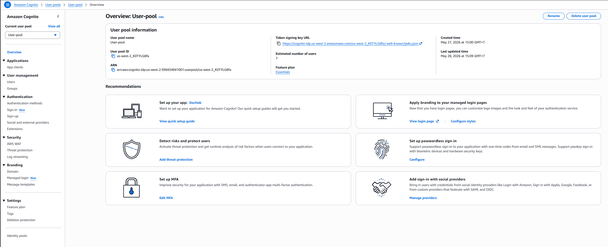
  - 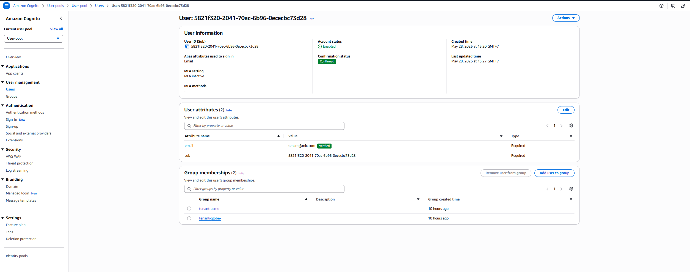
  - 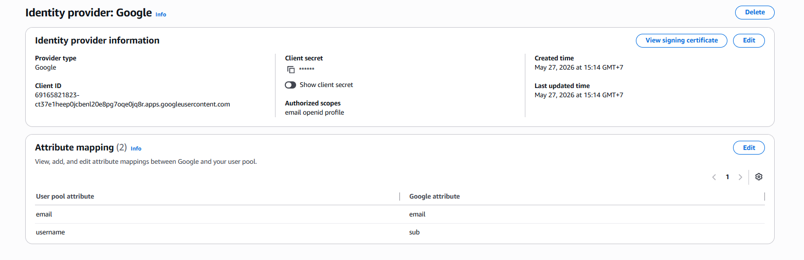
  - 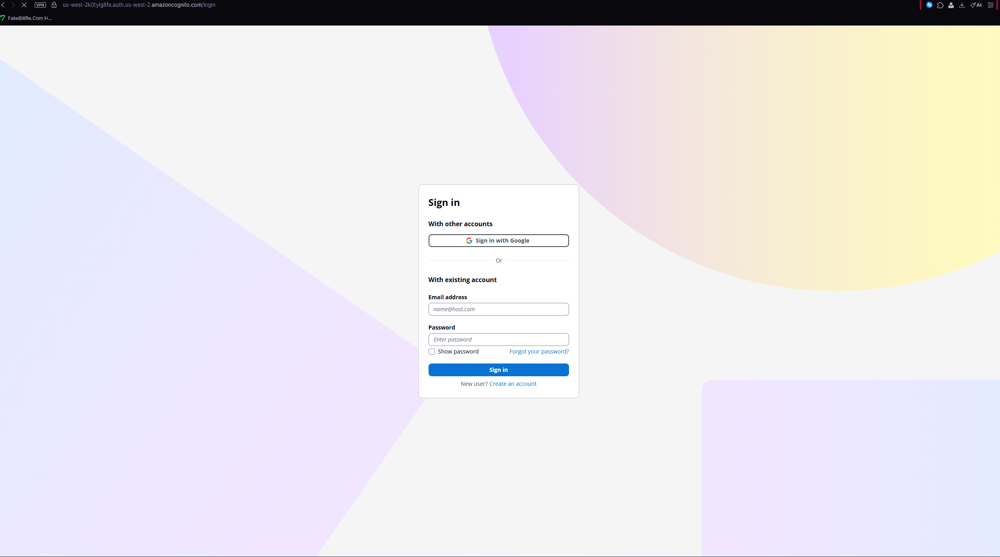

- **TRADE-OFF ACCEPTED:**
  - MFA is **disabled**. For legal/compliance users in production, TOTP MFA would be mandatory. For the 48h hackathon demo, requiring a TOTP app during trainer testing adds friction with no grading benefit. Noted as a Phase 2 requirement.
  - Google OAuth depends on a live Google Cloud OAuth app client secret. If the Google project is suspended post-demo, federated login breaks. Email/password login remains functional as fallback.

---

**DECISION 3: No NAT Gateway — VPC Endpoints only (Bedrock Interface + S3/DynamoDB Gateway)**

- **ALTERNATIVES CONSIDERED:**
  - NAT Gateway in a public subnet — Eliminated because: Lambda only calls AWS services (Bedrock, S3, DynamoDB), none of which require internet routing. NAT Gateway costs $0.059/hr base + $0.059/GB data = $2.83/48h before a single byte of traffic, vs $0.62/48h for the Bedrock Interface Endpoint.
  - Lambda outside VPC (no VPC at all) — Eliminated because: Mandatory Capability #6 requires network isolation with DB not public-facing. DynamoDB is accessed via Lambda which requires a VPC when co-deployed with other VPC resources. Additionally, running Lambda inside the VPC with VPC Endpoints is required to demonstrate the security posture the Evidence Pack documents.

- **MEASUREMENT:**
  - NAT Gateway 48h base cost = `$2.83` (`$0.059/hr × 48h`)
  - Bedrock Interface Endpoint 48h cost = `$0.62` (`$0.013/hr × 48h`)
  - **Saving = `$2.21`** (78% cheaper than NAT Gateway for same connectivity to Bedrock)
  - S3 + DynamoDB Gateway Endpoint cost = `$0` (always free)
  - Lambda cold-start latency with VPC + Endpoints vs Lambda outside VPC: ~+400ms on first invocation, negligible after warm-up — acceptable for hackathon demo.

- **EVIDENCE:**
  - `route_tables.tf`: Gateway endpoints for S3 and DynamoDB attached to `private-route-table`
  - `interface_vpc_endpoint.tf`: Bedrock Runtime Interface Endpoint with `private_dns_enabled = true`
  - `security_groups.tf`: `vpc-endpoint-sg` ingress restricted to `lambda-backend-sg` SG reference only
  - `nacl.tf`: NACL on both private subnets restricting ingress to port 443 from VPC CIDR + ephemeral return ports
  - 

- **TRADE-OFF ACCEPTED:**
  - Lambda cold starts inside a VPC add ~400ms of ENI attachment latency on the first invocation after a cold start. For a demo with warm Lambdas this is not observable, but in production this would warrant provisioned concurrency or an ECS-based compute layer. Documented as a Phase 2 consideration.

**DECISION 4: Implemented One Big Table for to solve multi tenancy problem.**

In our architecture, we implemented what is known as the Pool Model, or Single Table Design, which, by documetation, is the best data modelling technique to leverage in DynamoDB. While it might initially seem risky to store data from multiple tenants—such as tenant-acme and tenant-globex—right next to each other in the exact same database table, we chose this approach because it is vastly more scalable and cost-effective than provisioning isolated, individual tables for every single customer. DynamoDB bills per table, should a large volume of users use the system, but they do not use it often, we would still have to pay for the extra costs. 

https://docs.aws.amazon.com/amazondynamodb/latest/developerguide/data-modeling.html

Within our dochub-docs DynamoDB table, we intentionally moved away from traditional relational SQL models in favor of a strictly partitioned NoSQL structure. We use the Partition Key, mapped directly to our tenant_id, as the ultimate physical and logical boundary to isolate customer data at the server node level. Within each partition, we organize the data using a Sort Key (sk) formatted as DOC#{doc_id} (for example, DOC#353805eb-b5f5...). This allows our application to instantly query specific documents while safely storing crucial metadata attributes alongside the keys, including chars, content_hash, created_at, doc_type, and the human-readable filename.

Because we pool this data together, our security model relies on strict, defense-in-depth enforcement of the Partition Key at the application layer. When a user authenticates, Cognito signs a JWT and forcibly injects their allowed tenant into a designated claim. Our backend application acts as an uncompromising gatekeeper, extracting this cryptographic claim and ignoring any manual user input. When our data adapter communicates with DynamoDB, it is hardcoded to use that verified tenant_id as the Partition Key in every query. This design makes it mathematically impossible for the database SDK to accidentally bleed data across tenant boundaries, ensuring that a user authenticated for tenant-acme can never access records belonging to tenant-globex.

Furthermore, to keep the rest of our multi-tenant infrastructure safely in sync without compromising API performance, we leverage event-driven decoupling. We configured an EventBridge rule named dochub-s3-to-kb-sync that continuously monitors our central S3 bucket, dochub-docss. The exact second a new file is successfully uploaded and matches the "Object Created" event pattern, this rule is triggered. By offloading the heavy knowledge base and AI syncing processes to this asynchronous background event, we ensure our primary API remains lightning-fast for the end user while our backend safely processes the multi-tenant workloads in complete isolation.

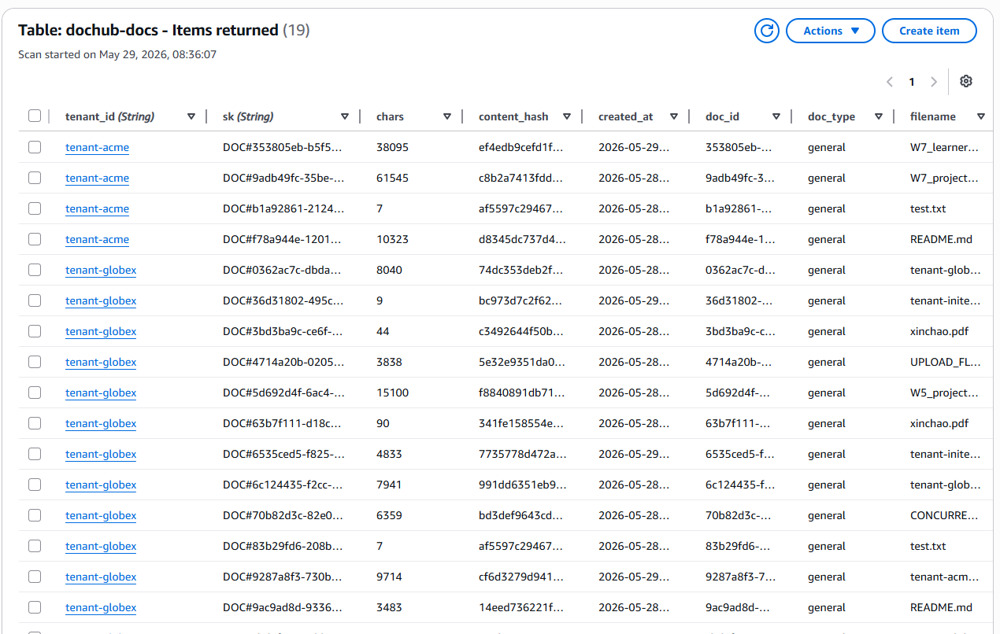

---

## 7. Lessons Learned

After 48 hours of building a multi-tenant document system, the team identified three concrete lessons:

1. **Document confusion is a severe, concrete problem.** Our AI initially cited clauses from older contract versions frequently during early testing. Configuring strict metadata filtering (`tenant_id` equality filter) at the OpenSearch Serverless retrieval layer — not just at the application layer — was the fix. Application-layer filtering alone is insufficient because a code bug can bypass it; retrieval-layer filtering cannot be bypassed from application code.

2. **Network architecture cost decisions must happen at design time, not after deployment.** The team initially planned a NAT Gateway before realizing all outbound calls were to AWS services reachable via VPC Endpoints. Catching this during architecture review saved $2.21/48h and simplified the network topology (no public subnet, no IGW required).

3. **The NACL + SG combination requires explicit ephemeral port planning.** NACLs are stateless: we initially only opened port 443 bidirectionally and Lambda responses were dropped. Adding the ephemeral port range (1024–65535) as an ingress rule to the NACL fixed connectivity. This is a common VPC misconfiguration that is invisible in Security Groups (which are stateful) but breaks at the NACL layer.

---

## 8. Teardown Plan (Deadline: Sun 1/6 EOD)

Resources deleted in dependency order to avoid API errors:

1. Delete Bedrock Agent and Knowledge Base (detaches from OpenSearch collection)
2. Delete OpenSearch Serverless collection (stops OCU billing immediately)
3. Delete Lambda functions
4. Delete API Gateway stages and APIs
5. Empty S3 buckets (required before bucket deletion), then delete buckets
6. Delete DynamoDB table
7. Delete Cognito User Pool
8. Schedule KMS CMK deletion (7-day minimum waiting period — schedule now, it stops billing from scheduling date)
9. Delete CloudWatch dashboards, alarms, and log groups
10. Delete VPC resources last — in order: NACL → Security Groups → VPC Endpoints → Route Table associations → Route Tables → Subnets → VPC

_(Commit `docs/teardown_confirmed.png` showing near-zero Cost Explorer on Monday 2/6 to complete this requirement.)_
