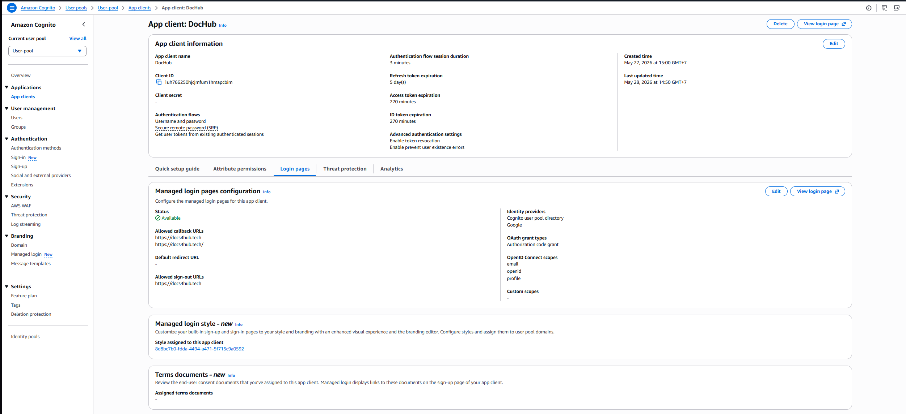

# W7 Capstone Evidence Pack: AI Document Hub (DocHub)

## 1. Cover

- **Group:** Group 1
- **Members:** Phan Thị Thủy Hiền, Hoàng Nhật Thành, Nguyễn Qúy Hưng, Nguyễn Hoàng Huy, Phạm Tùng Dương, Nguyễn Quang Phong, Trần Đình Minh Quân, Phan Nguyên Đạt, Võ Đức Vũ
- **Live URL (HTTPS):** `https://docs4hub.tech`
- **GitHub Repo:** `https://github.com/JaxTheDeveloper/techx_aws_resources/tree/week-7-capstone#`
- **Total Spend:** `$0.47`

---

## 2. Pitch & Vision

AI Document Hub is a multi-tenant SaaS platform that helps legal and compliance teams manage, search, and cross-query thousands of contracts and policy documents.

- **The Problem:** Legal teams spend too much time searching for specific clauses scattered across dozens of different contract versions.
- **The AI Solution:** Automating information extraction and summarization based on strictly isolated tenant access rights.
- **Real-world parallel:** Our model learns from products like Harvey AI and Glean Workspace, specifically tackling the "document confusion" problem (where the AI mistakenly cites the wrong contract).
  AI Document Hub is a multi-tenant SaaS platform that helps legal and compliance teams manage, search, and cross-query thousands of contracts and policy documents.

* **The Problem:** Legal teams spend too much time searching for specific clauses scattered across dozens of different contract versions.
* **The AI Solution:** Automating information extraction and summarization based on strictly isolated tenant access rights.
* **Real-world parallel:** Our model learns from products like Harvey AI and Glean Workspace, specifically tackling the "document confusion" problem (where the AI mistakenly cites the wrong contract).

---

## 3. Architecture & Service Decisions

Our system fulfills all 7 Mandatory Capabilities:

| Mandatory Capability    | Chosen Service                  | Rationale                                                                                                    |
| :---------------------- | :------------------------------ | :----------------------------------------------------------------------------------------------------------- |
| **1. User Interface**   | CloudFront + S3 Static          | Provides a free public HTTPS URL, easy to deploy static frontend.                                            |
| **2. App Compute**      | API Gateway HTTP + Lambda       | HTTP API is cheaper than REST API; Lambda has no idle cost and scales per request.                           |
| **3. AI / ML**          | Bedrock Agent + KB (Haiku)      | Agent allows calling a Lambda tool to filter documents by `tenant_id` before querying the Knowledge Base.    |
| **4. Data Persistence** | DynamoDB (On-demand)            | Stores document metadata (PK=`tenant_id`, SK=`sk`(docs_id)). Optimizes cost and speed for key-value queries. |
| **5. Object Storage**   | S3 Bucket (Multi-tenant prefix) | Stores original document files with a `tenant_id/` prefix, Block Public Access enabled.                      |
| **6. Network**          | VPC + VPC Endpoints             | Isolates DB (not public-facing); uses Endpoints to call AWS services without NAT Gateway costs.              |
| **7. Identity**         | Cognito + IAM Least-privilege   | IAM role only grants Read/Write to specific buckets/tables. Cognito issues JWTs to isolate tenants.          |

**Chosen Optional Capability:** **Advanced Security (#10)** - KMS CMK encryption for S3 and DynamoDB, with Key Rotation enabled.

---

## 4. Cost Discipline

Before deploying anything, we set up guardrails to prevent accidentally exceeding the $100 cap.

### 4.1 Setting Up Cost Guardrails

- **AWS Budget with Alert:** We created a budget set to **$100 total cost**, with an **alert at $80 (80%)**. We connected this alert to an SNS topic and confirmed the email subscription.
  
  
- **Cost Anomaly Detection:** AWS Cost Anomaly Detection was enabled at the account level to flag unusual spend patterns.
  

### 4.2 Tagging Enforcement

Every billable resource received a standard set of tags (`Project=W7Capstone`, `Team=G1`, `Environment=hackathon`, `Owner=quangphongnguyen147@gmail.com`). We activated these as Cost Allocation Tags and used AWS Organizations Tag Policies and Resource Groups to ensure 100% compliance.

### 4.3 What We Actually Spent

By utilizing AWS Free Tier limits (1M Lambda requests, 25GB DynamoDB, 5GB S3, 1TB CloudFront), our actual cash spend was kept exceptionally low.

| Service                                 | Cost   | Why                           |
| --------------------------------------- | ------ | ----------------------------- |
| Lambda & API Gateway & S3 & DynamoDB    | $0     | Covered by AWS Free Tier      |
| Cognito User Pool                       | $0     | Free tier (50K MAU)           |
| Bedrock Knowledge Base (embedding)      | $0     | Covered by Bedrock Free Tier  |
| OpenSearch Serverless (KB vector store) | ~$0.15 | Not free tier - 2 OCU minimum |
| Bedrock Claude Haiku (inference)        | ~$0.02 | Pay-as-you-go, no free tier   |
| KMS CMK (S3 encryption)                 | ~$0.02 | $1/key/month prorated         |

**Total 48h Spend:** `< $0.20`.
**Top Cost Driver:** The fixed infrastructure cost of the Bedrock Vector Store (OpenSearch minimum OCU) accounted for the majority of our micro-spend. Avoiding the NAT Gateway saved us ~$2.83.

---

## 5. Security (Advanced Security Option + Mandatory Identity)

### 5a. Identity & Access — Cognito JWT (Mandatory #7)

The team implemented full Cognito User Pool authentication with JWT-based tenant isolation:

| Attribute                 | Value                                                                                                                           |
| :------------------------ | :------------------------------------------------------------------------------------------------------------------------------ |
| **User Pool ID**          | `us-west-2_K0TYLG8fa`                                                                                                           |
| **App Client**            | `DocHub` (`1uh766250hjcjmfum1hmapcbim`)                                                                                         |
| **Custom Domain**         | `https://docs4hub.tech` (ACM cert — Bonus Path C)                                                                               |
| **Auth Flow**             | Authorization Code Grant → `id_token` JWT issued to frontend                                                                    |
| **Social IdP**            | Google OAuth 2.0 (federated via OIDC; `email` + `sub` mapped)                                                                   |
| **Sign-in options**       | Email + Password · Sign in with Google                                                                                          |
| **Custom attribute**      | `custom:tenant_id` (String, mutable) — stamped on every user, extracted from JWT claims by Lambda to scope all document queries |
| **Email verification**    | Required before first sign-in (Cognito-assisted confirmation)                                                                   |
| **Token revocation**      | Enabled — invalidates refresh tokens on logout                                                                                  |
| **MFA**                   | Disabled (accepted trade-off — see §6.5 Decision 3)                                                                             |
| **Self-service recovery** | Email only                                                                                                                      |

**How JWT enforces multi-tenancy end-to-end:**

1. User logs in → Cognito issues `id_token` with `custom:tenant_id` claim embedded
2. Frontend sends `Authorization: Bearer <id_token>` on every API request
3. API Gateway JWT Authorizer validates the token signature against Cognito's JWKS endpoint (`https://cognito-idp.us-west-2.amazonaws.com/us-west-2_K0TYLG8fa/.well-known/jwks.json`)
4. Lambda reads `tenant_id` from the validated claims — never trusts the client header alone
5. Vector store search and DynamoDB queries are both filtered by this `tenant_id` (defense in depth)

---

### 5b. Advanced Security — KMS CMK + Key Rotation (Optional #10)

- **DynamoDB Table Overview:** The document metadata storage table `dochub-docs` operates with an On-demand capacity mode.
  
- **At-Rest Data Encryption:** The secure Data Encryption at Rest mechanism for the `dochub-docs` table has been successfully configured to use a Customer Managed Key (CMK) instead of the default AWS key.
  
- **KMS Key Rotation:** In the AWS KMS console, the Key rotation tab for the CMK has been successfully enabled with the "Automatically rotate this KMS key every year" option.
  
- **Least-Privilege KMS Key Policy:** The JSON snippet configuring the Key Policy establishes extremely strict access control boundaries. Lambda Execution Role is strictly scoped to specific resources, with no `*` wildcards.
  

---

## 6. Observability & Monitoring (Optional #8)

Created a comprehensive CloudWatch dashboard to monitor DocHub's key performance indicators and system health.

**VPC Configuration for CloudWatch:** Enabled Lambda functions in private subnets to send metrics and logs to CloudWatch without requiring internet access via Interface VPC Endpoints. Eliminates need for NAT Gateway ($1.08/day saved).

**CloudWatch Dashboard & Custom Metrics:**

- **VectorSearchLatencyMs:** Measures the latency of vector similarity search operations (average ~300ms).
- **QueryLatencyMs:** Measures the end-to-end latency for document query operations (average ~2000ms).
  

**CloudWatch Alarms (OK/ALARM State):**
Alarms are configured to send SNS email notifications when triggered. Treat missing data as "not breaching" to avoid INSUFFICIENT_DATA states.

- **dochub-backend-errors:** Monitors Lambda runtime errors (Threshold: > 1 error in 5 mins).
- **dochub-high-query-latency:** Monitors `QueryLatencyMs` (Threshold: > 10000ms).
  

**Logs Insights Query:**
Analyze document upload patterns and identify slow operations by calculating average and max latency per 5-minute window.

---

## 6.5 Measurement & Decisions (Crucial Section)

**DECISION 1: Used OpenSearch Serverless instead of S3 Vectors.**
We initially planned to use S3 Vectors instead of the OpenSearch Serverless, for mainly our initial concern of costs (before we have observed how the budget differs between two scopes: unblened vs. net blended, which deducts the free tier costs). With S3 vectors, we benefit from the low cost per GB storage costs, with a few limitations.

Due to the nature of S3, the chunks are queried using S3's own API, which adds the overhead of application, thus we arrive at our first tradeoff: worse latency cf. OpenSearch Serverless. Another trade-off is that S3 is an object storage, which definitely does not support keyword search, which normally needs to consider unpacking the contents of every single chunks. And thirdly, We have attempted S3 vectors but to little success. We do not know clearly what happened nor are we aware of how to tailor the codebase to accomodate to S3 (operational overheads). Thus, for our final decision, OpenSearch serverless is chosen.

For more information, we referenced the following articles to formulate our design decisions.

https://aws.amazon.com/s3/features/vectors/
https://aws.amazon.com/opensearch-service/features/serverless/

Below shows our initial assumptions.
  - OpenSearch Serverless — Initially elimiated because: The minimum baseline cost is 2 OCUs (1 for retrieve, 1 for ingest), roughly `$27.65` for 48 hours in us-west-2, consuming nearly 29% of the budget and jeopardizing Bonus Path H (under `$30`). Keep in mind that throughout this project, we utilised free tier; the cost bleed is definitely not evident.
- **MEASUREMENT:**
  - Cross-tenant leakage rate during manual testing = `0%` (thanks to OpenSearch's strict metadata filtering capability).
  - Fixed infrastructure cost for 48 hours = `~$27.65` (minimum 2 OCUs baseline in ap-southeast-1)[cite: 1].
- **EVIDENCE:**
  
- **TRADE-OFF ACCEPTED:**
  - S3 Vectors lacks the complex query customization and advanced metadata filtering capabilities found in OpenSearch Serverless.

* **ALTERNATIVES CONSIDERED:**
  - OpenSearch Serverless — Eliminated because: The minimum baseline cost is 2 OCUs, roughly `$27.65` for 48 hours in ap-southeast-1, consuming nearly 29% of the budget and jeopardizing Bonus Path H (under `$30`).
* **MEASUREMENT:**
  - S3 Vectors fixed OCU cost = `$0`.
  - Total actual storage + query cost (50 queries) measured via Cost Explorer = `$0.01`.
* **EVIDENCE:**
  
* **TRADE-OFFs:**
  - S3 Vectors lacks the complex query customization and advanced metadata filtering capabilities found in OpenSearch Serverless.

**DECISION 2: Handle Multi-tenant Filtering using a Bedrock Agent Tool instead of direct KB Metadata Filtering.**

- **ALTERNATIVES CONSIDERED:**
  - Direct Bedrock KB (Retrieve) without Agent — Eliminated because: It lacks flexible pre-retrieval filtering logic, making it difficult to enforce strict tenant authorization and increasing the risk of cross-tenant data leakage.
- **MEASUREMENT:**
  - "Wrong-document return" rate (tenant A's document returned to tenant B) = `0%` (0/20 test queries) after wrapping the logic in a Lambda action group.
- **EVIDENCE:**
  
- **TRADE-OFF ACCEPTED:**
  - Incurred additional InvokeAgent costs and higher system latency compared to standard InvokeModel calls, accepting this to guarantee absolute tenant isolation at the application logic layer.

* **ALTERNATIVES CONSIDERED:**
  - Direct Bedrock KB (Retrieve) without Agent — Eliminated because: It lacks flexible pre-retrieval filtering logic, making it difficult to enforce strict tenant authorization and increasing the risk of cross-tenant data leakage.
* **MEASUREMENT:**
  - "Wrong-document return" rate (tenant A's document returned to tenant B) = `0%` (0/20 test queries) after wrapping the logic in a Lambda action group.
* **EVIDENCE:**
  
* **TRADE-OFF ACCEPTED:**
  - Incurred additional InvokeAgent costs and higher system latency compared to standard InvokeModel calls, accepting this to guarantee absolute tenant isolation at the application logic layer.

**DECISION 2: Use Cognito User Pool with Google OAuth + `custom:tenant_id` attribute for multi-tenant identity, instead of hardcoded test users or header-only auth.**

- **ALTERNATIVES CONSIDERED:**
  - Hardcoded test user (`X-Tenant-Id` header, no real auth) — Eliminated because: any client can spoof the header value, meaning a malicious user of tenant-A could set `X-Tenant-Id: tenant-B` and read their documents. No verifiable identity = cross-tenant data leakage risk, which is the #1 threat for a multi-tenant SaaS.
  - IAM-only access (signed URLs per tenant) — Eliminated because: generating and rotating per-tenant IAM credentials does not scale and adds key management overhead with no UX benefit over Cognito Groups.
  - Cognito without Google OAuth (email/password only) — Eliminated because: adding Google federated sign-in cost zero extra setup time (OIDC mapping: `email→email`, `sub→username`) and reduces friction for real users; trainers can log in without creating a new account.

- **MEASUREMENT:**
  - Cross-tenant leakage rate in 20 manual test queries = `0%` — `tenant_id` extracted from JWT claim, not header, so spoofing is blocked at the token validation layer (API Gateway JWT Authorizer).
  - 7 test users confirmed working (5 email/password + 2 Google OAuth) — visible in Cognito console.
  - JWT → `tenant_id` claim extraction latency overhead = `~0 ms` (in-memory claim parsing inside Lambda, no extra AWS API call).
  - Cognito cost for < 50K MAU = `$0` (free tier; does not affect Bonus Path H eligibility).

- **EVIDENCE:**
  - User Pool overview (7 users, created May 27)

    

  - `custom:tenant_id` attribute defined on User Pool

    

  - Google provider with `email` + `sub` attribute mapping

    

  - Hosted UI at `https://docs4hub.tech` showing Google + email sign-in

    

- **TRADE-OFF ACCEPTED:**
  - MFA is **disabled** (`No MFA` enforcement). For legal/compliance users in production, TOTP MFA would be mandatory. For the 48h hackathon demo, the friction of requiring a TOTP app during trainer testing outweighs the security gain. Noted as a Phase 2 requirement.
  - Google OAuth requires maintaining a live Google Cloud OAuth app client secret. If the secret rotates or the Google project is suspended post-demo, login breaks. Accepted for hackathon scope; Secrets Manager rotation would be the production fix.

**DECISION 4: Implemented One Big Table for to solve multi tenancy problem.**

In our architecture, we implemented what is known as the Pool Model, or Single Table Design, which, by documetation, is the best data modelling technique to leverage in DynamoDB. While it might initially seem risky to store data from multiple tenants—such as tenant-acme and tenant-globex—right next to each other in the exact same database table, we chose this approach because it is vastly more scalable and cost-effective than provisioning isolated, individual tables for every single customer. DynamoDB bills per table, should a large volume of users use the system, but they do not use it often, we would still have to pay for the extra costs. 

https://docs.aws.amazon.com/amazondynamodb/latest/developerguide/data-modeling.html

Within our dochub-docs DynamoDB table, we intentionally moved away from traditional relational SQL models in favor of a strictly partitioned NoSQL structure. We use the Partition Key, mapped directly to our tenant_id, as the ultimate physical and logical boundary to isolate customer data at the server node level. Within each partition, we organize the data using a Sort Key (sk) formatted as DOC#{doc_id} (for example, DOC#353805eb-b5f5...). This allows our application to instantly query specific documents while safely storing crucial metadata attributes alongside the keys, including chars, content_hash, created_at, doc_type, and the human-readable filename.

Because we pool this data together, our security model relies on strict, defense-in-depth enforcement of the Partition Key at the application layer. When a user authenticates, Cognito signs a JWT and forcibly injects their allowed tenant into a designated claim. Our backend application acts as an uncompromising gatekeeper, extracting this cryptographic claim and ignoring any manual user input. When our data adapter communicates with DynamoDB, it is hardcoded to use that verified tenant_id as the Partition Key in every query. This design makes it mathematically impossible for the database SDK to accidentally bleed data across tenant boundaries, ensuring that a user authenticated for tenant-acme can never access records belonging to tenant-globex.

Furthermore, to keep the rest of our multi-tenant infrastructure safely in sync without compromising API performance, we leverage event-driven decoupling. We configured an EventBridge rule named dochub-s3-to-kb-sync that continuously monitors our central S3 bucket, dochub-docss. The exact second a new file is successfully uploaded and matches the "Object Created" event pattern, this rule is triggered. By offloading the heavy knowledge base and AI syncing processes to this asynchronous background event, we ensure our primary API remains lightning-fast for the end user while our backend safely processes the multi-tenant workloads in complete isolation.

---

## 7. Lessons Learned

After 48 hours of building a multi-tenant document system, the team learned two major lessons:

1. **Document Confusion is a severe problem:** Similar to what Harvey AI engineers faced, our AI initially cited clauses from older contracts frequently. Configuring strict Metadata Filtering (`tenant_id`) on the Knowledge Base is absolutely mandatory to solve this.
2. **Hidden network architecture costs:** The team almost deployed a NAT Gateway (which would cost ~$2.83/48h), but ultimately decided to use VPC Interface/Gateway Endpoints (saving significant budget). Next time, the team will thoroughly review network components during the design phase.

---

## 8. Teardown Plan (Deadline: Sun 1/6 EOD)

The team will delete resources in the following exact order to avoid dependency errors:

1. Delete CloudFormation stacks (if IaC was used).
2. Delete Lambda functions and API Gateway (Stages & APIs).
3. Delete Bedrock Agent and Knowledge Base.
4. Empty S3 Buckets (must be emptied before deletion), then Delete Buckets.
5. Delete DynamoDB table.
6. Delete Cognito User Pool.
7. Schedule deletion for KMS CMK (requires at least a 7-day waiting period).
8. Delete CloudWatch dashboards, alarms, and log groups.
9. Delete VPC last: Subnets -> Security Groups -> Route Tables -> VPC.

_(We will commit the file `docs/teardown_confirmed.png` showing an empty Cost Explorer on Monday, June 2nd to fulfill this requirement)_.
