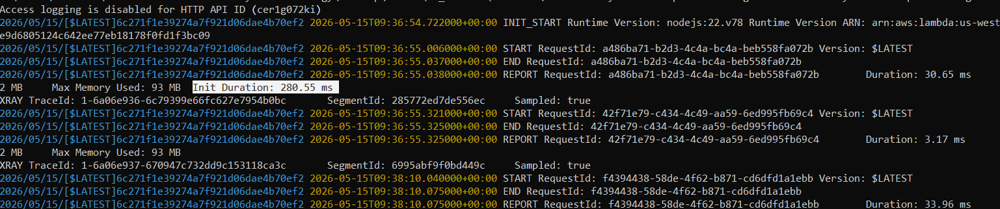
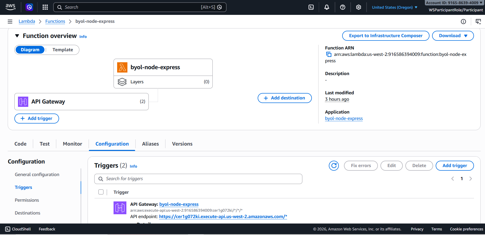

# Lambda Deployment Strategy

## Strategy Chosen
A - serverless-http

## Why This Strategy:
- Đơn giản nhất, chỉ cần thêm 1 file + 1 thư viện
- Adapter serverless-http là chuẩn công nghiệp, được sử dụng rộng rãi
- Code thay đổi tối thiểu (Express app không cần sửa gì)

## Cold Start Measurement
- **Cold Start Time: 280.55 ms** (đo được từ CloudWatch logs)

## API Gateway URL
https://cer1g072ki.execute-api.us-west-2.amazonaws.com

## Evidence
- cold_start: 280.55 ms

- evidence_api_gateway: https://cer1g072ki.execute-api.us-west-2.amazonaws.com

